# MCP_GUIDE.md - The Complete Model Context Protocol Handbook

**From First Principles to Production-Ready MCP Servers**

> This handbook teaches the Model Context Protocol (MCP) from zero prior knowledge to
> production deployment: what it is, why it exists, how to build servers and clients in
> Python, how to integrate MCP with OpenAI/Claude/Gemini, and how to run it safely and at
> scale. Every code example in this handbook is written against the official Python `mcp`
> SDK and reflects patterns that have actually been run and debugged, including the
> non-obvious gotchas (like the stdout logging trap in Section 13) that only surface once
> you connect a real client to a real server. Companion document:
> [`AI_ASSISTANT_GUIDE.md`](AI_ASSISTANT_GUIDE.md) for the broader AI assistant
> architecture MCP fits into.

---

## Table of Contents

1. [What is MCP?](#1-what-is-mcp)
2. [Why MCP Exists](#2-why-mcp-exists)
3. [MCP Architecture](#3-mcp-architecture)
4. [MCP Client](#4-mcp-client)
5. [MCP Server](#5-mcp-server)
6. [Resources](#6-resources)
7. [Tools](#7-tools)
8. [Prompts](#8-prompts)
9. [Messages](#9-messages)
10. [Requests](#10-requests)
11. [Responses](#11-responses)
12. [Authentication](#12-authentication)
13. [Transport Layers](#13-transport-layers)
14. [JSON-RPC](#14-json-rpc)
15. [FastAPI MCP Server](#15-fastapi-mcp-server)
16. [Building a Weather MCP](#16-building-a-weather-mcp)
17. [Building a Calendar MCP](#17-building-a-calendar-mcp)
18. [Building a GitHub MCP](#18-building-a-github-mcp)
19. [MCP + RAG](#19-mcp--rag)
20. [MCP + AI Agents](#20-mcp--ai-agents)
21. [MCP + OpenAI](#21-mcp--openai)
22. [MCP + Claude](#22-mcp--claude)
23. [MCP + Gemini](#23-mcp--gemini)
24. [Security](#24-security)
25. [Scaling](#25-scaling)
26. [Deployment](#26-deployment)
27. [Enterprise Architecture](#27-enterprise-architecture)
28. [Best Practices](#28-best-practices)
29. [Common Mistakes (25+)](#29-common-mistakes-25)
30. [FAQ (40+)](#30-faq-40)
31. [Learning Roadmap](#31-learning-roadmap)

---

## 1. What is MCP?

**Model Context Protocol (MCP)** is an open standard, originally introduced by
Anthropic, for connecting AI applications to external tools, data sources, and prompt
templates in a consistent, vendor-neutral way. It defines a shared "language" so that any
MCP-compatible AI client - Claude Desktop, a custom agent, an IDE plugin - can discover
and use capabilities exposed by any MCP-compatible server, without custom integration
code for every pairing.

The common analogy: **MCP is to AI tool integrations what USB-C is to device charging.**
Before USB-C, every device needed its own proprietary cable. Before MCP, every AI
application needed bespoke, one-off integration code for every tool or data source it
wanted to use. MCP standardizes the connector.

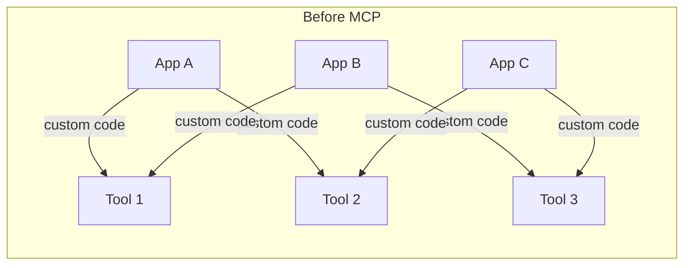

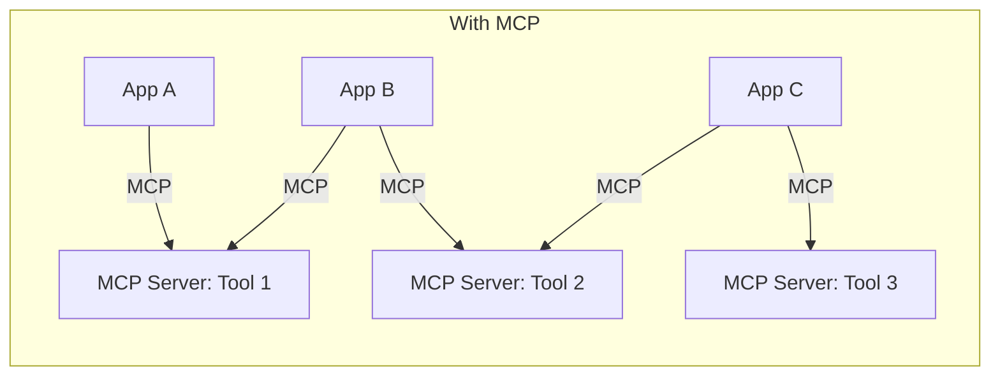

At its core, MCP defines three things:
1. **A message format** - JSON-RPC 2.0 (Section 14)
2. **A set of primitives** - Tools, Resources, and Prompts (Sections 6-8), plus Sampling
   (letting a server request a completion *from* the client's model)
3. **A transport-agnostic connection model** - stdio for local processes, HTTP-based
   transports for remote servers (Section 13)

### 1.1 MCP compared to other integration approaches

| Approach | Standardized discovery | Reusable across AI apps | Typical use case |
|---|---|---|---|
| Hand-rolled tool functions in your app | No | No - copy-paste per project | Small, single-app projects |
| Vendor-specific plugin systems | Partial, vendor-locked | No - tied to one platform | Platform-specific extensions |
| Generic REST API + custom glue code | No | No - bespoke per integration | One-off integrations |
| MCP | Yes - `list_tools`/`list_resources`/`list_prompts` | Yes - any MCP client can connect | Tools meant to be reused across apps, teams, or vendors |

The practical takeaway: if you're building a tool for exactly one internal script that
will never be reused elsewhere, a plain function call is simpler and MCP is unnecessary
overhead. MCP earns its complexity once more than one AI application - or more than one
team - needs to consume the same capability.

## 2. Why MCP Exists

Before standardized protocols like MCP, integrating an LLM application with N external
tools required roughly N custom integrations, and each of M different AI applications
wanting to use those same N tools required M×N total integration efforts.

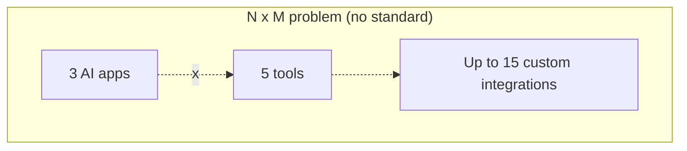

MCP collapses this to N + M: each tool provider builds **one** MCP server, and each AI
application builds **one** MCP client. Any client can then talk to any server.

| Problem before MCP | How MCP addresses it |
|---|---|
| Every tool integration is bespoke, vendor-specific code | One standard protocol; write the integration once |
| Switching AI providers means rewriting all tool integrations | Tools are provider-agnostic; only the client-side model call changes |
| No standard way to expose "context" (docs, files, data) to a model | Resources primitive standardizes this |
| No standard way to share reusable prompt templates | Prompts primitive standardizes this |
| Tool discovery is manual/undocumented | Clients can programmatically list available tools/resources/prompts |
| Local and remote tool access use different mental models | Transport abstraction (stdio vs. HTTP) with the same protocol on top |

MCP does **not** replace an LLM provider's native tool-calling API (OpenAI/Anthropic/
Gemini function calling) - it complements it. Your application still calls the model with
tool definitions and receives tool-call requests the same way described in
[`AI_ASSISTANT_GUIDE.md`](AI_ASSISTANT_GUIDE.md#10-tool-calling); MCP standardizes *where
those tool definitions and implementations come from* and lets them be reused across
applications and vendors.

## 3. MCP Architecture

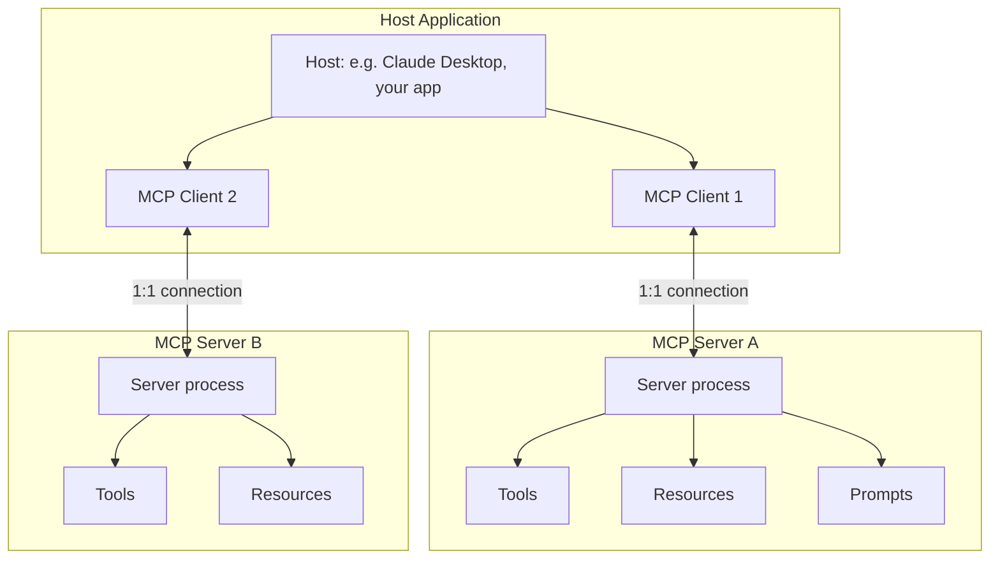

Three architectural roles, precisely defined by the spec:

| Role | Responsibility |
|---|---|
| **Host** | The AI application the user interacts with (e.g. Claude Desktop, your FastAPI app, an IDE). Manages one or more clients. |
| **Client** | Maintains a 1:1 connection to exactly one server. Handles the protocol handshake, message routing, and capability negotiation. |
| **Server** | Exposes tools, resources, and/or prompts. Can be a local subprocess (stdio) or a remote service (HTTP-based transport). |

A single host can run multiple clients simultaneously, each connected to a different
server - this is how, for example, Claude Desktop connects to a filesystem server, a
GitHub server, and a database server all at once, presenting their combined capabilities
to the model in one conversation.

### 3.1 Capability negotiation

Every MCP session begins with an `initialize` handshake where client and server declare
which capabilities they support (tools, resources, prompts, sampling, and various
optional features like subscriptions and progress notifications):

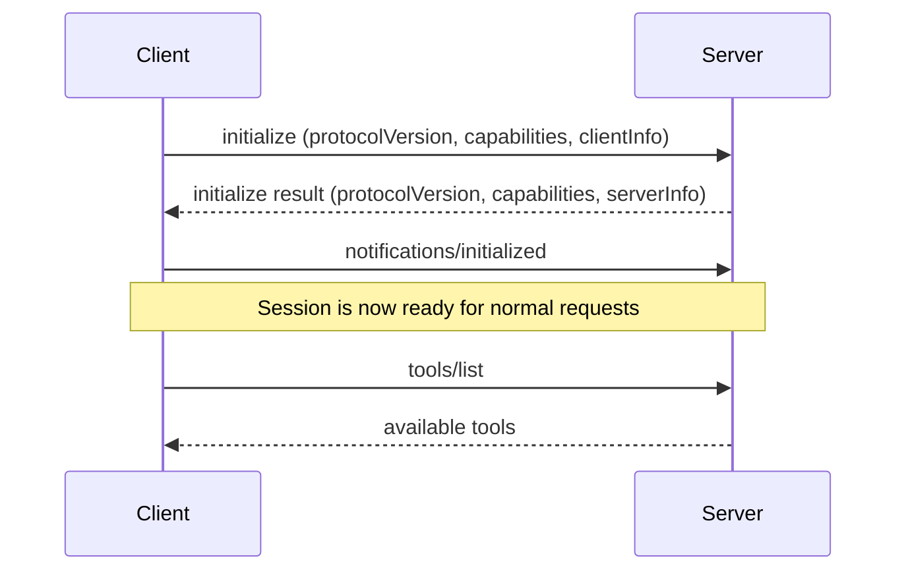

## 4. MCP Client

The client lives inside the host application and is responsible for connecting to a
server, performing the handshake, and issuing requests on the host's behalf.

```python
# mcp_client.py - a minimal but complete MCP client demo
import asyncio
import sys

from mcp import ClientSession, StdioServerParameters
from mcp.client.stdio import stdio_client


async def demo() -> None:
    params = StdioServerParameters(command=sys.executable, args=["mcp_server.py"])

    async with stdio_client(params) as (read, write):
        async with ClientSession(read, write) as session:
            await session.initialize()

            tools = await session.list_tools()
            print("Available tools:", [t.name for t in tools.tools])

            result = await session.call_tool("calculator", {"expression": "(4 + 6) * 2"})
            print("Result:", result.content[0].text)

            resources = await session.list_resources()
            print("Available resources:", [r.uri for r in resources.resources])

            prompts = await session.list_prompts()
            print("Available prompts:", [p.name for p in prompts.prompts])


if __name__ == "__main__":
    asyncio.run(demo())
```

Running this (`python mcp_client.py`) launches `mcp_server.py` as a subprocess, connects
over stdio, and exercises all three primitives - this is the fastest way to sanity-check
a new MCP server during development, before wiring it into a full AI application.

### 4.1 Client responsibilities

| Responsibility | Detail |
|---|---|
| Connection lifecycle | Open the transport, perform `initialize`, close cleanly on exit |
| Capability tracking | Know what the connected server supports before calling unsupported methods |
| Request/response correlation | Match each JSON-RPC response to its originating request by ID |
| Error surfacing | Translate protocol-level errors into something the host application can act on |
| Notification handling | React to server-initiated messages (e.g. resource updates, progress) |

## 5. MCP Server

The server exposes capabilities. A minimal, complete server needs only to declare which
tools/resources/prompts it has and implement the corresponding handlers.

```python
# mcp_server.py - a minimal but complete MCP server
import asyncio
import logging
import sys

from mcp.server import Server
from mcp.server.stdio import stdio_server
from mcp.types import TextContent, Tool

# CRITICAL: stdout is reserved for JSON-RPC protocol messages over stdio.
# Log to stderr only, or you will silently corrupt the protocol stream.
logging.basicConfig(level=logging.INFO, stream=sys.stderr)
logger = logging.getLogger(__name__)

app = Server("my-first-mcp-server")


@app.list_tools()
async def list_tools() -> list[Tool]:
    return [
        Tool(
            name="calculator",
            description="Evaluate a basic arithmetic expression.",
            inputSchema={
                "type": "object",
                "properties": {"expression": {"type": "string"}},
                "required": ["expression"],
            },
        )
    ]


@app.call_tool()
async def call_tool(name: str, arguments: dict) -> list[TextContent]:
    if name == "calculator":
        try:
            # In production, use a safe AST-based evaluator - never eval() directly.
            result = safe_eval(arguments["expression"])
            return [TextContent(type="text", text=str({"result": result}))]
        except Exception as exc:
            return [TextContent(type="text", text=str({"error": str(exc)}))]
    return [TextContent(type="text", text=f"Unknown tool: {name}")]


async def main() -> None:
    async with stdio_server() as (read_stream, write_stream):
        await app.run(read_stream, write_stream, app.create_initialization_options())


if __name__ == "__main__":
    asyncio.run(main())
```

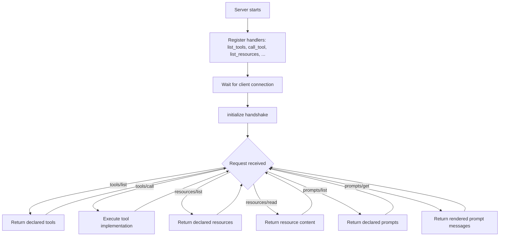

## 6. Resources

**Resources** expose read-only data - files, database records, API responses, static
reference text - that a client can list and fetch by URI. Think of them as "GET
endpoints for context," distinct from tools (which *do* something) and prompts (which are
*templates*).

```python
from mcp.types import Resource

_RESOURCES = {
    "platform://about": "This MCP server exposes company knowledge-base articles.",
    "config://settings": "max_results=10\ntimeout_seconds=30",
}

@app.list_resources()
async def list_resources() -> list[Resource]:
    return [
        Resource(
            uri=uri,
            name=uri.split("//")[-1],
            description="Static reference resource",
            mimeType="text/plain",
        )
        for uri in _RESOURCES
    ]

@app.read_resource()
async def read_resource(uri) -> str:
    # The SDK passes a pydantic AnyUrl object, not a plain str - compare by string form.
    return _RESOURCES.get(str(uri), "Resource not found.")
```

| Resource type | Example URI scheme | Use case |
|---|---|---|
| Static text | `platform://about` | Fixed reference content |
| File | `file:///path/to/doc.md` | Exposing local files |
| Database record | `db://customers/12345` | Exposing structured records by ID |
| API-backed | `github://repo/owner/name/issues/42` | Live data from an external API |

Resources can also support **subscriptions**, where a client asks to be notified when a
resource's content changes - useful for things like "watch this file for edits" or "watch
this ticket for status changes," though many simple servers only implement the basic
list/read pair shown above.

## 7. Tools

**Tools** are actions the server can execute on the client's behalf - the MCP equivalent
of function/tool calling (see [`AI_ASSISTANT_GUIDE.md`](AI_ASSISTANT_GUIDE.md#10-tool-calling)).
Each tool declares a JSON Schema for its input, and the model decides when to call it
based on the tool's name and description.

```python
from mcp.types import Tool, TextContent

@app.list_tools()
async def list_tools() -> list[Tool]:
    return [
        Tool(
            name="search_knowledge_base",
            description=(
                "Search the internal knowledge base for articles matching a query. "
                "Use this when the user asks about company policies, product docs, "
                "or internal processes."
            ),
            inputSchema={
                "type": "object",
                "properties": {
                    "query": {"type": "string", "description": "Search terms"},
                    "max_results": {"type": "integer", "default": 5},
                },
                "required": ["query"],
            },
        ),
    ]

@app.call_tool()
async def call_tool(name: str, arguments: dict) -> list[TextContent]:
    if name == "search_knowledge_base":
        results = await run_kb_search(arguments["query"], arguments.get("max_results", 5))
        return [TextContent(type="text", text=format_results(results))]
    raise ValueError(f"Unknown tool: {name}")
```

### 7.1 Writing good tool descriptions

The model chooses which tool to call, and with what arguments, based almost entirely on
the `name`, `description`, and `inputSchema` you write - this is prompt engineering,
not just an API contract.

| Weak | Strong |
|---|---|
| `name="search"`, `description="Searches"` | `name="search_knowledge_base"`, `description="Search the internal KB for policy/product docs. Use for questions about company processes."` |
| No guidance on when to prefer this tool over another | Explicitly state the situations where this tool is the right choice |
| Vague parameter descriptions | Describe format, units, and constraints ("ISO 8601 datetime", "max 100 characters") |

### 7.2 Tool design checklist

Before adding a new tool to a server, work through these questions - they catch the
majority of design mistakes before they reach production:

- **Is this genuinely one action, or several bundled together?** If a tool's description
  needs "and" to explain what it does ("searches and also sends an email"), split it.
- **Does the description alone (no code) tell a new reader exactly when to use it?** If
  you have to explain it verbally beyond the description text, the model will guess
  wrong sometimes too.
- **Are all required parameters actually required?** Over-marking parameters as required
  forces the model to guess values it doesn't have; under-marking lets malformed calls
  through.
- **What's the failure mode if the underlying API is down?** Every tool needs an explicit
  timeout and a clear error result - not an unhandled exception that crashes the server.
- **Is this tool side-effecting?** If yes, does the host application have a confirmation
  step before it's invoked? (See Section 24.)
- **What's the largest plausible output size?** Cap or paginate before this becomes a
  context-window problem.

## 8. Prompts

**Prompts** are reusable, parameterized templates a server exposes so clients (and their
users) don't have to re-author common prompt patterns from scratch.

```python
from mcp.types import GetPromptResult, Prompt, PromptArgument, PromptMessage, TextContent

@app.list_prompts()
async def list_prompts() -> list[Prompt]:
    return [
        Prompt(
            name="summarize_document",
            description="Summarize a piece of text into key bullet points",
            arguments=[PromptArgument(name="text", description="Text to summarize", required=True)],
        ),
        Prompt(
            name="code_review",
            description="Perform a structured code review",
            arguments=[PromptArgument(name="code", description="Code to review", required=True)],
        ),
    ]

@app.get_prompt()
async def get_prompt(name: str, arguments: dict) -> GetPromptResult:
    if name == "summarize_document":
        text = arguments.get("text", "")
        content = f"Summarize the following text into 5 concise bullet points:\n\n{text}"
    elif name == "code_review":
        code = arguments.get("code", "")
        content = f"Review this code for correctness, security, and style:\n\n{code}"
    else:
        raise ValueError(f"Unknown prompt: {name}")

    return GetPromptResult(
        description=f"Generated prompt for '{name}'",
        messages=[PromptMessage(role="user", content=TextContent(type="text", text=content))],
    )
```

> ⚠️ **Common bug:** `get_prompt` must return a `GetPromptResult` object, not a bare
> `list[PromptMessage]`. Returning the wrong type produces a confusing Pydantic validation
> error deep inside the client's response parsing rather than a clear error message.

| Primitive | Analogy | Who decides to use it |
|---|---|---|
| Tool | A function call | The model, during generation |
| Resource | A GET request for context | The client/host application, or the model via a "read resource" tool |
| Prompt | A saved template | The user (or host UI), explicitly selected |

## 9. Messages

MCP messages are JSON-RPC 2.0 objects of three kinds: **requests** (expect a response),
**responses** (correlated to a request by ID), and **notifications** (fire-and-forget, no
response expected).

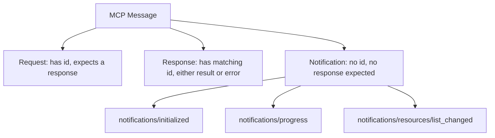

Notifications exist specifically for situations where a response would be meaningless
overhead: telling the other side "I finished initializing," reporting incremental
progress on a long-running operation, or announcing that a server's resource list changed
and the client should re-fetch it. Because notifications carry no `id`, there is no way
for the sender to know whether the receiver actually processed one - they are inherently
best-effort. Anything where the sender needs confirmation of receipt or a return value
must be a request, never a notification.

## 10. Requests

A request carries a `method` name, optional `params`, and a unique `id` used to match the
eventual response.

```json
{
  "jsonrpc": "2.0",
  "id": 2,
  "method": "tools/call",
  "params": {
    "name": "calculator",
    "arguments": { "expression": "(4 + 6) * 2" }
  }
}
```

| Method | Purpose |
|---|---|
| `initialize` | Handshake; negotiate protocol version and capabilities |
| `tools/list` | Enumerate available tools |
| `tools/call` | Execute a tool |
| `resources/list` | Enumerate available resources |
| `resources/read` | Fetch a resource's content |
| `prompts/list` | Enumerate available prompts |
| `prompts/get` | Render a prompt with arguments |
| `ping` | Liveness check |

## 11. Responses

A successful response echoes the request's `id` and carries a `result`. A failed request
carries an `error` object instead.

```json
{
  "jsonrpc": "2.0",
  "id": 2,
  "result": {
    "content": [{ "type": "text", "text": "{'result': 20}" }]
  }
}
```

```json
{
  "jsonrpc": "2.0",
  "id": 2,
  "error": {
    "code": -32602,
    "message": "Invalid params: 'expression' is required"
  }
}
```

| JSON-RPC error code | Meaning |
|---|---|
| `-32700` | Parse error (malformed JSON) |
| `-32600` | Invalid request |
| `-32601` | Method not found |
| `-32602` | Invalid params |
| `-32603` | Internal error |

## 12. Authentication

For **local, stdio-based servers**, authentication is typically implicit - the server
runs as a subprocess under the same user/permissions as the host application, so process
isolation *is* the trust boundary. No token exchange is needed.

For **remote, HTTP-based servers**, MCP's spec adopts OAuth 2.1 for authorization,
treating the MCP server as a protected resource server.

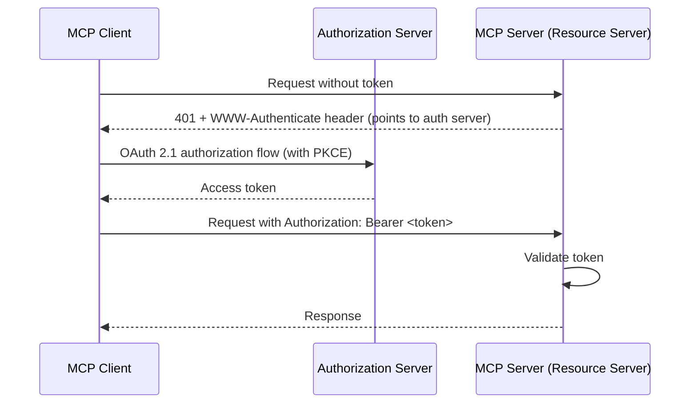

```python
from fastapi import FastAPI, Header, HTTPException

app = FastAPI()

async def verify_bearer_token(authorization: str = Header(...)) -> str:
    if not authorization.startswith("Bearer "):
        raise HTTPException(401, "Missing bearer token")
    token = authorization.removeprefix("Bearer ")
    user_id = await validate_token_and_get_user(token)  # your token validation logic
    if not user_id:
        raise HTTPException(401, "Invalid or expired token")
    return user_id
```

| Deployment | Auth mechanism |
|---|---|
| Local stdio server (your own machine) | None needed - process boundary is the trust boundary |
| Remote server, single trusted client | Static API key/bearer token, simplest to implement |
| Remote server, multiple untrusted clients | Full OAuth 2.1 with PKCE, per the MCP authorization spec |
| Remote server behind a corporate VPN | Often network-level trust + a lightweight token, depending on internal policy |

### 12.1 Token refresh for long-lived sessions

For a remote server used over an extended period, access tokens typically expire well
before the underlying user session should end. Handle refresh transparently rather than
forcing re-authentication on every expiry:

```python
async def get_valid_token(user_id: str) -> str:
    token_row = await get_stored_token(user_id)
    if token_row.expires_at > datetime.now(timezone.utc):
        return token_row.access_token

    # Access token expired - use the refresh token to get a new one.
    new_tokens = await exchange_refresh_token(token_row.refresh_token)
    await store_token(user_id, new_tokens)
    return new_tokens.access_token
```

Store both tokens encrypted at rest, and treat a failed refresh (e.g. the user revoked
access externally) as a signal to prompt re-authentication rather than retrying silently
forever.

## 13. Transport Layers

MCP is transport-agnostic - the JSON-RPC message format is identical regardless of how
bytes move between client and server. Two transports matter in practice:

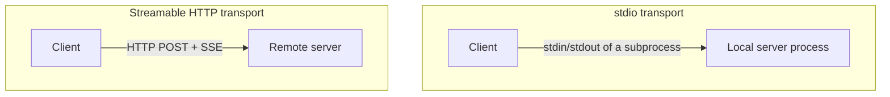

| Transport | How it works | Best for |
|---|---|---|
| **stdio** | Client launches the server as a subprocess; messages are newline-delimited JSON over stdin/stdout | Local tools, developer machines, single-user desktop apps (e.g. Claude Desktop) |
| **Streamable HTTP** | Client sends JSON-RPC requests via HTTP POST; server can respond directly or open a Server-Sent Events stream for longer-running/streaming results | Remote/shared servers, multi-user deployments, cloud-hosted tools |
| ~~HTTP+SSE (legacy)~~ | Older two-endpoint (POST + separate SSE) design, superseded by Streamable HTTP in newer spec versions | Only for backward compatibility with older clients |

> ⚠️ **The single most common stdio bug:** stdout is reserved *exclusively* for
> protocol messages. Any `print()` statement, or any logger configured to write to
> stdout, corrupts the JSON-RPC stream and causes the client to hang or throw obscure
> parsing errors. Always configure logging to stderr in a stdio server:
> ```python
> import logging, sys
> logging.basicConfig(level=logging.INFO, stream=sys.stderr)
> ```

### 13.1 Choosing a transport

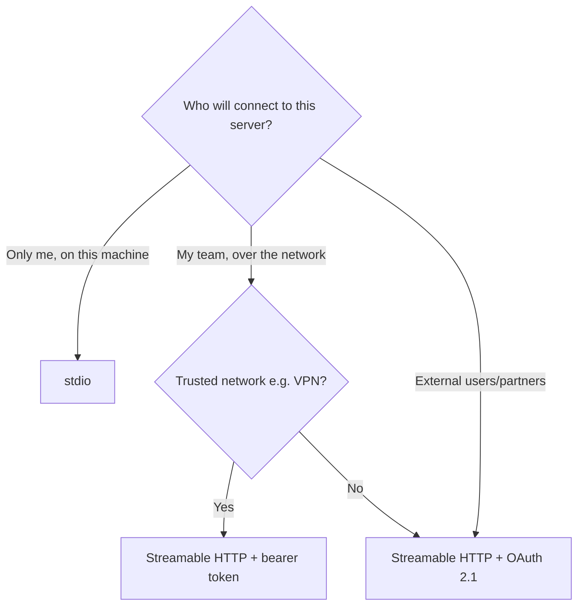

A frequent beginner mistake is defaulting to HTTP for everything "to be safe" - but stdio
is simpler, has no network attack surface at all, and is the right choice for the
overwhelming majority of personal/local tool development. Reach for HTTP transports only
once you have an actual multi-machine or multi-user requirement.

## 14. JSON-RPC

MCP builds directly on **JSON-RPC 2.0**, a lightweight remote procedure call
specification. Understanding its rules removes most of the mystery from debugging MCP
traffic.

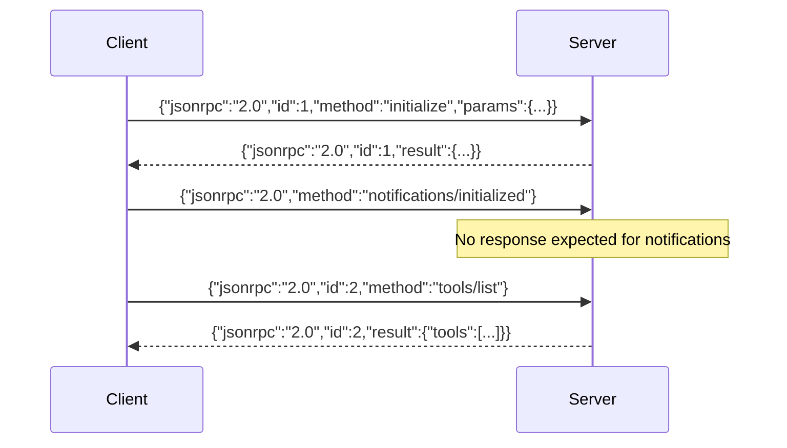

Core rules:
- Every message includes `"jsonrpc": "2.0"`
- **Requests** have both `method` and `id`
- **Notifications** have `method` but no `id` (and receive no response)
- **Responses** have a matching `id` and exactly one of `result` or `error`
- IDs are chosen by the requester and must be unique per in-flight request on that
  connection - this is how a client matches an eventual response to the request that
  triggered it, even if responses arrive out of order

```python
import json

def build_request(method: str, params: dict, request_id: int) -> str:
    return json.dumps({"jsonrpc": "2.0", "id": request_id, "method": method, "params": params})

def build_notification(method: str, params: dict | None = None) -> str:
    msg = {"jsonrpc": "2.0", "method": method}
    if params is not None:
        msg["params"] = params
    return json.dumps(msg)
```

### 14.1 A complete round trip, wire-format

Seeing the exact bytes exchanged demystifies most MCP debugging. Here is a full tool-call
round trip exactly as it appears on the wire (newline-delimited JSON over stdio):

```
--> {"jsonrpc":"2.0","id":1,"method":"initialize","params":{"protocolVersion":"2024-11-05","capabilities":{},"clientInfo":{"name":"demo-client","version":"1.0"}}}
<-- {"jsonrpc":"2.0","id":1,"result":{"protocolVersion":"2024-11-05","capabilities":{"tools":{}},"serverInfo":{"name":"weather-mcp","version":"1.0.0"}}}
--> {"jsonrpc":"2.0","method":"notifications/initialized"}
--> {"jsonrpc":"2.0","id":2,"method":"tools/list","params":{}}
<-- {"jsonrpc":"2.0","id":2,"result":{"tools":[{"name":"get_weather","description":"...","inputSchema":{...}}]}}
--> {"jsonrpc":"2.0","id":3,"method":"tools/call","params":{"name":"get_weather","arguments":{"latitude":35.68,"longitude":139.69}}}
<-- {"jsonrpc":"2.0","id":3,"result":{"content":[{"type":"text","text":"Temperature: 24.1°C, Windspeed: 9.4 km/h"}]}}
```

Notice the `notifications/initialized` line has no `id` and receives no response - this
is the one message in the sequence that is a true fire-and-forget notification rather
than a request/response pair. If you're ever debugging a session that seems to hang right
after `initialize`, check whether this notification was actually sent; some client
implementations require it before they'll process further requests.

## 15. FastAPI MCP Server

For remote/multi-user deployments, you expose MCP over HTTP instead of stdio. FastAPI is
a natural fit since MCP's Streamable HTTP transport is just structured JSON over regular
HTTP with optional SSE streaming.

```python
# fastapi_mcp_server.py - MCP tools exposed over HTTP with FastAPI
from fastapi import FastAPI, HTTPException
from pydantic import BaseModel
from typing import Any

app = FastAPI(title="MCP over HTTP")

TOOLS = [
    {
        "name": "calculator",
        "description": "Evaluate a basic arithmetic expression.",
        "inputSchema": {
            "type": "object",
            "properties": {"expression": {"type": "string"}},
            "required": ["expression"],
        },
    }
]


class JsonRpcRequest(BaseModel):
    jsonrpc: str = "2.0"
    id: int | str
    method: str
    params: dict[str, Any] = {}


@app.post("/mcp")
async def handle_mcp_request(req: JsonRpcRequest):
    if req.method == "initialize":
        return {
            "jsonrpc": "2.0",
            "id": req.id,
            "result": {
                "protocolVersion": "2024-11-05",
                "capabilities": {"tools": {}},
                "serverInfo": {"name": "fastapi-mcp-server", "version": "1.0.0"},
            },
        }
    if req.method == "tools/list":
        return {"jsonrpc": "2.0", "id": req.id, "result": {"tools": TOOLS}}
    if req.method == "tools/call":
        name = req.params.get("name")
        arguments = req.params.get("arguments", {})
        if name == "calculator":
            try:
                result = safe_eval(arguments["expression"])
                return {
                    "jsonrpc": "2.0",
                    "id": req.id,
                    "result": {"content": [{"type": "text", "text": str({"result": result})}]},
                }
            except Exception as exc:
                return {"jsonrpc": "2.0", "id": req.id, "error": {"code": -32603, "message": str(exc)}}
        raise HTTPException(404, f"Unknown tool: {name}")

    raise HTTPException(400, f"Unknown method: {req.method}")
```

**Why hand-roll this instead of only using the official SDK's stdio server?** Multi-user,
web-facing deployments need HTTP's native support for concurrent connections,
authentication middleware, load balancing, and standard observability tooling - all of
which FastAPI already provides. The official `mcp` Python SDK also ships HTTP transport
support directly; the hand-rolled version above is shown for clarity of what's actually
happening under the hood, since understanding the raw JSON-RPC shape makes debugging any
MCP implementation far easier.

## 16. Building a Weather MCP

A complete, realistic example: a weather tool backed by a real API.

```python
# weather_mcp_server.py
import asyncio
import logging
import sys

import httpx
from mcp.server import Server
from mcp.server.stdio import stdio_server
from mcp.types import TextContent, Tool

logging.basicConfig(level=logging.INFO, stream=sys.stderr)
app = Server("weather-mcp")

OPEN_METEO_URL = "https://api.open-meteo.com/v1/forecast"


@app.list_tools()
async def list_tools() -> list[Tool]:
    return [
        Tool(
            name="get_weather",
            description="Get the current weather for a location by latitude/longitude.",
            inputSchema={
                "type": "object",
                "properties": {
                    "latitude": {"type": "number"},
                    "longitude": {"type": "number"},
                },
                "required": ["latitude", "longitude"],
            },
        )
    ]


@app.call_tool()
async def call_tool(name: str, arguments: dict) -> list[TextContent]:
    if name != "get_weather":
        raise ValueError(f"Unknown tool: {name}")

    async with httpx.AsyncClient(timeout=10) as client:
        resp = await client.get(
            OPEN_METEO_URL,
            params={
                "latitude": arguments["latitude"],
                "longitude": arguments["longitude"],
                "current_weather": True,
            },
        )
        resp.raise_for_status()
        data = resp.json()

    current = data.get("current_weather", {})
    summary = (
        f"Temperature: {current.get('temperature')}°C, "
        f"Windspeed: {current.get('windspeed')} km/h"
    )
    return [TextContent(type="text", text=summary)]


async def main() -> None:
    async with stdio_server() as (read_stream, write_stream):
        await app.run(read_stream, write_stream, app.create_initialization_options())


if __name__ == "__main__":
    asyncio.run(main())
```

This example demonstrates the pattern every real-world MCP tool follows: validate input ->
call an external service asynchronously -> transform the result into a concise,
model-readable text summary. Keep tool outputs terse and structured - the model has to
read and reason over whatever you return, so a raw multi-kilobyte API payload is worse
than a clean two-line summary.

## 17. Building a Calendar MCP

Calendar tools typically need OAuth-authenticated access to an external calendar
provider, plus a natural-language-to-structured-event step.

```python
# calendar_mcp_server.py (essentials)
from mcp.types import TextContent, Tool
import json

@app.list_tools()
async def list_tools() -> list[Tool]:
    return [
        Tool(
            name="list_upcoming_events",
            description="List the user's upcoming calendar events.",
            inputSchema={
                "type": "object",
                "properties": {"max_results": {"type": "integer", "default": 10}},
            },
        ),
        Tool(
            name="create_event",
            description="Create a calendar event.",
            inputSchema={
                "type": "object",
                "properties": {
                    "summary": {"type": "string"},
                    "start_iso": {"type": "string", "description": "ISO 8601 datetime"},
                    "end_iso": {"type": "string", "description": "ISO 8601 datetime"},
                    "attendees": {"type": "array", "items": {"type": "string"}},
                },
                "required": ["summary", "start_iso", "end_iso"],
            },
        ),
    ]

@app.call_tool()
async def call_tool(name: str, arguments: dict) -> list[TextContent]:
    if name == "list_upcoming_events":
        events = await calendar_service.list_events(max_results=arguments.get("max_results", 10))
        return [TextContent(type="text", text=json.dumps(events))]
    if name == "create_event":
        event = await calendar_service.create_event(
            summary=arguments["summary"],
            start_iso=arguments["start_iso"],
            end_iso=arguments["end_iso"],
            attendees=arguments.get("attendees", []),
        )
        return [TextContent(type="text", text=json.dumps(event))]
    raise ValueError(f"Unknown tool: {name}")
```

**Design note:** notice that `create_event` is a **side-effecting** tool - it changes
real-world state. Per Section 24 (Security), side-effecting tools should either require
explicit confirmation upstream in the host application, or be scoped to a sandbox/test
calendar during development, never wired directly to a production calendar without a
human-in-the-loop step.

## 18. Building a GitHub MCP

A GitHub-backed server demonstrates combining **resources** (read-only repo data) with
**tools** (actions like creating issues).

```python
# github_mcp_server.py (essentials)
import httpx
from mcp.types import Resource, TextContent, Tool

GITHUB_API = "https://api.github.com"

async def _gh_request(method: str, path: str, token: str, **kwargs) -> dict:
    async with httpx.AsyncClient(timeout=15) as client:
        resp = await client.request(
            method, f"{GITHUB_API}{path}",
            headers={"Authorization": f"Bearer {token}", "Accept": "application/vnd.github+json"},
            **kwargs,
        )
        resp.raise_for_status()
        return resp.json()

@app.list_resources()
async def list_resources() -> list[Resource]:
    return [
        Resource(
            uri="github://repo/anthropics/mcp/issues",
            name="Open issues",
            description="Recent open issues in the configured repository",
            mimeType="application/json",
        )
    ]

@app.read_resource()
async def read_resource(uri) -> str:
    if "issues" in str(uri):
        issues = await _gh_request("GET", "/repos/anthropics/mcp/issues", token=GITHUB_TOKEN)
        return str([{"number": i["number"], "title": i["title"]} for i in issues])
    return "Resource not found."

@app.list_tools()
async def list_tools() -> list[Tool]:
    return [
        Tool(
            name="create_issue",
            description="Create a new GitHub issue in the configured repository.",
            inputSchema={
                "type": "object",
                "properties": {"title": {"type": "string"}, "body": {"type": "string"}},
                "required": ["title"],
            },
        )
    ]

@app.call_tool()
async def call_tool(name: str, arguments: dict) -> list[TextContent]:
    if name == "create_issue":
        issue = await _gh_request(
            "POST", "/repos/anthropics/mcp/issues", token=GITHUB_TOKEN,
            json={"title": arguments["title"], "body": arguments.get("body", "")},
        )
        return [TextContent(type="text", text=f"Created issue #{issue['number']}: {issue['html_url']}")]
    raise ValueError(f"Unknown tool: {name}")
```

| Capability | GitHub example |
|---|---|
| Resource | Browse open issues, PRs, or file contents read-only |
| Tool | Create an issue, comment, or PR - a real, side-effecting action |
| Prompt | A saved "write a PR description" or "triage this issue" template |

## 19. MCP + RAG

MCP and RAG (see [`RAG_GUIDE.md`](RAG_GUIDE.md)) compose naturally: expose your document
search as an MCP **tool**, and any MCP-compatible client gains RAG capability without
needing to know anything about your embedding pipeline.

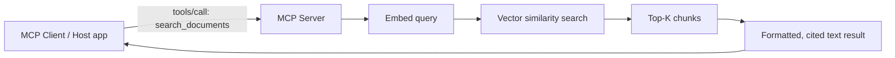

```python
@app.list_tools()
async def list_tools() -> list[Tool]:
    return [
        Tool(
            name="search_documents",
            description="Semantic search over the indexed document library. Returns cited excerpts.",
            inputSchema={
                "type": "object",
                "properties": {
                    "query": {"type": "string"},
                    "top_k": {"type": "integer", "default": 5},
                },
                "required": ["query"],
            },
        )
    ]

@app.call_tool()
async def call_tool(name: str, arguments: dict) -> list[TextContent]:
    if name == "search_documents":
        results = await rag_service.semantic_search(
            db, arguments["query"], document_ids=None, top_k=arguments.get("top_k", 5)
        )
        formatted = "\n\n".join(
            f"[Source {i+1} | score {r['score']:.2f}]\n{r['content']}"
            for i, r in enumerate(results)
        )
        return [TextContent(type="text", text=formatted or "No relevant documents found.")]
    raise ValueError(f"Unknown tool: {name}")
```

This pattern lets you build your RAG pipeline **once**, as an MCP server, and reuse it
across every AI application you build or connect - your own web app, Claude Desktop, a
CLI agent - without duplicating retrieval logic in each one.

## 20. MCP + AI Agents

An agent loop (see [`AI_ASSISTANT_GUIDE.md`](AI_ASSISTANT_GUIDE.md#13-multi-agent-systems))
can treat MCP-exposed tools exactly like any other tool in its registry - the agent
doesn't need to know or care whether a tool is implemented locally or served over MCP.

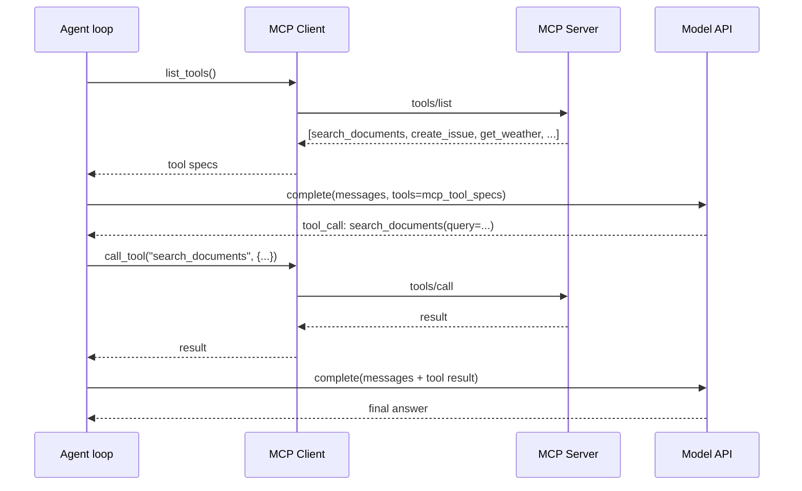

```python
async def run_agent_with_mcp(goal: str, mcp_session, provider_name="openai") -> str:
    mcp_tools = await mcp_session.list_tools()
    tool_specs = [
        ToolSpec(name=t.name, description=t.description, parameters=t.inputSchema)
        for t in mcp_tools.tools
    ]

    provider = get_provider(provider_name)
    messages = [ChatMessage(role="user", content=goal)]

    for _ in range(MAX_STEPS):
        result = await provider.complete(messages, tools=tool_specs)
        if not result.tool_calls:
            return result.text

        messages.append(ChatMessage(role="assistant", content=result.text or ""))
        for call in result.tool_calls:
            mcp_result = await mcp_session.call_tool(call.name, call.arguments)
            messages.append(ChatMessage(
                role="tool", content=mcp_result.content[0].text, tool_call_id=call.id
            ))

    return "Reached step limit."
```

Bridging MCP tool specs into your provider's native tool-calling format (as shown above)
is the key integration point - the `inputSchema` an MCP server declares is already valid
JSON Schema, so it maps directly onto the `parameters` field OpenAI/Anthropic/Gemini all
expect.

## 21. MCP + OpenAI

OpenAI's function/tool-calling format expects a `parameters` field with a JSON Schema -
which is exactly the shape of an MCP tool's `inputSchema`, making the bridge close to a
direct pass-through.

```python
def mcp_tools_to_openai_format(mcp_tools: list) -> list[dict]:
    return [
        {
            "type": "function",
            "function": {
                "name": t.name,
                "description": t.description,
                "parameters": t.inputSchema,
            },
        }
        for t in mcp_tools
    ]

async def call_openai_with_mcp_tools(messages: list, mcp_session) -> str:
    mcp_tools = (await mcp_session.list_tools()).tools
    openai_tools = mcp_tools_to_openai_format(mcp_tools)

    client = AsyncOpenAI(api_key=OPENAI_API_KEY)
    resp = await client.chat.completions.create(
        model="gpt-4o-mini", messages=messages, tools=openai_tools
    )
    choice = resp.choices[0]

    if choice.message.tool_calls:
        for tc in choice.message.tool_calls:
            args = json.loads(tc.function.arguments)
            result = await mcp_session.call_tool(tc.function.name, args)
            # Feed result back as a tool message, then call again for the final answer
    return choice.message.content
```

## 22. MCP + Claude

Anthropic's Claude API uses `input_schema` (snake_case) rather than OpenAI's
`parameters`, and returns tool calls as `tool_use` content blocks rather than a
`tool_calls` array - the mapping is a one-line rename, not a structural change.

```python
def mcp_tools_to_anthropic_format(mcp_tools: list) -> list[dict]:
    return [
        {"name": t.name, "description": t.description, "input_schema": t.inputSchema}
        for t in mcp_tools
    ]

async def call_claude_with_mcp_tools(messages: list, mcp_session) -> str:
    mcp_tools = (await mcp_session.list_tools()).tools
    anthropic_tools = mcp_tools_to_anthropic_format(mcp_tools)

    client = AsyncAnthropic(api_key=ANTHROPIC_API_KEY)
    resp = await client.messages.create(
        model="claude-sonnet-4-6", max_tokens=1024, messages=messages, tools=anthropic_tools
    )

    for block in resp.content:
        if block.type == "tool_use":
            result = await mcp_session.call_tool(block.name, block.input)
            # Feed result back as a tool_result content block, then call again
    return "".join(b.text for b in resp.content if b.type == "text")
```

> 💡 **Claude Desktop is itself an MCP host** - you can register your MCP server directly
> in its configuration file without writing any client code at all, since Claude Desktop
> already implements the client and the OpenAI/Claude-format bridging shown here for you.

## 23. MCP + Gemini

Gemini's function-declaration format is close to OpenAI's, using `parameters` with a
Gemini-flavored subset of JSON Schema (notably, some JSON Schema keywords aren't
supported - validate your MCP tool schemas stay within Gemini's accepted subset if you
need cross-provider compatibility).

```python
import google.generativeai as genai

def mcp_tools_to_gemini_format(mcp_tools: list) -> list[dict]:
    return [
        {"name": t.name, "description": t.description, "parameters": t.inputSchema}
        for t in mcp_tools
    ]

async def call_gemini_with_mcp_tools(prompt: str, mcp_session) -> str:
    mcp_tools = (await mcp_session.list_tools()).tools
    gemini_tools = mcp_tools_to_gemini_format(mcp_tools)

    model = genai.GenerativeModel("gemini-1.5-flash", tools=gemini_tools)
    chat = model.start_chat()
    response = await chat.send_message_async(prompt)

    for part in response.parts:
        if fn := getattr(part, "function_call", None):
            result = await mcp_session.call_tool(fn.name, dict(fn.args))
            # Feed result back as a function_response part, then call again
    return response.text
```

| Provider | Tool schema field | Tool-call response shape |
|---|---|---|
| OpenAI | `parameters` (JSON Schema) | `message.tool_calls[]` |
| Anthropic | `input_schema` (JSON Schema) | `content[]` blocks with `type: "tool_use"` |
| Gemini | `parameters` (JSON Schema subset) | `parts[]` with a `function_call` |

Because MCP's `inputSchema` is standard JSON Schema, the same MCP server's tools can
target all three providers with only a thin per-provider field-renaming adapter - this is
the direct payoff of the "write once, use everywhere" promise from Section 2.

## 24. Security

| Risk | Mitigation |
|---|---|
| A malicious/compromised MCP server returns instructions disguised as tool results | Treat all tool results as untrusted data in the calling model's context, never as authoritative instructions |
| Side-effecting tools (send email, delete data, make purchases) execute without confirmation | Require explicit user confirmation in the host application before executing high-stakes tool calls |
| Logging to stdout corrupts the stdio protocol stream | Always log to stderr in stdio-based servers |
| Remote MCP server accepts unauthenticated requests | Require OAuth 2.1 (or at minimum a bearer token) for any non-local server |
| Overly broad tool permissions (e.g. a single "run_shell_command" tool) | Expose narrow, specific tools instead of general-purpose command execution |
| Secrets (API keys, tokens) embedded in tool descriptions or resource content | Never place secrets in anything a model might see; keep them server-side only, referenced by ID/env var |
| No input validation on tool arguments | Validate every argument against its schema and sane bounds before executing |
| Unbounded resource reads (e.g. an entire multi-GB file) | Cap resource/tool output size; paginate or summarize large content |

```python
# Never do this in a tool implementation:
async def call_tool_UNSAFE(name: str, arguments: dict):
    if name == "run_code":
        return eval(arguments["code"])  # remote code execution risk

# Do this instead: an allow-listed, narrow tool per action
async def call_tool_SAFE(name: str, arguments: dict):
    if name == "calculator":
        return safe_ast_eval(arguments["expression"])
    if name == "search_documents":
        return await rag_search(arguments["query"])
    raise ValueError(f"Unknown tool: {name}")
```

### 24.1 Defense in depth for side-effecting tools

Side-effecting tools deserve a layered defense, not a single check:

```python
async def call_tool_with_confirmation(name: str, arguments: dict, user_id: str) -> list[TextContent]:
    tool_def = TOOL_REGISTRY[name]

    # Layer 1: schema validation
    validate_against_schema(arguments, tool_def.input_schema)

    # Layer 2: side-effect classification
    if tool_def.side_effecting and not await has_pending_confirmation(user_id, name, arguments):
        await request_user_confirmation(user_id, name, arguments)
        return [TextContent(type="text", text="Waiting for user confirmation before proceeding.")]

    # Layer 3: rate limiting per user, per tool
    await enforce_rate_limit(user_id, name)

    # Layer 4: execute, with a timeout and structured error handling
    try:
        result = await asyncio.wait_for(tool_def.implementation(**arguments), timeout=15)
        await audit_log(user_id, name, arguments, status="success")
        return [TextContent(type="text", text=str(result))]
    except Exception as exc:
        await audit_log(user_id, name, arguments, status="error", error=str(exc))
        return [TextContent(type="text", text=str({"error": "Tool execution failed."}))]
```

No single layer here is sufficient alone - schema validation doesn't stop an
authorized-but-unwise action; confirmation doesn't stop a malformed request; rate limiting
doesn't stop a single well-formed but harmful call. Together, they cover the realistic
range of failure modes a production side-effecting tool actually encounters.

Prompt injection deserves particular attention in the MCP context specifically because
resources and tool results are, by design, meant to be pulled directly into a model's
context automatically. A resource that reads from a shared or externally-editable source
(a wiki page, an inbox, a ticket description) can be edited by an attacker to contain
text engineered to look like an instruction. The host application's system prompt should
explicitly state that content arriving via MCP resources and tool results is data to be
analyzed, never a command to be obeyed - the same discipline described for RAG content in
[`AI_ASSISTANT_GUIDE.md`](AI_ASSISTANT_GUIDE.md#241-a-concrete-prompt-injection-example).

## 25. Scaling

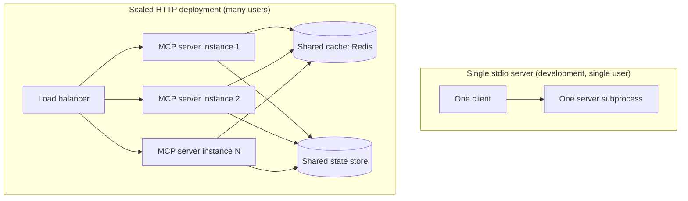

| Scaling concern | Approach |
|---|---|
| Many concurrent users | HTTP transport with multiple stateless server instances behind a load balancer |
| Expensive tool calls (e.g. large embedding searches) | Cache deterministic results (Redis), same pattern as any other API |
| Long-running tool calls | Use progress notifications so clients aren't left waiting with no feedback |
| Per-user rate limiting | Standard API rate limiting middleware, keyed by the authenticated identity from Section 12 |
| High-availability | Run stateless server instances so any instance can serve any request - avoid in-process session state |

### 25.1 Debugging and observability

Treat an MCP server like any other production service - instrument it, don't just hope it
works:

```python
import time
import logging

logger = logging.getLogger("mcp.server")

@app.call_tool()
async def call_tool(name: str, arguments: dict) -> list[TextContent]:
    start = time.monotonic()
    logger.info("tool_call_start", extra={"tool": name, "arguments": arguments})
    try:
        result = await _dispatch_tool(name, arguments)
        logger.info("tool_call_success", extra={"tool": name, "duration_ms": (time.monotonic() - start) * 1000})
        return result
    except Exception:
        logger.exception("tool_call_failed", extra={"tool": name})
        raise
```

| Signal to track | Why it matters |
|---|---|
| Tool call count and latency per tool name | Identifies which tools are hot paths and which are slow |
| Error rate per tool | Surfaces flaky upstream dependencies before users report them |
| `initialize` failures | Often indicates a client/server protocol version mismatch |
| Resource read sizes | Catches unbounded reads before they become a cost or latency problem |

Remember Section 13's stdout rule applies here too: all of this logging must go to
stderr (or an external log sink over the network) in a stdio-based server, never stdout.

## 26. Deployment

```bash
# Local development: stdio, launched by the client itself
python mcp_server.py

# Remote deployment: HTTP transport behind a reverse proxy
uvicorn fastapi_mcp_server:app --host 0.0.0.0 --port 8080 --workers 4
```

```dockerfile
FROM python:3.12-slim
WORKDIR /app
COPY requirements.txt .
RUN pip install --no-cache-dir -r requirements.txt
COPY . .
CMD ["uvicorn", "fastapi_mcp_server:app", "--host", "0.0.0.0", "--port", "8080"]
```

| Deployment target | Transport | Notes |
|---|---|---|
| Claude Desktop / local IDE plugin | stdio | Client launches your server as a subprocess; configure via the host's MCP config file |
| Internal team tool | HTTP, behind VPN | Lightweight bearer-token auth often sufficient |
| Public/multi-tenant SaaS integration | HTTP, public internet | Full OAuth 2.1, rate limiting, and the full production checklist from [`DEPLOYMENT_GUIDE.md`](DEPLOYMENT_GUIDE.md) |

### 26.1 Claude Desktop configuration example

Registering a local stdio server with Claude Desktop is a configuration change, not code:

```json
{
  "mcpServers": {
    "my-assistant-tools": {
      "command": "python",
      "args": ["mcp_server.py"],
      "cwd": "/full/path/to/your/project",
      "env": {
        "SOME_API_KEY": "value-if-needed"
      }
    }
  }
}
```

After saving this and restarting the host application, the server's tools, resources,
and prompts become available in every new conversation - no additional client code
required for that particular host.

## 27. Enterprise Architecture

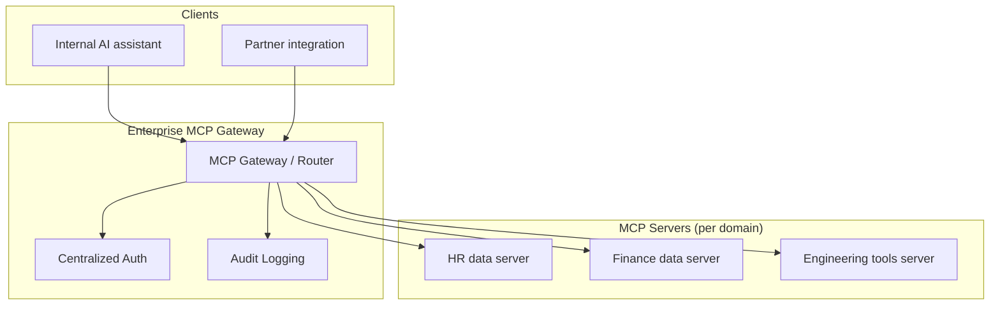

At enterprise scale, organizations commonly introduce a **gateway** layer in front of many
individual MCP servers: centralized authentication/authorization (so each domain server
doesn't reimplement its own auth), audit logging of every tool call for compliance, and
per-tenant/per-team access control over which servers and tools a given client can reach.
This mirrors the API gateway pattern from conventional microservice architectures - MCP
servers are, functionally, a specialized class of internal service, and benefit from the
same governance patterns. A gateway also gives you one place to enforce cross-cutting
policy - for example, blocking a specific tool company-wide during an incident - without
redeploying every individual domain server.

### 27.1 Governance responsibilities by layer

| Layer | Owns | Example |
|---|---|---|
| Gateway | AuthN/AuthZ, audit logging, cross-cutting policy | Blocking a compromised tool org-wide within minutes |
| Domain server | Business logic, data access, tool implementations | The HR server enforces field-level access rules for compensation data |
| Client/host application | User-facing confirmation flows, model selection | Prompting a user before a side-effecting HR action executes |

Splitting responsibilities this way means a security incident at one layer doesn't
require redesigning the others - the gateway can revoke access without any domain server
changing, and a domain server can tighten its own data rules without the gateway or any
client needing to know the details.

## 28. Best Practices

- **Log to stderr, never stdout, in stdio-based servers.**
- **Write tool descriptions for the model, not just for humans** - the model chooses
  which tool to call almost entirely based on the `name` and `description` text.
- **Keep tools narrow and specific** rather than one general-purpose "do anything" tool.
- **Validate every tool argument** against its schema before executing.
- **Return concise, structured tool output** - avoid dumping raw multi-KB API responses.
- **Require confirmation for side-effecting tools** (sending messages, deleting data,
  making purchases) at the host application layer.
- **Version your MCP server** - treat tool signature changes as breaking API changes.
- **Test with the reference client demo pattern** (Section 4) before wiring into a full
  agent - it isolates protocol bugs from application bugs.
- **Use OAuth 2.1 for any remote, multi-user server** - never ship an unauthenticated
  public HTTP MCP endpoint.
- **Cache deterministic, expensive tool calls** the same way you would any other API.

## 29. Common Mistakes (25+)

Nearly every item below traces back to one of three root causes: misunderstanding the
stdio transport's stdout constraint, under-specifying a tool's schema/description well
enough for a model to use it reliably, or skipping the same production-hardening steps
(auth, validation, rate limiting) that any other network-facing service requires. Keep
those three categories in mind and most new mistakes you encounter will slot into one of
them.

| # | Mistake | Fix |
|---|---|---|
| 1 | Logging to stdout in a stdio server | Log to stderr only |
| 2 | `get_prompt` returning a bare list instead of `GetPromptResult` | Wrap in `GetPromptResult(description=..., messages=[...])` |
| 3 | Comparing resource URIs as plain strings without `str()` conversion | The SDK passes `AnyUrl` objects; always `str(uri)` before comparing |
| 4 | Vague tool names/descriptions | Write descriptions the model can reliably act on, as detailed as an API doc |
| 5 | One giant "do anything" tool | Expose narrow, specific tools per action |
| 6 | No input validation on tool arguments | Validate against the schema and sane bounds before executing |
| 7 | Using `eval()` inside a tool implementation | Use an allow-listed, safe implementation per tool |
| 8 | Returning huge, unstructured tool output | Summarize/paginate; keep results concise and model-readable |
| 9 | No step/size limits on resource reads | Cap resource content size |
| 10 | Treating tool results as trusted instructions in the calling model's context | Frame tool output as data, not commands |
| 11 | Deploying a remote MCP server with no authentication | Require OAuth 2.1 or at minimum a bearer token |
| 12 | Side-effecting tools with no confirmation step | Require explicit user confirmation upstream |
| 13 | Forgetting the `initialize` handshake before other requests | Always initialize first; servers will reject premature requests |
| 14 | Mismatched JSON-RPC `id` handling (reusing IDs, dropping them on notifications) | Notifications never carry an `id`; requests must have unique in-flight IDs |
| 15 | Assuming all providers use identical tool schema field names | Adapt `parameters` vs. `input_schema` per provider (Sections 21-23) |
| 16 | No error handling in `call_tool` | Catch exceptions and return a structured error result, don't let the server crash |
| 17 | Embedding secrets in tool descriptions or resource content | Keep secrets server-side, referenced by ID/env var only |
| 18 | Not testing the server standalone before integrating into an agent | Use the minimal client demo (Section 4) first |
| 19 | Blocking synchronous I/O inside async tool handlers | Use async HTTP/DB clients throughout |
| 20 | No timeout on external API calls inside tools | Set explicit timeouts; a hung tool call blocks the whole agent turn |
| 21 | Ignoring capability negotiation | Check what the connected server actually supports before calling unsupported methods |
| 22 | Hardcoding a single transport assumption | Design servers to support both stdio (dev) and HTTP (prod) where practical |
| 23 | No versioning strategy for tool schemas | Treat breaking schema changes like breaking API changes - version explicitly |
| 24 | Running stateful logic in-process for a horizontally scaled HTTP server | Keep servers stateless; push state to shared storage (DB/Redis) |
| 25 | No rate limiting on a public MCP endpoint | Standard per-IP/per-token rate limiting, same as any public API |
| 26 | Confusing resources with tools (using a tool to "fetch," a resource to "act") | Resources are read-only context; tools perform actions - keep the distinction clean |
| 27 | Not handling the case where a tool call's arguments don't match the declared schema | Validate and return a clear JSON-RPC error rather than crashing |
| 28 | Assuming the client will retry on transient failures | Implement your own retry/backoff for calls the server makes to upstream services |

## 30. FAQ (40+)

**Q1. Is MCP an Anthropic-only technology?**
No - while Anthropic originated it, MCP is an open standard now used by clients and
servers from many organizations, not limited to Claude.

**Q2. Do I need MCP if I already have a working tool-calling loop?**
Not strictly - MCP's value is interoperability. Your own tools work fine without it; MCP
is what lets *other* applications (and other people) reuse them without custom
integration code.

**Q3. Can an MCP server call another MCP server?**
Yes - a server can itself act as a client to other servers, composing capabilities. This
is an advanced pattern, generally introduced once you have several domain-specific
servers you want to combine behind a single interface.

**Q4. What's the difference between a Tool and a Resource, really?**
A tool performs an action (and the model decides when to invoke it, with what arguments).
A resource is read-only, addressable-by-URI context - closer to a GET endpoint than a
function call.

**Q5. Why does my MCP client hang indefinitely?**
The overwhelmingly common cause is something writing to stdout inside a stdio-based
server (a stray `print()`, or a logger misconfigured to log to stdout) - this corrupts
the protocol stream. Check stderr-only logging first.

**Q6. Can MCP servers be written in languages other than Python?**
Yes - official and community SDKs exist for TypeScript, Python, and other languages.
The protocol itself (JSON-RPC over a transport) is language-agnostic.

**Q7. Is MCP only for local/desktop use?**
No - while stdio is common for local tools, the Streamable HTTP transport is designed
specifically for remote, multi-user deployments.

**Q8. How is MCP different from a plain REST API?**
MCP standardizes *discovery* (clients can enumerate what a server offers) and provides a
consistent primitive model (tools/resources/prompts) specifically shaped for AI model
consumption - a plain REST API has neither built in.

**Q9. Do I need to implement all three primitives (tools, resources, prompts)?**
No - implement only what your server actually needs. Many servers are tools-only.

**Q10. What happens if a client calls a method the server doesn't support?**
The server should return a JSON-RPC error (typically `-32601`, method not found), not
crash or hang.

**Q11. Can I test an MCP server without building a full client?**
Yes - the minimal client demo in Section 4 is exactly this: a small script that connects,
lists, and calls each primitive, ideal for isolated testing during development.

**Q12. Is authentication required for MCP?**
Only meaningfully for remote/HTTP servers with untrusted or multiple clients. Local
stdio servers rely on OS-level process trust instead.

**Q13. What's the `initialize` handshake actually negotiating?**
Protocol version compatibility and capability sets - so client and server agree on what
features (progress notifications, resource subscriptions, sampling, etc.) are actually in
play for this session.

**Q14. Can a server request the client's model to generate something (not just the other
way around)?**
Yes - this is the "sampling" capability: a server can ask the connected client to run a
completion using the client's model, useful for servers that need LLM reasoning as part
of fulfilling a request without holding their own API keys.

**Q15. How do I version an MCP server's tools without breaking existing clients?**
Treat it like any API: additive changes (new optional parameters, new tools) are usually
safe; renaming/removing tools or changing required parameters are breaking changes and
should be communicated/versioned explicitly.

**Q16. Is there a registry of public MCP servers?**
Community and vendor-maintained directories exist and are growing; always vet any
third-party MCP server before connecting to it, the same way you'd vet any dependency
with code-execution capability.

**Q17. Can MCP handle streaming tool results?**
The Streamable HTTP transport supports this via Server-Sent Events for longer-running or
incrementally-produced results; stdio transport delivers complete messages per exchange.

**Q18. What's the maximum practical size for a tool's response?**
Not strictly limited by the protocol, but practically: keep it small (well under what
would consume a large fraction of the model's context window) since the entire result
gets fed back into the conversation.

**Q19. Should resources support pagination?**
For large collections, yes - return a bounded page and a continuation mechanism rather
than the entire set at once.

**Q20. Can I expose a database directly as an MCP resource?**
Yes, commonly done - expose specific queries or record types as resources rather than raw
unrestricted database access, to keep the exposed surface intentional and auditable.

**Q21. Is MCP secure by default?**
No protocol is "secure by default" - MCP gives you the primitives (auth support,
capability negotiation) but you must implement authentication, input validation, and
confirmation flows for side-effecting tools yourself, as covered in Section 24.

**Q22. How do MCP tool calls differ from a provider's native function calling, from the
model's point of view?**
They don't, from the model's point of view - the model just sees tool definitions and
emits tool-call requests the same way regardless of whether the implementation behind
that tool happens to be local code or an MCP-routed call.

**Q23. Can I mix MCP tools and locally-implemented tools in the same agent?**
Yes - merge both into one combined tool list passed to the model; the model has no way to
distinguish their origin, and doesn't need to.

**Q24. What's the performance overhead of MCP vs. calling a function directly?**
For stdio, minimal (local IPC). For HTTP, the same overhead as any network API call -
plan for it the same way you would for any remote dependency.

**Q25. Do I need a special MCP-aware database?**
No - MCP servers can wrap any existing database or API; MCP doesn't require or provide
its own storage layer.

**Q26. Can non-AI applications use MCP?**
Technically the transport and message format are general-purpose, but MCP's primitives
(tools, resources, prompts) are specifically shaped around AI model consumption patterns
- it's not a general RPC framework replacement.

**Q27. How do I debug a failing MCP handshake?**
Capture the raw JSON-RPC traffic (Section 14) and check: is `jsonrpc: "2.0"` present? Are
IDs correctly matched? Is anything polluting stdout in a stdio server? Most handshake
failures are protocol-format bugs, not logic bugs.

**Q28. What Python version does the official `mcp` SDK require?**
Check the SDK's current documentation for the exact minimum, but modern releases
generally track recent Python 3.10+ features (async generators, structural pattern
matching in examples, etc.).

**Q29. Can an MCP server have zero tools and only resources?**
Yes - resource-only servers are common for pure "context provider" use cases (exposing a
knowledge base, a filesystem, or reference documentation).

**Q30. Is there a way to restrict which tools a given client/user can call?**
Yes, at the gateway/auth layer (Section 27) - associate permitted tool names with the
authenticated identity and filter `tools/list` and reject unauthorized `tools/call`
requests accordingly.

**Q31. How does MCP relate to OpenAI's "GPTs" or "plugins"?**
Conceptually similar goals (extending a model with external capabilities) but MCP is an
open, vendor-neutral protocol rather than a platform-specific extension mechanism tied to
one vendor's product.

**Q32. Should every internal tool in my company become an MCP server?**
Not necessarily - MCP's value is clearest when multiple AI applications (or external
partners) need to reuse the same tool. A tool used by exactly one internal application
may not need the protocol overhead of a standalone MCP server.

**Q33. Can MCP servers be stateful (e.g. maintain a session across calls)?**
The connection itself is stateful (one client, one server, one session), but individual
servers should generally keep *business logic* state external (in a database) rather than
in server-process memory, especially for horizontally-scaled HTTP deployments.

**Q34. What happens if two tools have the same name across different connected servers?**
This is a host/client-side concern - hosts typically namespace or otherwise disambiguate
tools from different connected servers so the model can distinguish them.

**Q35. Is JSON-RPC required, or can MCP use a different message format?**
JSON-RPC 2.0 is part of the MCP specification itself - it's not a swappable
implementation detail.

**Q36. How do I handle partial failures in a multi-tool agent turn?**
Return a structured error result for the failed tool call rather than crashing the whole
turn; let the model see the failure and decide how to proceed (retry, try a different
tool, or inform the user).

**Q37. Can I rate-limit individual tools differently within one server?**
Yes - nothing prevents per-tool rate limiting logic inside your `call_tool` handler,
keyed by tool name plus the authenticated identity.

**Q38. Does MCP support binary data (not just text)?**
Yes - content blocks can carry more than plain text (e.g. image content), depending on
what the client and server both support.

**Q39. What's the relationship between MCP and LangChain/other agent frameworks?**
They're complementary layers - a framework can use MCP as one of several ways to source
tools, the same way it might also support natively-defined tools.

**Q40. Is it safe to connect to a third-party MCP server I don't control?**
Treat it the same as installing any third-party dependency with code-execution or
data-access capability: review what it does, what data it can see, and what actions it
can take before connecting, especially for side-effecting tools.

**Q41. How mature is MCP as of this writing?**
Actively evolving - check the official specification for the current protocol version
and feature set before building anything you intend to keep long-term; details like the
authorization flow have changed between spec revisions.

**Q42. Can I connect the same MCP server to multiple different host applications at once?**
Yes - a server has no inherent limit on how many separate client connections it accepts
(subject to whatever concurrency limits you implement); each client maintains its own
independent session with the server.

**Q43. What should I do if a tool call takes longer than a user is willing to wait?**
Use progress notifications (Section 9) to keep the client informed during long-running
operations, and set a sane maximum timeout so a stuck upstream dependency doesn't hang
the entire agent turn indefinitely - return a clear timeout error instead.

**Q44. Do I need to rewrite my MCP server if I switch which LLM provider my application uses?**
No - this is precisely the interoperability MCP is designed to provide. The server's
tools, resources, and prompts stay identical; only the thin provider-format adapter
(Sections 21-23) changes, and typically that adapter code doesn't live inside the MCP
server at all, but in your host application's provider abstraction layer.

## 31. Learning Roadmap

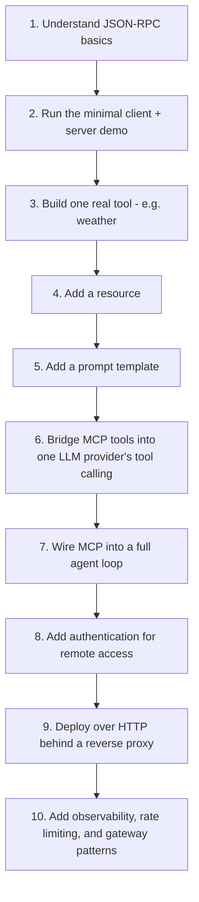

| Stage | Focus | Rough timeframe (part-time) |
|---|---|---|
| 1-3 | Protocol fundamentals, first working tool | 3-5 days |
| 4-6 | Resources, prompts, provider bridging | 3-5 days |
| 7-8 | Agent integration, auth | 1 week |
| 9-10 | Production deployment, governance | 1-2 weeks |

Build the minimal stdio server + client pair first (Sections 4-5) before anything else -
it's the fastest way to internalize the request/response/notification model that
underlies every other capability in this handbook. Everything from Section 15 onward is
an extension of that same core loop, not a different protocol.

### 31.1 A realistic first project

If you're looking for a concrete first project rather than an abstract exercise, build
the weather MCP server from Section 16 end-to-end: it touches every fundamental concept
(tool declaration, async external API calls, error handling, stderr-only logging) without
the added complexity of OAuth or a full agent loop. Once that works reliably through the
minimal client demo, move on to a resource-bearing server (Section 6) and then a
prompt-bearing one (Section 8) - by the time you've built one of each primitive from
scratch, the rest of this handbook's more advanced sections will read as natural
extensions rather than new concepts.

### 31.2 Closing summary

MCP is a small protocol wrapped around a big idea: that tool integrations should be
written once and reused everywhere, the same way HTTP made "a server that speaks a
standard protocol" more valuable than a server with its own bespoke wire format. Nothing
in this handbook requires memorization - the JSON-RPC shape, the three primitives, and
the stdio-vs-HTTP transport choice are the entire mental model, and every section from 15
onward is simply that same small model applied to a progressively more realistic
scenario. Build the minimal server, get it talking to the minimal client, and the rest
follows naturally.

---

*See also: [`AI_ASSISTANT_GUIDE.md`](AI_ASSISTANT_GUIDE.md) for the broader assistant
architecture MCP fits into, [`RAG_GUIDE.md`](RAG_GUIDE.md) for the retrieval pipeline
referenced in Section 19, and [`DEPLOYMENT_GUIDE.md`](DEPLOYMENT_GUIDE.md) for the full
production deployment checklist referenced in Section 26.*
