# RAG_GUIDE.md - The Complete Retrieval-Augmented Generation Handbook

**From First Principles to Production-Ready RAG Systems**

> This handbook teaches Retrieval-Augmented Generation (RAG) from zero prior knowledge to
> production deployment: embeddings, chunking, vector databases, retrieval and ranking
> strategies, and how to build and ship a real RAG pipeline with Python, LangChain, and
> FastAPI. Every code example is written to be directly adaptable to a real project -
> the chunking, embedding, and retrieval functions shown here are the same shape as a
> production-tested implementation, not simplified toy versions that fall apart on real
> documents. Companion documents: [`AI_ASSISTANT_GUIDE.md`](AI_ASSISTANT_GUIDE.md) for the
> broader assistant architecture RAG fits into, and [`MCP_GUIDE.md`](MCP_GUIDE.md) for
> exposing a RAG pipeline as a standardized tool.

---

## Table of Contents

1. [What is RAG?](#1-what-is-rag)
2. [Why RAG Exists](#2-why-rag-exists)
3. [Embeddings](#3-embeddings)
4. [Chunking](#4-chunking)
5. [Vector Databases](#5-vector-databases)
6. [Retrieval](#6-retrieval)
7. [Ranking](#7-ranking)
8. [Re-ranking](#8-re-ranking)
9. [Metadata](#9-metadata)
10. [Semantic Search](#10-semantic-search)
11. [Hybrid Search](#11-hybrid-search)
12. [Chroma](#12-chroma)
13. [Pinecone](#13-pinecone)
14. [Qdrant](#14-qdrant)
15. [LangChain](#15-langchain)
16. [FastAPI Integration](#16-fastapi-integration)
17. [OpenAI Integration](#17-openai-integration)
18. [Enterprise RAG Architecture](#18-enterprise-rag-architecture)
19. [Performance Optimization](#19-performance-optimization)
20. [Cost Optimization](#20-cost-optimization)
21. [Security](#21-security)
22. [Production Deployment](#22-production-deployment)
23. [Common Mistakes (30+)](#23-common-mistakes-30)
24. [FAQ (40+)](#24-faq-40)
25. [Best Practices](#25-best-practices)
26. [Learning Roadmap](#26-learning-roadmap)

---

## 1. What is RAG?

**Retrieval-Augmented Generation (RAG)** is a technique for grounding an LLM's answers in
specific external documents, retrieved at query time, rather than relying purely on what
the model learned during training. Instead of asking the model to answer from memory, you
first *retrieve* the most relevant pieces of your own data, then *generate* an answer that
cites and is constrained by that retrieved content.

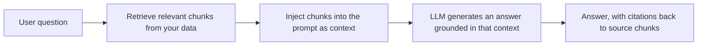

The name describes the two-stage pipeline exactly: **Retrieval** (find relevant
information) followed by **Augmented Generation** (the model generates using that
information as additional context, augmenting what it already knows). Nothing about RAG
requires a specific vector database or embedding model - those are implementation
choices, not part of the definition. The one non-negotiable property of any RAG system is
that the model's answer is *conditioned on retrieved, verifiable content*, which is what
makes citations possible and hallucination less likely (though never impossible).

## 2. Why RAG Exists

LLMs have three structural limitations RAG directly addresses. These aren't minor
inconveniences worked around with clever prompting - they're inherent to how a language
model is trained and deployed, and no amount of prompt engineering alone can fully
overcome them without changing what information the model has access to at generation
time.

| Limitation | How RAG helps |
|---|---|
| **Training cutoff** - the model knows nothing past its training data | Retrieval pulls in current information at query time |
| **No access to private/proprietary data** - the model was never trained on your documents | Retrieval indexes and searches your own data |
| **Hallucination on unfamiliar topics** - the model may confidently invent plausible-sounding but false details | Grounding answers in retrieved text with citations lets users verify claims, and reduces (not eliminates) fabrication |

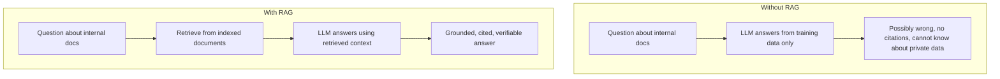

### 2.1 RAG vs. fine-tuning

A frequent point of confusion: RAG and fine-tuning solve different problems and are often
complementary, not competing choices.

| | RAG | Fine-tuning |
|---|---|---|
| Updates knowledge by | Re-indexing documents (fast, cheap) | Retraining weights (slower, costlier) |
| Best for | Facts that change, need attribution, or are private | Style, tone, task-specific behavior patterns |
| Explainability | High - shows source chunks | Low - knowledge is baked into weights, unverifiable |
| Cost to update | Low - just re-embed changed documents | High - requires a training run |
| Typical latency added | Retrieval step adds tens to hundreds of ms | None at inference time |

Use RAG when the answer depends on specific, current, or proprietary facts. Use
fine-tuning when you need to change *how* the model behaves (tone, format adherence,
domain-specific reasoning patterns) rather than *what* it knows. Many mature production
systems eventually use both together: RAG for grounding factual answers in current data,
and a lightly fine-tuned model for consistent tone, output formatting, or domain-specific
reasoning style - the two techniques address genuinely different axes of model behavior
and are not mutually exclusive choices.

## 3. Embeddings

An **embedding** is a fixed-length vector of numbers that represents the meaning of a
piece of text, such that semantically similar text produces similar vectors. This is the
mathematical foundation that makes semantic search possible.

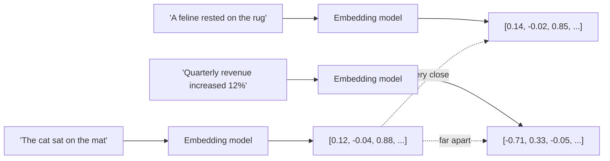

```python
from openai import AsyncOpenAI

async def embed_texts(texts: list[str], model: str = "text-embedding-3-small") -> list[list[float]]:
    client = AsyncOpenAI(api_key=OPENAI_API_KEY)
    resp = await client.embeddings.create(model=model, input=texts)
    return [d.embedding for d in resp.data]
```

### 3.1 Comparing embedding options

| Model | Dimensions | Cost profile | Notes |
|---|---|---|---|
| OpenAI `text-embedding-3-small` | 1536 (configurable) | Low cost, strong general quality | Good default for most projects |
| OpenAI `text-embedding-3-large` | 3072 (configurable) | Higher cost, higher quality | Worth it for demanding retrieval tasks |
| Cohere `embed-v3` | 1024 | Competitive pricing, strong multilingual | Good for non-English corpora |
| Open-source (sentence-transformers, e.g. `all-MiniLM-L6-v2`) | 384 | Free, runs locally, no API key needed | Lower quality than commercial models, but zero marginal cost and full data privacy |
| Local hashing embedding (fallback) | Configurable | Free, deterministic, no model at all | Lowest quality; useful only as a zero-dependency fallback |

```python
# A minimal local fallback embedding - useful for demos with zero API keys,
# not a substitute for a real embedding model in production.
import hashlib
import numpy as np

def hash_embedding(text: str, dim: int = 384) -> list[float]:
    vec = np.zeros(dim, dtype=np.float32)
    for token in text.lower().split():
        h = int(hashlib.md5(token.encode()).hexdigest(), 16)
        vec[h % dim] += 1.0
    norm = np.linalg.norm(vec)
    return (vec / norm if norm else vec).tolist()
```

### 3.2 Cosine similarity

Once you have vectors, comparing them is simple arithmetic - cosine similarity measures
the angle between two vectors, ranging from -1 (opposite) to 1 (identical direction),
independent of vector magnitude:

```python
import numpy as np

def cosine_similarity(a: list[float], b: list[float]) -> float:
    va, vb = np.array(a), np.array(b)
    denom = (np.linalg.norm(va) * np.linalg.norm(vb)) or 1e-9
    return float(np.dot(va, vb) / denom)
```

**Critical rule:** never mix embeddings from different models in the same similarity
comparison. A vector from `text-embedding-3-small` and one from a sentence-transformers
model live in entirely different vector spaces - comparing them produces meaningless
numbers, not just lower-quality ones.

## 4. Chunking

Documents must be split into smaller pieces ("chunks") before embedding, both because
embedding models have input length limits and because retrieval precision improves when
each chunk represents one coherent idea rather than an entire document.

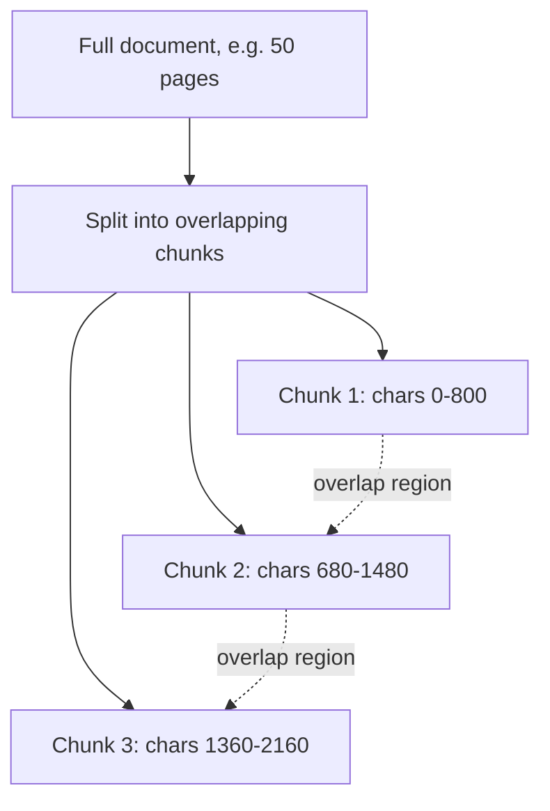

```python
def chunk_text(text: str, size: int = 800, overlap: int = 120) -> list[str]:
    text = " ".join(text.split())  # normalize whitespace
    if not text:
        return []
    chunks, start = [], 0
    while start < len(text):
        end = min(start + size, len(text))
        chunks.append(text[start:end])
        if end == len(text):
            break
        start = end - overlap
    return chunks
```

### 4.1 Chunking strategy comparison

| Strategy | How it works | Pros | Cons |
|---|---|---|---|
| Fixed-size, character-based | Split every N characters with overlap | Simple, predictable, fast | Can split mid-sentence or mid-idea |
| Fixed-size, token-based | Split every N tokens (using the actual tokenizer) | Respects the model's real unit of context | Slightly more implementation overhead |
| Sentence-aware | Split on sentence boundaries, group into target size | Avoids mid-sentence splits | Requires a sentence segmenter |
| Semantic/structural | Split on headings, paragraphs, or detected topic shifts | Chunks align with actual document structure | More complex, sometimes uneven chunk sizes |
| Recursive (LangChain's default) | Try large separators first (paragraphs), fall back to smaller ones (sentences, words) | Good general-purpose balance | Still heuristic, not perfect |

```python
# LangChain's recursive splitter - a strong general-purpose default
from langchain.text_splitter import RecursiveCharacterTextSplitter

splitter = RecursiveCharacterTextSplitter(
    chunk_size=800,
    chunk_overlap=120,
    separators=["\n\n", "\n", ". ", " ", ""],
)
chunks = splitter.split_text(document_text)
```

### 4.2 Choosing chunk size

| Chunk size | Retrieval precision | Context preserved | Best for |
|---|---|---|---|
| Small (200-400 chars) | High - very targeted matches | Low - may lose surrounding context | FAQ-style content, short factual snippets |
| Medium (600-1000 chars) | Balanced | Balanced | General-purpose documents - most common default |
| Large (1500+ chars) | Lower - dilutes relevance scoring | High - preserves full context | Long-form narrative content, legal/contract text |

There is no universally correct chunk size - tune it against your actual documents and
representative queries, not against a rule of thumb alone.

### 4.3 Chunking by document type

Different document types benefit from different chunking approaches - a one-size-fits-all
splitter applied uniformly across a heterogeneous corpus is a common source of mediocre
retrieval quality:

| Document type | Recommended approach |
|---|---|
| Long-form prose (articles, reports) | Recursive splitter respecting paragraph boundaries, medium chunk size |
| Structured docs (manuals, wikis with headings) | Split on heading boundaries first, so each chunk stays within one section's topic |
| Code files | Split by function/class boundaries using a language-aware parser, not raw character count |
| Chat/support transcripts | Split by conversation turn or thread, preserving speaker context |
| Tables/spreadsheets | Convert to a structured text representation (e.g. one row = one chunk with column headers repeated) rather than naive character splitting, which fragments rows unpredictably |
| Legal/contract text | Larger chunks with generous overlap - clauses often depend heavily on surrounding context |

```python
def chunk_by_headings(markdown_text: str) -> list[str]:
    """Split on markdown headings so each chunk stays within one logical section."""
    import re
    sections = re.split(r"(?=^#{1,3}\s)", markdown_text, flags=re.MULTILINE)
    return [s.strip() for s in sections if s.strip()]
```

## 5. Vector Databases

A **vector database** stores embeddings alongside their source text/metadata and provides
efficient similarity search - critical once your document collection is too large for a
naive linear scan of every stored vector to stay fast.

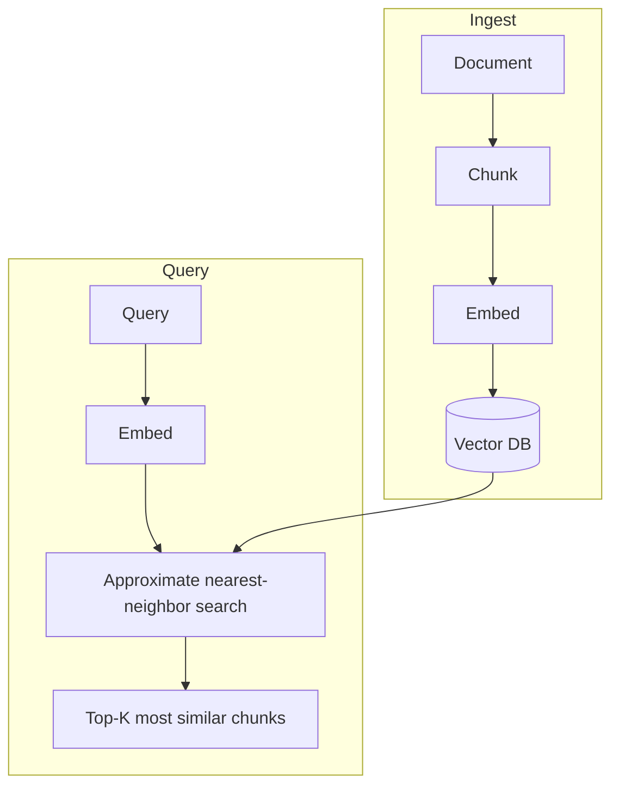

### 5.1 Why not just linear scan?

For small collections (thousands of chunks), computing cosine similarity against every
stored vector in application code is perfectly fine and requires no extra infrastructure.
Vector databases earn their complexity once you need **approximate nearest-neighbor
(ANN)** indexing - data structures (like HNSW graphs) that make similarity search
sub-linear, trading a small amount of recall accuracy for large speed gains at scale.

| Collection size | Recommended approach |
|---|---|
| Under ~10,000 chunks | Linear scan in application code (SQLite + numpy) is fine |
| 10,000-1,000,000 chunks | A dedicated vector database becomes worthwhile |
| 1,000,000+ chunks | A dedicated vector database is close to mandatory for acceptable latency |

### 5.2 How approximate nearest-neighbor search actually works

Understanding the mechanism, even briefly, makes vector database configuration options
far less mysterious. The dominant approach in modern vector databases is **HNSW**
(Hierarchical Navigable Small World graphs):

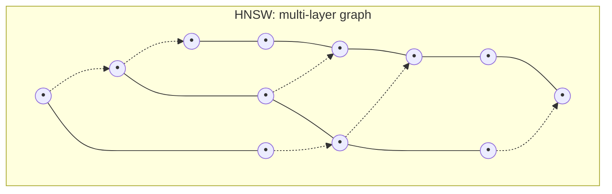

Rather than comparing a query against every stored vector, HNSW organizes vectors into a
layered graph: sparse "highway" layers for coarse, fast navigation, and denser layers for
fine-grained search near the target. A query starts at the sparse top layer, quickly
narrows to the right neighborhood, then descends through progressively denser layers -
similar to how you'd navigate a country, then a city, then a street, rather than checking
every address in the country one by one. This is what makes search sub-linear: query time
grows roughly logarithmically with collection size rather than linearly.

| Parameter | Trade-off |
|---|---|
| `ef_construction` (build-time) | Higher = better graph quality, slower indexing |
| `ef_search` (query-time) | Higher = better recall, slower queries |
| `M` (max connections per node) | Higher = better recall, more memory usage |

The practical implication: ANN search trades a small amount of recall (it may
occasionally miss the true nearest neighbor) for large speed gains - "approximate" is not
a bug, it's the entire point. Most applications never notice the accuracy trade-off; it
becomes relevant only in domains where missing the single best match has real
consequences (e.g. legal or medical retrieval), where tuning `ef_search` upward is the
usual mitigation.

## 6. Retrieval

Retrieval is the act of finding the most relevant chunks for a given query. The simplest
and most common form is **semantic (vector) retrieval**: embed the query, compare against
stored chunk embeddings, return the top-K matches.

```python
async def semantic_search(
    db, query: str, document_ids: list[str] | None, top_k: int = 5
) -> list[dict]:
    chunks = await fetch_candidate_chunks(db, document_ids)
    if not chunks:
        return []

    query_embedding = (await embed_texts([query]))[0]
    scored = [
        {
            "chunk_id": c.id,
            "document_id": c.document_id,
            "content": c.content,
            "score": cosine_similarity(query_embedding, c.embedding),
        }
        for c in chunks
    ]
    scored.sort(key=lambda x: x["score"], reverse=True)
    return scored[:top_k]
```

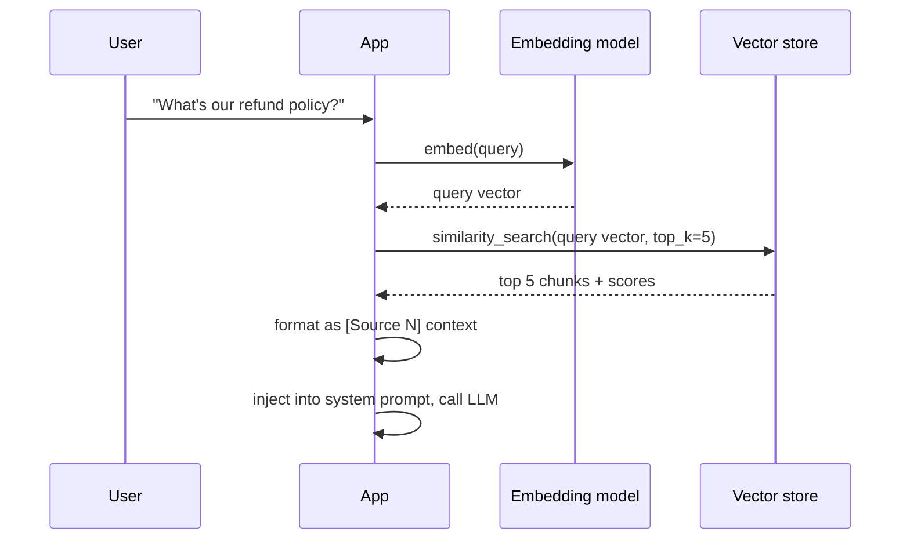

## 7. Ranking

**Ranking** is simply ordering retrieved candidates by relevance score before deciding
which ones to use. With pure vector search, the ranking signal is cosine similarity (or
an equivalent distance metric) - but similarity to the query embedding is not the only
signal worth considering.

| Ranking signal | What it captures |
|---|---|
| Vector similarity | Semantic closeness to the query |
| Keyword/exact match | Precision on specific terms, codes, names embeddings may blur |
| Recency | Newer documents may be more relevant for time-sensitive queries |
| Source authority | Some documents (official policy) may deserve priority over others (a draft) |
| User/document popularity | Frequently-referenced content may be more broadly useful |

```python
def combine_scores(vector_score: float, recency_boost: float, authority_boost: float) -> float:
    """A simple weighted combination - tune weights against real query/relevance data."""
    return (0.7 * vector_score) + (0.2 * recency_boost) + (0.1 * authority_boost)
```

### 7.1 Measuring retrieval quality

You cannot reliably tune chunk size, top-K, or ranking weights without a way to measure
whether changes actually help. Build a small golden dataset - representative queries with
manually identified relevant chunks - and compute standard retrieval metrics against it:

```python
def recall_at_k(retrieved_ids: list[str], relevant_ids: set[str], k: int) -> float:
    """What fraction of truly relevant chunks appear in the top K retrieved?"""
    top_k_ids = set(retrieved_ids[:k])
    if not relevant_ids:
        return 1.0
    return len(top_k_ids & relevant_ids) / len(relevant_ids)

def precision_at_k(retrieved_ids: list[str], relevant_ids: set[str], k: int) -> float:
    """Of the top K retrieved, what fraction are actually relevant?"""
    top_k_ids = retrieved_ids[:k]
    if not top_k_ids:
        return 0.0
    hits = sum(1 for i in top_k_ids if i in relevant_ids)
    return hits / len(top_k_ids)

async def evaluate_retrieval(golden_set: list[dict], top_k: int = 5) -> dict:
    """golden_set: [{"query": str, "relevant_chunk_ids": set[str]}, ...]"""
    recalls, precisions = [], []
    for item in golden_set:
        results = await semantic_search(db, item["query"], None, top_k=top_k)
        retrieved_ids = [r["chunk_id"] for r in results]
        recalls.append(recall_at_k(retrieved_ids, item["relevant_chunk_ids"], top_k))
        precisions.append(precision_at_k(retrieved_ids, item["relevant_chunk_ids"], top_k))
    return {
        "avg_recall_at_k": sum(recalls) / len(recalls),
        "avg_precision_at_k": sum(precisions) / len(precisions),
    }
```

Run this evaluation before and after any change to chunking, embedding model, or ranking
logic - "it feels better" is not a substitute for a measured recall/precision delta, and
changes that feel like improvements on a handful of manual spot-checks sometimes make the
golden-set numbers worse. Treat this evaluation function as a first-class part of your
codebase, not a throwaway script - check it into version control alongside the retrieval
code it tests, and re-run it as part of your normal test suite whenever chunking,
embedding, or ranking logic changes, exactly as you would for any other regression test.

## 8. Re-ranking

**Re-ranking** is a second-pass refinement: retrieve a larger candidate set cheaply
(e.g. top 20-50 by vector similarity), then apply a more expensive, more accurate model
to re-score and reorder just those candidates down to the final top-K actually used.

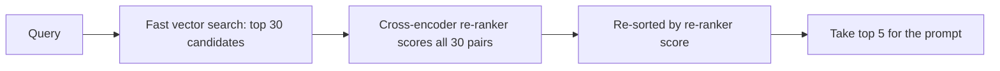

```python
from sentence_transformers import CrossEncoder

reranker = CrossEncoder("cross-encoder/ms-marco-MiniLM-L-6-v2")

def rerank(query: str, candidates: list[dict], top_k: int = 5) -> list[dict]:
    pairs = [(query, c["content"]) for c in candidates]
    scores = reranker.predict(pairs)
    for c, score in zip(candidates, scores):
        c["rerank_score"] = float(score)
    return sorted(candidates, key=lambda c: c["rerank_score"], reverse=True)[:top_k]
```

**Why bother with two stages?** Vector similarity (bi-encoder) is fast because query and
document embeddings are computed independently, but this independence loses some
precision. A cross-encoder re-ranker looks at the query and each candidate *together*,
producing a much more accurate relevance score - but it's too slow to run against your
entire corpus. Combining both - cheap broad retrieval, then expensive precise re-ranking
on a small candidate set - gets you the speed of one and the accuracy of the other.

| Approach | Speed | Accuracy | When to use |
|---|---|---|---|
| Vector search only | Fast | Good | Most applications, especially at scale |
| Vector search + re-ranking | Slower (extra pass) | Better | High-stakes retrieval where precision matters most |
| Re-ranking only (no vector pre-filter) | Very slow | Best possible | Impractical except on tiny corpora |

## 9. Metadata

Every chunk should carry metadata beyond its raw text - this enables filtering,
attribution, and access control that pure semantic similarity can't provide on its own.

```python
@dataclass
class ChunkMetadata:
    document_id: str
    document_title: str
    chunk_index: int
    source_url: str | None
    created_at: datetime
    owner_user_id: str
    tags: list[str]
    access_level: str  # e.g. "public", "internal", "restricted"
```

```python
async def semantic_search_with_filters(
    db, query: str, user_id: str, tags: list[str] | None = None, top_k: int = 5
) -> list[dict]:
    # Filter candidates by access control and metadata BEFORE scoring -
    # never rely on the LLM to "politely ignore" content it shouldn't have seen.
    candidates = await fetch_chunks_filtered(
        db, accessible_to=user_id, tags=tags
    )
    query_embedding = (await embed_texts([query]))[0]
    scored = [
        {**c, "score": cosine_similarity(query_embedding, c["embedding"])}
        for c in candidates
    ]
    scored.sort(key=lambda x: x["score"], reverse=True)
    return scored[:top_k]
```

> ⚠️ **Security-critical:** access control must be enforced as a **pre-filter** on which
> chunks are even eligible for retrieval - never as a post-hoc instruction to the model
> ("don't share restricted content"). Once restricted text is in the model's context, you
> are relying on the model to keep a secret, which is not a security boundary.

### 9.1 Metadata filtering across different vector databases

The concept is universal - narrow the candidate set by structured attributes before or
during similarity scoring - but the exact syntax varies by database:

```python
# Chroma
collection.query(query_embeddings=[qv], n_results=5, where={"access_level": "public"})

# Pinecone
index.query(vector=qv, top_k=5, filter={"access_level": {"$eq": "public"}})

# Qdrant
from qdrant_client.models import Filter, FieldCondition, MatchValue
client.search(
    collection_name="documents", query_vector=qv, limit=5,
    query_filter=Filter(must=[FieldCondition(key="access_level", match=MatchValue(value="public"))]),
)
```

Common metadata fields worth indexing on nearly every RAG system: `owner_user_id` or
`tenant_id` (access control), `access_level` (public/internal/restricted), `created_at`
and `updated_at` (recency ranking and staleness detection), `source_type` (PDF, wiki
page, ticket - useful for filtering by document category), and `document_id` (so an
entire document's chunks can be excluded/included as a unit, e.g. when a document is
deleted).

## 10. Semantic Search

Semantic search is retrieval based on *meaning* rather than exact keyword matching - the
core capability embeddings provide. It excels at queries phrased differently than the
source text ("how do I get my money back" matching a document that says "refund policy")
but can underperform on queries requiring exact matches: product codes, error codes,
proper nouns, or acronyms an embedding model may not represent distinctly.

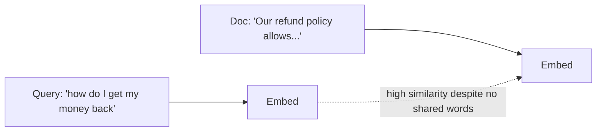

| Query type | Semantic search performance |
|---|---|
| Natural language questions | Strong |
| Paraphrased/synonym-heavy queries | Strong |
| Exact product/error codes | Weak - embeddings blur precise tokens |
| Proper nouns, rare terms | Variable - depends on the embedding model's training data |
| Numeric/date-specific lookups | Weak - better served by structured metadata filters |

## 11. Hybrid Search

**Hybrid search** combines semantic (vector) search with traditional keyword search
(e.g. BM25), then merges the results - capturing both "finds paraphrases" and "finds
exact terms," which neither approach handles well alone.

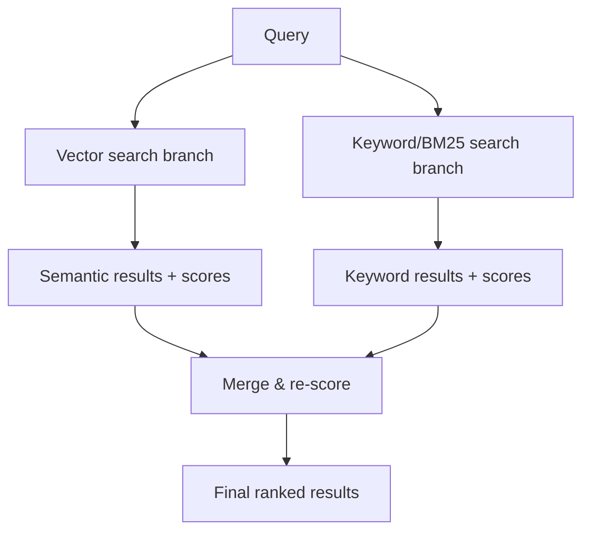

```python
from rank_bm25 import BM25Okapi

class HybridSearcher:
    def __init__(self, chunks: list[dict]):
        self.chunks = chunks
        tokenized = [c["content"].lower().split() for c in chunks]
        self.bm25 = BM25Okapi(tokenized)

    async def search(self, query: str, top_k: int = 5, alpha: float = 0.5) -> list[dict]:
        # alpha weights semantic vs. keyword: 1.0 = pure semantic, 0.0 = pure keyword
        query_embedding = (await embed_texts([query]))[0]
        semantic_scores = [
            cosine_similarity(query_embedding, c["embedding"]) for c in self.chunks
        ]
        keyword_scores = self.bm25.get_scores(query.lower().split())

        # Normalize both score sets to [0, 1] before combining
        sem_norm = _normalize(semantic_scores)
        kw_norm = _normalize(keyword_scores)

        combined = [
            {**c, "score": alpha * s + (1 - alpha) * k}
            for c, s, k in zip(self.chunks, sem_norm, kw_norm)
        ]
        combined.sort(key=lambda x: x["score"], reverse=True)
        return combined[:top_k]

def _normalize(scores: list[float]) -> list[float]:
    lo, hi = min(scores), max(scores)
    span = (hi - lo) or 1e-9
    return [(s - lo) / span for s in scores]
```

| Search type | Strong at | Weak at |
|---|---|---|
| Pure semantic | Paraphrases, conceptual queries | Exact codes, rare/unseen terms |
| Pure keyword (BM25) | Exact terms, codes, proper nouns | Paraphrases, synonyms, conceptual matches |
| Hybrid | Both, tunable via the alpha weight | Slightly more implementation and tuning complexity |

## 12. Chroma

**Chroma** is an open-source, embedded-first vector database - easy to run locally with
no separate server process, a good starting point for prototyping.

```python
import chromadb

client = chromadb.PersistentClient(path="./chroma_data")
collection = client.get_or_create_collection("documents")

def add_chunks(chunks: list[str], embeddings: list[list[float]], ids: list[str], metadatas: list[dict]):
    collection.add(documents=chunks, embeddings=embeddings, ids=ids, metadatas=metadatas)

def query_chroma(query_embedding: list[float], top_k: int = 5, where: dict | None = None):
    results = collection.query(query_embeddings=[query_embedding], n_results=top_k, where=where)
    return [
        {"content": doc, "metadata": meta, "distance": dist}
        for doc, meta, dist in zip(
            results["documents"][0], results["metadatas"][0], results["distances"][0]
        )
    ]
```

## 13. Pinecone

**Pinecone** is a fully-managed cloud vector database - no infrastructure to run
yourself, built for production scale.

```python
from pinecone import Pinecone, ServerlessSpec

pc = Pinecone(api_key=PINECONE_API_KEY)

if "documents" not in pc.list_indexes().names():
    pc.create_index(
        name="documents",
        dimension=1536,
        metric="cosine",
        spec=ServerlessSpec(cloud="aws", region="us-east-1"),
    )

index = pc.Index("documents")

def upsert_chunks(ids: list[str], embeddings: list[list[float]], metadatas: list[dict]):
    vectors = [
        {"id": i, "values": e, "metadata": m} for i, e, m in zip(ids, embeddings, metadatas)
    ]
    index.upsert(vectors=vectors)

def query_pinecone(query_embedding: list[float], top_k: int = 5, filter: dict | None = None):
    results = index.query(vector=query_embedding, top_k=top_k, include_metadata=True, filter=filter)
    return [{"content": m["metadata"]["content"], "score": m["score"]} for m in results["matches"]]
```

## 14. Qdrant

**Qdrant** is an open-source vector database offering both a managed cloud option and
straightforward self-hosting - a middle ground between Chroma's simplicity and
Pinecone's fully-managed model.

```python
from qdrant_client import QdrantClient
from qdrant_client.models import Distance, VectorParams, PointStruct

client = QdrantClient(url="http://localhost:6333")

client.recreate_collection(
    collection_name="documents",
    vectors_config=VectorParams(size=1536, distance=Distance.COSINE),
)

def upsert_chunks(ids: list[int], embeddings: list[list[float]], payloads: list[dict]):
    points = [
        PointStruct(id=i, vector=e, payload=p) for i, e, p in zip(ids, embeddings, payloads)
    ]
    client.upsert(collection_name="documents", points=points)

def query_qdrant(query_embedding: list[float], top_k: int = 5, query_filter: dict | None = None):
    results = client.search(
        collection_name="documents", query_vector=query_embedding, limit=top_k, query_filter=query_filter
    )
    return [{"content": r.payload["content"], "score": r.score} for r in results]
```

### 14.1 Vector database comparison

| | Chroma | Pinecone | Qdrant | pgvector (Postgres extension) |
|---|---|---|---|---|
| Hosting model | Self-hosted / embedded | Fully managed cloud only | Self-hosted or managed cloud | Self-hosted (in your existing Postgres) |
| Setup complexity | Very low | Low (just an API key) | Low-medium | Low if you already run Postgres |
| Scale ceiling | Good for small/medium | Very high, built for scale | High | Good for small/medium, scales with Postgres |
| Cost model | Free (self-hosted compute only) | Usage-based subscription | Free self-hosted, or usage-based cloud | Free (part of your existing DB) |
| Best fit | Prototyping, small projects | Production at scale, minimal ops burden | Production with self-hosting preference | Teams already invested in Postgres |

### 14.2 Choosing a vector database

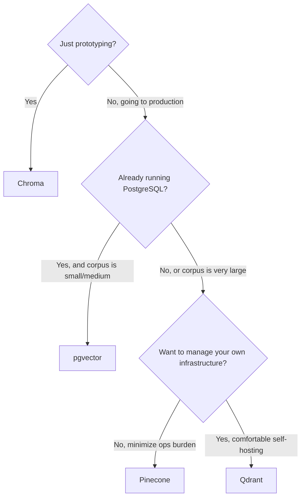

This decision is rarely permanent - many teams start with Chroma for velocity, then
migrate to a production-grade option once they have real usage data about their scale and
operational preferences. Because the core pipeline (chunk -> embed -> store -> search) is
the same regardless of backend, migrating later mainly means re-implementing the thin
`upsert`/`search` adapter shown in Section 22.1, not rewriting your application logic.

## 15. LangChain

LangChain provides pre-built abstractions over the entire RAG pipeline - useful for rapid
prototyping, at the cost of an additional abstraction layer to understand and debug.

```python
from langchain_openai import OpenAIEmbeddings, ChatOpenAI
from langchain_community.vectorstores import Chroma
from langchain.text_splitter import RecursiveCharacterTextSplitter
from langchain.chains import RetrievalQA

# 1. Load and split documents
splitter = RecursiveCharacterTextSplitter(chunk_size=800, chunk_overlap=120)
chunks = splitter.split_text(raw_document_text)

# 2. Embed and store
embeddings = OpenAIEmbeddings(model="text-embedding-3-small")
vectorstore = Chroma.from_texts(chunks, embedding=embeddings, persist_directory="./chroma_data")

# 3. Build a retrieval QA chain
llm = ChatOpenAI(model="gpt-4o-mini", temperature=0)
qa_chain = RetrievalQA.from_chain_type(
    llm=llm,
    retriever=vectorstore.as_retriever(search_kwargs={"k": 5}),
    return_source_documents=True,
)

result = qa_chain.invoke({"query": "What is our refund policy?"})
print(result["result"])
for doc in result["source_documents"]:
    print("Source:", doc.metadata)
```

**When to reach for LangChain vs. hand-rolling:** LangChain's abstractions genuinely
speed up prototyping and give you battle-tested implementations of chunking, retrieval,
and chain composition. The trade-off is an extra dependency and abstraction layer between
you and the underlying API calls, which can make debugging subtly wrong retrieval
behavior harder. Many production RAG systems (including the reference implementation in
[`AI_ASSISTANT_GUIDE.md`](AI_ASSISTANT_GUIDE.md#14-rag-integration)) implement the
pipeline directly for exactly this reason - full control and transparency. Choose based
on whether you value velocity (LangChain) or transparency and minimal dependencies
(direct implementation) more for your specific project.

A pragmatic middle ground many teams land on: prototype with LangChain to validate the
approach quickly, then selectively replace the pieces that need the most tuning (usually
chunking strategy and retrieval scoring) with direct implementations once you understand
your data well enough to know exactly what those pieces need to do - keeping LangChain
only where its abstractions genuinely save meaningful effort, such as document loaders
for uncommon file formats.

## 16. FastAPI Integration

A complete, production-shaped RAG endpoint set: upload, background ingestion, and query.

```python
from fastapi import APIRouter, BackgroundTasks, Depends, HTTPException, UploadFile
from pydantic import BaseModel

router = APIRouter(prefix="/api/documents")

class RagQuery(BaseModel):
    query: str
    top_k: int = 5

@router.post("/upload")
async def upload_document(
    file: UploadFile, background_tasks: BackgroundTasks, user=Depends(get_current_user), db=Depends(get_db)
):
    content = await file.read()
    document = await save_document_record(db, user.id, file.filename, content)
    # Ingest asynchronously so the upload response doesn't block on embedding calls
    background_tasks.add_task(ingest_document_task, document.id)
    return {"id": document.id, "status": "processing"}

@router.post("/query")
async def query_documents(payload: RagQuery, user=Depends(get_current_user), db=Depends(get_db)):
    results = await semantic_search_with_filters(db, payload.query, user.id, top_k=payload.top_k)
    if not results:
        return {"results": [], "message": "No relevant documents found."}
    return {"results": results}

async def ingest_document_task(document_id: str):
    async with AsyncSessionLocal() as db:
        document = await get_document(db, document_id)
        try:
            text = extract_text(document.file_path, document.file_type)
            chunks = chunk_text(text)
            embeddings = await embed_texts(chunks)
            await store_chunks(db, document_id, chunks, embeddings)
            document.status = "ready"
        except Exception:
            document.status = "error"
        await db.commit()
```

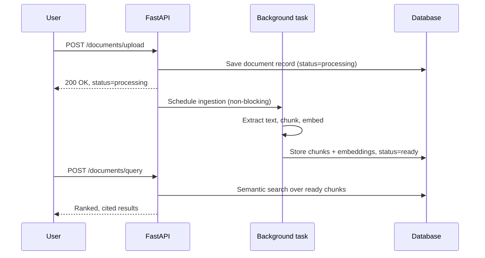

**Why background ingestion?** Embedding a large document can take several seconds to
minutes. Blocking the upload HTTP response on that work produces a poor user experience
and risks request timeouts - return immediately with a `processing` status, and let the
client poll or receive a notification when ingestion completes.

## 17. OpenAI Integration

Putting it together: retrieval feeding directly into a chat completion, with citations.

```python
async def answer_with_rag(query: str, user_id: str, db, provider_name: str = "openai") -> dict:
    results = await semantic_search_with_filters(db, query, user_id, top_k=5)

    if not results:
        context_block = ""
    else:
        context_block = "\n\n# Retrieved context (cite as [Source N])\n" + "\n\n".join(
            f"[Source {i+1} | score {r['score']:.2f}]\n{r['content']}"
            for i, r in enumerate(results)
        )

    system_prompt = (
        "You are a helpful assistant. Answer using the retrieved context when relevant, "
        "and cite sources as [Source N]. If the context doesn't contain the answer, say so "
        "rather than guessing." + context_block
    )

    client = AsyncOpenAI(api_key=OPENAI_API_KEY)
    resp = await client.chat.completions.create(
        model="gpt-4o-mini",
        messages=[
            {"role": "system", "content": system_prompt},
            {"role": "user", "content": query},
        ],
    )
    return {"answer": resp.choices[0].message.content, "sources": results}
```

**Best practice:** explicitly instruct the model to say when the retrieved context
doesn't answer the question, rather than falling back silently to its own trained
knowledge - this preserves the trustworthiness guarantee that makes RAG valuable in the
first place. A RAG system that quietly answers from parametric memory when retrieval
comes up empty defeats the purpose of building it.

The same `answer_with_rag` pattern works essentially unchanged against Anthropic's Claude
or Google's Gemini - swap the provider call for the equivalent SDK method and keep the
context-building logic (retrieval, filtering, citation formatting) exactly as written.
This is the same provider-abstraction principle covered in
[`AI_ASSISTANT_GUIDE.md`](AI_ASSISTANT_GUIDE.md#3-modern-ai-assistant-architecture): the
retrieval pipeline should never need to know or care which model ultimately consumes its
output.

## 18. Enterprise RAG Architecture

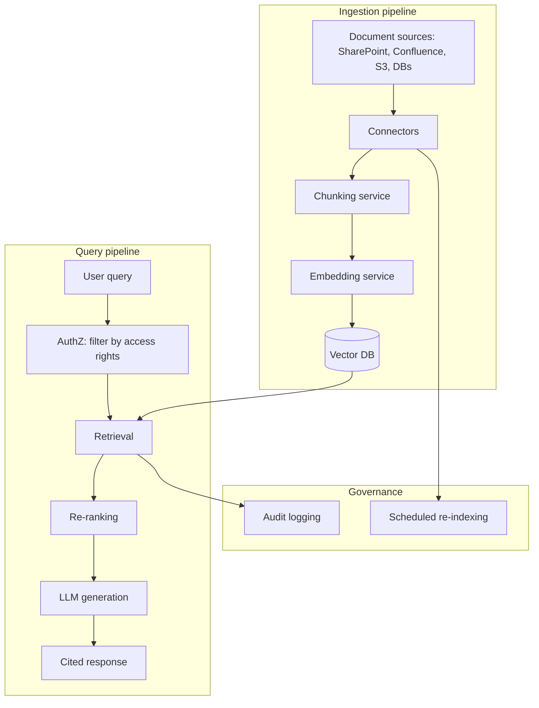

At enterprise scale, RAG systems add several concerns beyond the core pipeline: **connector
infrastructure** to pull from many source systems (SharePoint, Confluence, S3, ticketing
systems) on a recurring schedule; **per-document access control** so retrieval never
surfaces content a given user isn't authorized to see (Section 9); **audit logging** of
what was retrieved for which query, for compliance; and **re-indexing pipelines** to keep
the vector store in sync as source documents change or get deleted, since stale embeddings
of deleted/outdated content silently degrade answer quality over time.

### 18.1 Governance responsibilities by layer

| Layer | Owns | Example failure if skipped |
|---|---|---|
| Connectors | Reliable, scheduled sync from each source system | A deleted source document stays retrievable forever |
| Chunking/embedding service | Consistent processing across all content types | Inconsistent chunk quality between document types degrades some sources silently |
| Vector store + access control | Enforcing which chunks are eligible per user/tenant | Cross-tenant or unauthorized data leakage |
| Query/generation layer | Citation-grounded, hallucination-resistant answers | Unverifiable or fabricated claims presented as fact |
| Audit/governance | Traceable record of what was retrieved and by whom | No way to investigate a data-exposure incident after the fact |

Each layer should be independently testable and independently deployable - a connector
outage for one source system shouldn't take down retrieval across the entire corpus, and
a chunking bug in one content type shouldn't silently degrade unrelated sources. This
independence is precisely why the architecture diagram above draws these as separate
boxes rather than one monolithic ingestion script.

## 19. Performance Optimization

| Technique | Impact |
|---|---|
| Batch embedding calls instead of one-at-a-time | Fewer API round trips, significant latency reduction during ingestion |
| Cache embeddings for unchanged content | Skip redundant embedding calls entirely |
| Keep top-K small (5-10) | Less context for the LLM to process, faster generation |
| Use approximate nearest-neighbor indexing at scale | Sub-linear search instead of full linear scan |
| Async I/O throughout the pipeline | Avoids blocking on embedding/DB calls |
| Pre-compute and store embeddings at ingest time, never at query time (for documents) | Query latency only pays for embedding the query itself, not the corpus |

```python
async def embed_texts_batched(texts: list[str], batch_size: int = 100) -> list[list[float]]:
    """Batch embedding calls - most providers charge and rate-limit per request,
    not per text, so batching is a straightforward latency and cost win."""
    all_embeddings = []
    for i in range(0, len(texts), batch_size):
        batch = texts[i : i + batch_size]
        embeddings = await embed_texts(batch)
        all_embeddings.extend(embeddings)
    return all_embeddings
```

## 20. Cost Optimization

| Lever | Savings mechanism |
|---|---|
| Use a smaller/cheaper embedding model | Embedding cost scales with model size and dimensionality |
| Cache embeddings, never re-embed unchanged content | Eliminates redundant embedding spend on re-ingestion |
| Reduce chunk overlap | Fewer total chunks to embed and store |
| Keep top-K retrieval small | Less context tokens sent to the LLM per query |
| Use a self-hosted vector DB (Chroma/Qdrant) instead of managed, if ops burden is acceptable | Avoids per-query/per-storage managed-service pricing |
| Deduplicate near-identical documents before ingestion | Avoids paying to embed and store redundant content |

```python
import hashlib

async def ingest_if_new(db, content: str, document_id: str) -> bool:
    """Skip re-embedding content that hasn't actually changed."""
    content_hash = hashlib.sha256(content.encode()).hexdigest()
    existing_hash = await get_stored_content_hash(db, document_id)
    if existing_hash == content_hash:
        return False  # unchanged, skip re-ingestion entirely
    await ingest_document(db, document_id, content)
    await store_content_hash(db, document_id, content_hash)
    return True
```

### 20.1 A worked cost estimate

Concrete numbers make the trade-offs easier to reason about than abstract percentages.
Consider a corpus of 10,000 documents averaging 5 pages (roughly 2,500 words / ~3,300
tokens) each, chunked at 800 characters with 15% overlap:

| Stage | Rough calculation | Order of magnitude |
|---|---|---|
| Chunks produced | 10,000 docs × ~15 chunks/doc | ~150,000 chunks |
| One-time embedding cost | 150,000 chunks × ~200 tokens/chunk × embedding price/token | A few dollars, one-time, for a small embedding model |
| Per-query embedding cost | 1 query embedding call | Negligible - a query is a handful of tokens |
| Per-query generation cost | 5 retrieved chunks × 200 tokens + query + system prompt ≈ 1,500-2,500 input tokens | The dominant recurring cost per query, not the retrieval step |

The consistent finding across real deployments: **embedding cost is a one-time (or
occasional re-ingestion) expense, while generation cost recurs on every single query** -
optimization effort is almost always better spent on reducing retrieved-context size and
choosing an appropriately-sized generation model than on squeezing the embedding budget.

## 21. Security

| Risk | Mitigation |
|---|---|
| Retrieval surfaces content a user isn't authorized to see | Filter candidates by access control *before* scoring, never after (Section 9) |
| Prompt injection embedded in retrieved documents | Treat retrieved content as untrusted data in the model's context, never as instructions - see [`AI_ASSISTANT_GUIDE.md`](AI_ASSISTANT_GUIDE.md#241-a-concrete-prompt-injection-example) |
| Sensitive data (PII, secrets) embedded and searchable | Redact or exclude sensitive fields before embedding; never embed raw secrets |
| Vector database exposed without authentication | Require authentication on the vector DB itself, not just your application layer |
| Uploaded documents containing malicious content | Validate file types, scan uploads, cap file sizes before ingestion |
| Query logs leaking sensitive search terms | Apply the same retention/access policies to query logs as to the underlying documents |

```python
# Pre-filter by access control, never post-filter or rely on the model
async def get_authorized_chunks(db, user_id: str, document_ids: list[str] | None):
    accessible_doc_ids = await get_documents_user_can_access(db, user_id)
    if document_ids:
        accessible_doc_ids = [d for d in document_ids if d in accessible_doc_ids]
    return await fetch_chunks(db, accessible_doc_ids)
```

## 22. Production Deployment

```bash
# Development: everything in-process (SQLite + local embedding compute)
uvicorn main:app --reload

# Production: dedicated vector DB + async ingestion workers
uvicorn main:app --host 0.0.0.0 --port 8000 --workers 4
```

```dockerfile
FROM python:3.12-slim
WORKDIR /app
COPY requirements.txt .
RUN pip install --no-cache-dir -r requirements.txt
COPY . .
CMD ["uvicorn", "main:app", "--host", "0.0.0.0", "--port", "8000"]
```

| Deployment stage | What changes |
|---|---|
| Prototype | SQLite + numpy cosine similarity, synchronous ingestion |
| Small production | Dedicated vector DB (Chroma/Qdrant self-hosted), background task ingestion |
| Scaled production | Managed vector DB (Pinecone) or clustered Qdrant, dedicated ingestion worker queue, monitoring on retrieval quality |

See [`DEPLOYMENT_GUIDE.md`](DEPLOYMENT_GUIDE.md) for the full production deployment
checklist (HTTPS, health checks, structured logging) that applies to a RAG service the
same as any other backend component.

### 22.1 Putting it all together: a complete production-shaped pipeline

This combines chunking, embedding, hybrid search, re-ranking, access control, and
citation-grounded generation into one coherent service class - the shape a real
production RAG module tends to converge on after applying every technique in this
handbook:

```python
class RagService:
    def __init__(self, embed_fn, vector_store, reranker=None):
        self.embed_fn = embed_fn
        self.vector_store = vector_store
        self.reranker = reranker

    async def ingest(self, document_id: str, text: str, metadata: dict) -> int:
        chunks = chunk_text(text, size=800, overlap=120)
        if not chunks:
            return 0
        embeddings = await embed_texts_batched(chunks)
        await self.vector_store.upsert(
            ids=[f"{document_id}:{i}" for i in range(len(chunks))],
            embeddings=embeddings,
            payloads=[{**metadata, "content": c, "chunk_index": i} for i, c in enumerate(chunks)],
        )
        return len(chunks)

    async def query(
        self, query: str, user_id: str, top_k: int = 5, use_reranking: bool = True
    ) -> dict:
        # 1. Pre-filter by access control (never post-filter)
        allowed_filter = {"accessible_to": user_id}

        # 2. Broad retrieval - larger candidate set if re-ranking follows
        candidate_k = top_k * 6 if use_reranking else top_k
        query_embedding = (await self.embed_fn([query]))[0]
        candidates = await self.vector_store.search(
            query_embedding, top_k=candidate_k, query_filter=allowed_filter
        )

        # 3. Optional re-ranking pass
        if use_reranking and self.reranker and candidates:
            candidates = self.reranker(query, candidates, top_k=top_k)
        else:
            candidates = candidates[:top_k]

        # 4. Build cited context and generate
        if not candidates:
            return {"answer": None, "sources": [], "context_found": False}

        context = "\n\n".join(
            f"[Source {i+1}]\n{c['content']}" for i, c in enumerate(candidates)
        )
        answer = await self._generate(query, context)
        return {"answer": answer, "sources": candidates, "context_found": True}

    async def _generate(self, query: str, context: str) -> str:
        system_prompt = (
            "Answer using only the retrieved context below. Cite sources as [Source N]. "
            "If the context doesn't contain the answer, say so explicitly.\n\n" + context
        )
        provider = get_provider("openai")
        result = await provider.complete([
            ChatMessage(role="system", content=system_prompt),
            ChatMessage(role="user", content=query),
        ])
        return result.text
```

Every technique from Sections 3-11 shows up here in its final, composed form: chunking
and batched embedding at ingest time, access-control pre-filtering, a wider candidate
pull when re-ranking is enabled, and an explicit "say when you don't know" instruction
guarding against silent hallucination. This is deliberately a plain Python class with no
framework dependency - swap `vector_store` for Chroma, Pinecone, or Qdrant by implementing
a small common interface (`upsert`, `search`) around each, and the rest of the service
never needs to change. Treat this class as a starting template rather than a finished
product: real deployments typically add structured logging around each stage, a circuit
breaker around the embedding/generation API calls so a provider outage degrades
gracefully instead of failing every request, and the evaluation hooks from Section 7.1
wired in so retrieval quality regressions surface automatically in CI rather than being
discovered by users first.

## 23. Common Mistakes (30+)

Most of the mistakes below fall into one of four buckets: chunking decisions made without
testing against real documents, security assumptions that treat the LLM's context window
as a safe place to put access-controlled or untrusted content, cost/performance choices
made without measurement, and skipping the evaluation discipline described in Section
7.1. If you internalize those four failure categories, spotting a new variant of any of
them in your own system becomes far easier than memorizing this table item by item.

| # | Mistake | Fix |
|---|---|---|
| 1 | Chunking without overlap | Losing context that spans chunk boundaries - use 10-20% overlap |
| 2 | Chunks too large or too small for the use case | Tune chunk size against real queries and documents, not a fixed default |
| 3 | Mixing embeddings from different models in one comparison | Embeddings from different models live in incompatible vector spaces |
| 4 | No access control filtering before retrieval | Enforce authorization as a pre-filter, never a post-hoc instruction to the model |
| 5 | Treating retrieved content as trusted instructions | Frame it as data in the system prompt, vulnerable to prompt injection otherwise |
| 6 | Re-embedding unchanged documents on every ingestion run | Hash content and skip unchanged documents |
| 7 | No re-ranking on high-stakes retrieval | Add a cross-encoder re-ranking pass when precision matters most |
| 8 | Assuming semantic search handles exact codes/IDs well | Use hybrid search or metadata filters for exact-match needs |
| 9 | Ingesting scanned PDFs with plain text extraction | Scanned images need OCR, not just `pypdf`-style text extraction |
| 10 | No fallback when retrieval returns zero results | Explicitly tell the model to say "I don't know" rather than guessing |
| 11 | Blocking the upload request on synchronous embedding | Use background tasks/workers for ingestion |
| 12 | No deduplication of near-identical documents | Wastes embedding cost and dilutes retrieval quality with redundant matches |
| 13 | Unbounded top-K | Blows the context window and dilutes relevance; keep K small and deliberate |
| 14 | No citation requirement in the system prompt | Answers become unverifiable; always instruct the model to cite `[Source N]` |
| 15 | Forgetting to re-index when source documents are deleted | Stale, deleted-but-still-retrievable content degrades answer quality |
| 16 | No monitoring of retrieval quality over time | Silent degradation goes unnoticed; track metrics like "top result score distribution" |
| 17 | Assuming a bigger embedding model always helps | Diminishing returns exist; benchmark against your actual data before upgrading |
| 18 | Storing embeddings without their source text/metadata | Makes debugging and citation impossible; always store both together |
| 19 | No validation on uploaded file types/sizes | Security and resource-exhaustion risk; allow-list types, cap sizes |
| 20 | Using the wrong distance metric for your embedding model | Some models are trained for cosine similarity, others for dot product - check the model's documentation |
| 21 | Ignoring embedding dimensionality mismatches with the vector store schema | Causes runtime errors or silently wrong results |
| 22 | No consideration of multi-lingual content | A single English-tuned embedding model may underperform on non-English documents |
| 23 | Hardcoding chunk size/overlap with no way to tune per document type | Different document types (legal text vs. chat transcripts) benefit from different chunking |
| 24 | Not testing retrieval quality with real user queries | Synthetic test queries often don't reflect actual phrasing patterns |
| 25 | Assuming vector search alone solves all search needs | Hybrid search is often necessary for a complete solution |
| 26 | No caching layer for repeated identical queries | Wastes embedding and LLM cost on duplicate requests |
| 27 | Over-trusting cosine similarity scores as "confidence" | A 0.85 score isn't a probability of correctness - it's a relative ranking signal |
| 28 | Not handling embedding API failures gracefully | A transient API outage shouldn't crash the whole ingestion pipeline |
| 29 | Exposing the vector database directly to the internet with no auth | Same risk as exposing any database - always authenticate |
| 30 | No plan for schema/embedding-model migrations | Changing embedding models requires re-embedding the entire corpus, not just new documents - plan for this operationally |
| 31 | Assuming RAG eliminates hallucination entirely | RAG reduces it significantly but doesn't guarantee zero fabrication - the model can still misread or misuse retrieved context |

## 24. FAQ (40+)

**Q1. Do I need a vector database to do RAG?**
No - for small collections, computing cosine similarity in application code against
embeddings stored in a regular database works fine. Vector databases become worthwhile
once you need efficient approximate search at scale.

**Q2. What's the best embedding model to start with?**
OpenAI's `text-embedding-3-small` is a strong, inexpensive general-purpose default. Open
-source sentence-transformers models are a good zero-cost/offline alternative at somewhat
lower quality.

**Q3. How big should my chunks be?**
No universal answer - 700-900 characters with ~15% overlap is a reasonable starting
point; tune against your actual documents and queries.

**Q4. Should overlap always be included?**
Yes, in almost all cases - overlap prevents information that spans a chunk boundary from
being lost entirely from both resulting chunks.

**Q5. What's the difference between RAG and just putting the whole document in the
prompt?**
"Stuffing" the whole document works when it fits comfortably in the context window and
you have very few documents. RAG becomes necessary once your total corpus vastly exceeds
what fits in context, or when you want to search across many documents efficiently rather
than re-processing all of them on every query.

**Q6. Is a larger context window a substitute for RAG?**
Not fully - even with a very large context window, retrieval still matters for search
efficiency (finding the *right* content among millions of documents), cost (not paying
to process irrelevant content every query), and the "lost in the middle" effect where
models attend less reliably to information buried in very long contexts.

**Q7. How do I measure if my RAG system is actually good?**
Build a golden set of representative queries with known-relevant source chunks, and
measure retrieval metrics (precision/recall at K) plus end-to-end answer quality against
that set - don't rely purely on spot-checking.

**Q8. What's "recall at K"?**
The fraction of genuinely relevant chunks that appear within your top-K retrieved
results - a core retrieval quality metric, independent of what the LLM does with them
afterward.

**Q9. Should I chunk by paragraph, sentence, or fixed character count?**
Fixed character/token count with overlap is simplest and works well broadly; paragraph
or semantic-boundary-aware chunking often improves quality further at the cost of more
implementation complexity - start simple, upgrade if quality demands it.

**Q10. Can RAG work with images, not just text?**
Yes - multimodal embedding models can embed images into the same (or a comparable) vector
space as text, enabling image search and retrieval, though this is a more specialized
setup than the text-only pipeline covered in most of this handbook.

**Q11. How often should I re-index my documents?**
Depends on how frequently source content changes - real-time/event-driven re-indexing
for frequently-updated sources, scheduled batch re-indexing (daily/weekly) for mostly
static content.

**Q12. What happens if two documents contain contradictory information?**
The retriever may surface both; the LLM's answer quality then depends on the system
prompt instructing it to note contradictions or defer to the more authoritative source -
this is a real, unresolved edge case worth explicitly testing for in high-stakes domains.

**Q13. Is Pinecone better than Chroma?**
Neither is universally "better" - Pinecone is a fully-managed, highly scalable option
with less operational burden; Chroma is simpler to start with and free to self-host. Pick
based on your scale and ops-tolerance, not by reputation alone.

**Q14. Do I need LangChain to build RAG?**
No - as shown in Sections 3-11, the entire pipeline is straightforward to implement
directly. LangChain speeds up prototyping but adds an abstraction layer.

**Q15. How do I handle PDFs with scanned images instead of extractable text?**
Standard text extraction won't find text in a scanned image - run OCR (a vision model or
dedicated OCR library) on the page images first, then chunk and embed the OCR output.

**Q16. What's the right top-K value?**
Commonly 3-10; higher K improves recall but dilutes context relevance and increases cost
- tune against your actual retrieval quality metrics rather than defaulting blindly.

**Q17. Should every user query trigger retrieval?**
Not necessarily - simple greetings or meta-questions about the assistant itself don't
need document retrieval; some systems use a lightweight classifier or the LLM itself to
decide whether retrieval is warranted for a given query.

**Q18. How do I prevent the model from hallucinating even with RAG?**
Explicitly instruct it to answer only from retrieved context and to say when the context
doesn't contain an answer, and consider having it cite specific sources for each claim so
fabrications are easier to spot.

**Q19. What's a cross-encoder, and why is it slower than a bi-encoder?**
A bi-encoder embeds query and document independently (fast, enables pre-computed document
vectors); a cross-encoder processes the query and document together (slower, no
pre-computation possible, but more accurate) - this is exactly why re-ranking uses
cross-encoders only on a small pre-filtered candidate set.

**Q20. Can I use the same embedding model for queries and documents?**
Yes, and generally you must - using different models (or the same model in
asymmetric modes not designed for cross-comparison) for queries vs. documents will
produce poor or meaningless similarity scores.

**Q21. How much does RAG typically cost to run?**
Embedding cost is usually small relative to LLM generation cost; the bigger cost driver
is often the additional context tokens retrieved content adds to every generation call -
monitor both independently.

**Q22. Is metadata filtering the same as hybrid search?**
No - metadata filtering narrows the candidate pool by structured attributes (date, owner,
tag) before or alongside similarity scoring; hybrid search specifically blends semantic
and keyword *relevance scoring*. They're complementary, often used together.

**Q23. What's the biggest single quality lever in a RAG system?**
Retrieval quality - a great LLM given irrelevant retrieved context still produces a poor
answer. Debug "bad RAG answers" by first inspecting what was actually retrieved, not by
assuming the model itself is at fault.

**Q24. How do I debug "RAG isn't finding the right document"?**
Manually run the query's embedding against your corpus and inspect the raw similarity
scores and returned chunks - this usually reveals whether the issue is chunking (the
relevant text got split awkwardly), embedding quality, or a genuinely absent document.

**Q25. Should I embed document titles/headers separately from content?**
Often yes - prepending a title or section header to each chunk before embedding can
meaningfully improve retrieval, since it adds disambiguating context the raw body text
alone might lack.

**Q26. Can RAG be combined with tool calling and agents?**
Yes - exposing retrieval as a callable tool is a common, effective pattern, letting the
model decide when retrieval is actually needed rather than running it unconditionally on
every turn. See [`AI_ASSISTANT_GUIDE.md`](AI_ASSISTANT_GUIDE.md#13-multi-agent-systems)
and [`MCP_GUIDE.md`](MCP_GUIDE.md#19-mcp--rag).

**Q27. What's the difference between Pinecone's serverless and pod-based offerings?**
Serverless scales automatically and bills by usage; pod-based reserves dedicated capacity
with more predictable performance at a fixed cost - check current documentation, as
managed vector DB pricing/offering models change frequently.

**Q28. Is pgvector a good choice if I already use PostgreSQL?**
Often yes - it avoids introducing a separate database system, and Postgres's operational
tooling (backups, replication) applies directly. It scales well for small-to-medium
corpora; very large-scale deployments may outgrow it compared to purpose-built vector DBs.

**Q29. How do I handle multi-tenant RAG (many customers, isolated data)?**
Filter by tenant ID at the same pre-retrieval stage as user-level access control
(Section 9/21) - never rely on post-hoc filtering, and consider separate collections/
indices per tenant for stronger isolation at larger scale.

**Q30. What's "chunk drift" and why does it matter?**
As source documents are edited over time, stored chunks can become stale relative to the
current document - without a re-indexing strategy, users may receive answers grounded in
outdated content that looks current.

**Q31. Should citations link to the exact chunk or the whole document?**
Ideally both - the chunk for precise attribution, and a link to the full document for
users who want more context than the retrieved excerpt provides.

**Q32. Can I run embeddings entirely locally with no API calls?**
Yes - open-source sentence-transformers models run fully offline, trading some quality
for zero marginal cost and complete data privacy (nothing leaves your infrastructure).

**Q33. How do I handle very large documents (100+ pages)?**
Chunk normally - chunking exists precisely to handle documents far larger than any single
embedding call's input limit. Ensure your extraction step handles large files without
memory issues (stream/paginate extraction for very large PDFs).

**Q34. What's the risk of "context stuffing" - retrieving too much?**
Diminishing and eventually negative returns: more retrieved chunks means more tokens
processed (cost, latency) and more opportunity for irrelevant content to dilute the
model's attention on what's actually relevant - bigger K is not automatically better.

**Q35. Do all vector databases support metadata filtering?**
Most modern ones do (Chroma, Pinecone, Qdrant, pgvector all support it), but the exact
filter syntax and performance characteristics vary - check your chosen database's
documentation.

**Q36. How do I know if I need re-ranking?**
If your top-K retrieved results frequently include near-misses that outrank the actually
best answer, re-ranking's precision boost is likely worth its added latency - measure
before assuming you need it.

**Q37. What's the relationship between RAG and search engines like Elasticsearch?**
Conceptually related - both are retrieval systems - but Elasticsearch is primarily
built around keyword/full-text search (BM25-style), while RAG's distinctive addition is
semantic (embedding-based) retrieval feeding directly into LLM generation.

**Q38. Should I always show sources to the end user?**
Strongly recommended for trust and verifiability, though the exact UI treatment (inline
citations vs. a "sources" panel) is a product decision - the underlying data (which
chunks were used) should always be available even if not always displayed prominently.

**Q39. Can RAG answer questions that require reasoning across multiple documents?**
To a degree - if all relevant chunks are retrieved together, the LLM can synthesize
across them in one generation call. Very complex multi-hop reasoning across many
documents may need an agentic approach (multiple retrieval rounds) rather than a single
retrieve-then-generate pass.

**Q40. What's the honest failure rate I should expect from a well-built RAG system?**
There's no universal number - it depends heavily on document quality, query difficulty,
and domain. Measure it directly against your golden query set (Q7) rather than assuming
a benchmark figure from elsewhere applies to your data.

**Q41. Is it worth building my own re-ranker vs. using an off-the-shelf cross-encoder?**
Off-the-shelf cross-encoders (like `ms-marco-MiniLM`) are strong general-purpose starting
points; only invest in a custom-trained re-ranker once you have enough labeled
query-relevance data to meaningfully outperform a generic model.

**Q42. How does chunk overlap interact with re-ranking?**
They're independent concerns - overlap affects what information survives the initial
split; re-ranking affects which already-retrieved candidates get prioritized. Both help
retrieval quality but solve different problems, and are commonly used together.

**Q43. Is it worth pre-computing and caching answers to frequently asked questions rather
than running full retrieval every time?**
For genuinely static, high-frequency queries (an FAQ page's own questions, for instance),
caching the full retrieve-and-generate result is a reasonable optimization - just
invalidate the cache whenever the underlying source documents change, the same discipline
as any other cache.

**Q44. What's the single most impactful thing I can do to improve a mediocre RAG system?**
Build the evaluation harness from Section 7.1 before changing anything else. Without a
way to measure whether a change to chunking, embeddings, or ranking actually helps,
every subsequent optimization is guesswork - teams that skip this step tend to make a
series of plausible-sounding changes that never converge on a measurably better system.

## 25. Best Practices

The list below consolidates the highest-leverage recommendations from every section
above into a single scannable checklist. Treat it as a pre-launch review, not just
reading material - running through each line against your actual implementation catches
the majority of issues that would otherwise surface as confusing production incidents or
slow, silent quality degradation.

- **Store source text and metadata alongside every embedding** - never store vectors
  without a way to trace them back to their origin.
- **Enforce access control as a pre-retrieval filter**, never a post-hoc instruction.
- **Instruct the model explicitly to cite sources and admit when context is insufficient.**
- **Chunk with overlap** - 10-20% is a reasonable default.
- **Batch embedding calls** during ingestion for cost and latency efficiency.
- **Hash content to skip re-embedding unchanged documents.**
- **Ingest asynchronously** - never block an HTTP upload response on embedding calls.
- **Measure retrieval quality against a golden query set**, not just spot-checking.
- **Treat retrieved content as untrusted data** in the model's context - defend against
  prompt injection the same as any other RAG or tool-derived content.
- **Keep top-K deliberately small** and tune it against real relevance data.
- **Plan for embedding-model migrations** - changing models means re-embedding the whole
  corpus, so version your embeddings and plan the cutover.

## 26. Learning Roadmap

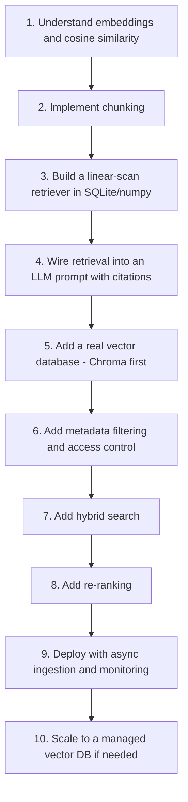

| Stage | Focus | Rough timeframe (part-time) |
|---|---|---|
| 1-4 | Fundamentals, first working end-to-end RAG pipeline | 1 week |
| 5-6 | Real vector database, security | 3-5 days |
| 7-8 | Hybrid search, re-ranking | 1 week |
| 9-10 | Production hardening, scaling | 1-2 weeks |

Build the linear-scan version first (Sections 3-6) before adopting any vector database -
it's a few dozen lines of code, has zero infrastructure dependencies, and teaches you
exactly what a vector database automates for you at scale. Understanding that underlying
mechanism makes every vector database's documentation dramatically easier to read once
you do reach for one.

### 26.1 Closing summary

Every technique in this handbook - chunking, embeddings, ranking, re-ranking, hybrid
search - exists to answer one question as accurately as possible: *given this query,
which pieces of my data actually matter?* Everything downstream (the generated answer,
its citations, its trustworthiness) depends entirely on getting that question right
first. When a RAG system produces a disappointing answer, the productive debugging
instinct is almost always to inspect what was retrieved before suspecting the language
model - in the overwhelming majority of real cases, the retrieval step, not the
generation step, is where the actual problem lives. Build the evaluation harness from
Section 7.1 early, keep it running as you iterate, and let measured recall/precision
numbers - not intuition - guide every chunking, ranking, and model choice from here.

---

*See also: [`AI_ASSISTANT_GUIDE.md`](AI_ASSISTANT_GUIDE.md) for how RAG fits into a full
assistant architecture, [`MCP_GUIDE.md`](MCP_GUIDE.md) for exposing retrieval as a
standardized tool, and [`DEPLOYMENT_GUIDE.md`](DEPLOYMENT_GUIDE.md) for the full
production deployment checklist. If you take one idea from this handbook into your own
project, let it be this: retrieval quality is the ceiling on answer quality, so measure
it directly and often, rather than inferring it indirectly from how good the final
generated answers happen to look on any given day.*
