# VISION_AI_GUIDE.md - The Complete Vision AI & Multimodal Handbook

**From First Principles to Production Vision Applications**

> This handbook teaches AI Vision and multimodal application development from zero prior
> knowledge to production deployment: computer vision fundamentals, OCR, document AI,
> object detection, image classification, and how to build real vision-powered features
> with Python and FastAPI. Every code example reflects a real production integration
> pattern - the same validation, normalization, and structured-extraction approach a
> shipped vision feature actually needs, not simplified demo code that breaks down on
> real-world images with poor lighting, odd angles, or unexpected formats. Companion
> documents: [`AI_ASSISTANT_GUIDE.md`](AI_ASSISTANT_GUIDE.md) for the broader assistant
> architecture vision fits into, and [`VOICE_AI_GUIDE.md`](VOICE_AI_GUIDE.md) for the
> audio counterpart.

---

## Table of Contents

1. [Computer Vision](#1-computer-vision)
2. [AI Vision](#2-ai-vision)
3. [Multimodal AI](#3-multimodal-ai)
4. [OCR](#4-ocr)
5. [Document AI](#5-document-ai)
6. [Receipt Analysis](#6-receipt-analysis)
7. [Image Captioning](#7-image-captioning)
8. [Object Detection](#8-object-detection)
9. [Image Classification](#9-image-classification)
10. [Vision APIs](#10-vision-apis)
11. [Prompt Engineering](#11-prompt-engineering)
12. [FastAPI Integration](#12-fastapi-integration)
13. [Security](#13-security)
14. [Performance](#14-performance)
15. [Deployment](#15-deployment)
16. [Production Architecture](#16-production-architecture)
17. [Common Mistakes (25+)](#17-common-mistakes-25)
18. [FAQ (40+)](#18-faq-40)
19. [Best Practices](#19-best-practices)
20. [Learning Roadmap](#20-learning-roadmap)

---

## 1. Computer Vision

**Computer vision** is the general field of extracting information from digital images
and video
- a decades-old discipline predating modern AI, spanning everything from edge detection
and classical image processing to today's deep-learning-based approaches. Understanding
this broader lineage is useful context even for engineers who will spend all their actual
time in this handbook's modern, prompting-based territory: it explains why some
vision-adjacent problems (precise object counting, real-time detection, fraud forensics)
still lean on decades of specialized, purpose-built techniques rather than general
multimodal prompting, and helps calibrate expectations about which category a given task
falls into before committing to an implementation approach.

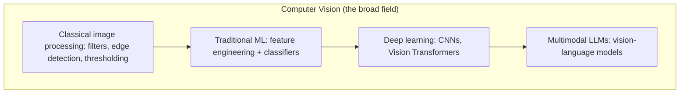

| Era | Approach | Example techniques |
|---|---|---|
| Pre-2010s | Classical / hand-engineered | Edge detection, SIFT/HOG features, thresholding |
| 2012-2020 | Deep learning (task-specific models) | CNNs (ResNet, YOLO), trained for one task each (classify, detect, segment) |
| 2021-present | Vision Transformers, multimodal LLMs | Models that jointly understand images and text, prompted rather than trained per-task |

This handbook focuses primarily on the modern, practical path most application
developers take today: **calling multimodal LLM APIs** (GPT-4o-class, Claude with
vision, Gemini) that understand images directly via natural-language prompting, rather
than training or fine-tuning task-specific computer vision models yourself. Sections 8-9
cover when a dedicated, task-specific model is still the better engineering choice.

### 1.1 Why the shift toward prompting-based vision matters for engineers

Historically, adding "understand this image" to an application meant collecting labeled
training data, choosing a model architecture, training and validating a classifier or
detector, and maintaining that model as a separate deployed artifact - a multi-week
project even for a narrowly-scoped task. Multimodal LLMs collapse most of that into a
single API call with a well-written prompt, the same engineering effort as adding any
other feature to an existing chat pipeline. This is the single biggest reason vision
capability has become commonplace in ordinary product features (receipt scanning,
document understanding, accessibility tooling) rather than remaining the domain of teams
with dedicated ML infrastructure. It does not eliminate the value of dedicated models -
Sections 8-9 cover exactly where they still win - but it has fundamentally lowered the
bar for "does this product need a vision feature" from a research project to a prompt.

## 2. AI Vision

**AI Vision** (as used in this handbook) specifically means using AI models - primarily
multimodal LLMs - to understand and reason about image content through natural-language
prompting, rather than classical computer vision pipelines. This is the practical center
of gravity for the rest of the handbook: nearly every subsequent section builds on this
one core interaction pattern, applying it to progressively more specific tasks.

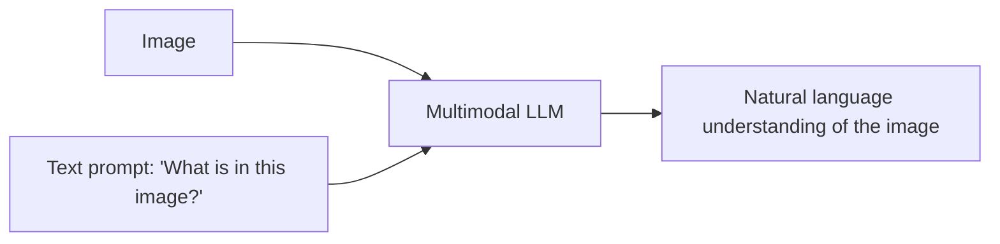

```python
from openai import AsyncOpenAI
import base64

async def analyze_image(image_bytes: bytes, prompt: str) -> str:
    client = AsyncOpenAI(api_key=OPENAI_API_KEY)
    data_url = f"data:image/png;base64,{base64.b64encode(image_bytes).decode()}"
    resp = await client.chat.completions.create(
        model="gpt-4o-mini",
        messages=[{
            "role": "user",
            "content": [
                {"type": "text", "text": prompt},
                {"type": "image_url", "image_url": {"url": data_url}},
            ],
        }],
    )
    return resp.choices[0].message.content
```

This is the same fundamental interaction pattern as text chat (see
[`AI_ASSISTANT_GUIDE.md`](AI_ASSISTANT_GUIDE.md#5-chat-architecture)) - a message with
content blocks, sent to a model, generating a response - with an `image_url` (or
equivalent) content block added alongside text. Nothing about the surrounding
application architecture (memory, tool calling, streaming) changes; vision is an
additional input modality layered onto the same chat pipeline.

## 3. Multimodal AI

**Multimodal AI** refers to models that process and reason across more than one input
modality - text and images being the most common combination today, with audio and video
increasingly supported.

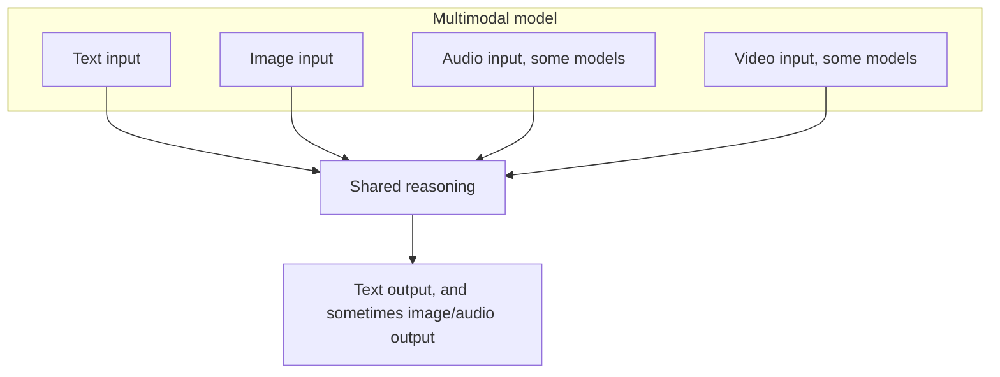

| Model family | Text | Image | Audio | Video |
|---|---|---|---|---|
| GPT-4o class | Yes | Yes | Yes, via Realtime API | Frame-sampling based |
| Claude (Sonnet/Opus with vision) | Yes | Yes | No | Frame-sampling based |
| Gemini 1.5/2.x class | Yes | Yes | Yes | Yes, native, strong long-video support |

The practical implication for application architecture: **treat multimodal input as
additional content blocks in the same message structure**, not a separate pipeline. A
single conversation can mix text-only turns and image-containing turns naturally, exactly
as shown in Section 2's example. This has a direct, practical consequence for anyone
building on top of the assistant architecture from
[`AI_ASSISTANT_GUIDE.md`](AI_ASSISTANT_GUIDE.md): conversation memory, tool calling, and
RAG retrieval all continue to work unmodified once an image enters a conversation,
because the underlying message-and-content-block abstraction was already designed to
carry more than plain text - vision support is additive, not a parallel system requiring
its own memory, its own tool-calling loop, or its own conversation model.

## 4. OCR

**Optical Character Recognition (OCR)** extracts text from images. Two fundamentally
different approaches exist today: dedicated OCR engines/models, and prompting a
multimodal LLM to read the text directly.

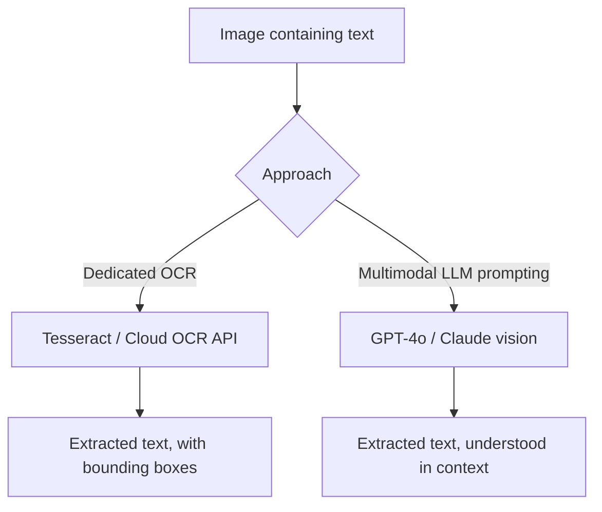

```python
# Multimodal LLM approach - simple, understands context, no separate infra
async def ocr_image(image_bytes: bytes, provider_name: str = "openai") -> str:
    return await analyze_image(image_bytes, "Extract all text from this image verbatim.")
```

```python
# Dedicated OCR approach - Tesseract (open-source, self-hosted, no API cost)
import pytesseract
from PIL import Image
import io

def ocr_with_tesseract(image_bytes: bytes) -> str:
    image = Image.open(io.BytesIO(image_bytes))
    return pytesseract.image_to_string(image)
```

```python
# Dedicated OCR approach - cloud API (Google Cloud Vision), higher accuracy than Tesseract
from google.cloud import vision

def ocr_with_google_vision(image_bytes: bytes) -> str:
    client = vision.ImageAnnotatorClient()
    image = vision.Image(content=image_bytes)
    response = client.text_detection(image=image)
    return response.text_annotations[0].description if response.text_annotations else ""
```

### 4.1 OCR approach comparison

| Approach | Accuracy | Cost | Understands context/layout | Setup complexity |
|---|---|---|---|---|
| Multimodal LLM (GPT-4o/Claude) | Very good, especially with context | Per-request LLM pricing | Yes - can reason about meaning, not just extract text | Very low, just a prompt |
| Tesseract (open-source) | Moderate, sensitive to image quality | Free (self-hosted compute only) | No - pure text extraction | Low |
| Cloud OCR APIs (Google/AWS/Azure) | High, purpose-built | Per-image pricing, often cheaper than LLM calls at volume | Partial - structured output (bounding boxes, tables) but no semantic reasoning | Low-medium |
| Specialized document OCR (e.g. AWS Textract) | Very high for forms/tables | Higher per-document pricing | Yes - form/table structure understanding | Medium |

**Practical guidance:** for low-to-medium volume applications where you also want the
system to *understand* what it extracted (not just get raw text), a multimodal LLM call
is simplest and often sufficient. For high-volume, pure text-extraction workloads where
cost per call matters more than contextual understanding, a dedicated OCR engine or cloud
OCR API is typically cheaper and just as accurate for that narrower task.

### 4.2 A hybrid OCR strategy

Many production systems don't pick one approach exclusively - they combine dedicated OCR
for the bulk extraction with multimodal LLM prompting for the understanding layer on top:

```python
async def hybrid_ocr_and_understand(image_bytes: bytes, question: str) -> dict:
    """Use fast, cheap dedicated OCR for raw text extraction, then a targeted
    LLM call only for the specific understanding/reasoning the raw text alone can't provide."""
    raw_text = ocr_with_tesseract(image_bytes)

    if not raw_text.strip():
        return {"raw_text": "", "answer": "No text was found in this image."}

    provider = get_provider("openai")
    result = await provider.complete([
        ChatMessage(
            role="user",
            content=f"Given this OCR-extracted text:\n\n{raw_text}\n\nQuestion: {question}",
        )
    ])
    return {"raw_text": raw_text, "answer": result.text}
```

This pattern is worth considering whenever you're processing high volumes but only need
LLM-level reasoning on a subset of cases - the cheap dedicated OCR pass runs on every
image, while the more expensive LLM call runs only when genuine understanding (beyond
raw text) is actually needed, keeping average per-image cost much closer to the dedicated
OCR price point than the multimodal LLM price point.

## 5. Document AI

**Document AI** extends OCR to understanding document *structure* - forms, tables,
headers, signatures - not just raw text extraction.

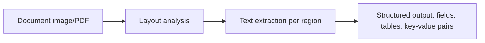

```python
import json

async def extract_structured_document(image_bytes: bytes, schema_description: str) -> dict:
    prompt = (
        f"Extract structured data from this document. Respond ONLY with JSON matching: "
        f"{schema_description}"
    )
    text = await analyze_image(image_bytes, prompt)
    cleaned = text.strip().removeprefix("```json").removesuffix("```").strip()
    try:
        return json.loads(cleaned)
    except json.JSONDecodeError:
        return {"raw_response": text, "error": "Could not parse structured JSON"}

# Example usage: invoice extraction
invoice_schema = '{"invoice_number": str, "date": str, "vendor": str, "line_items": [{"description": str, "amount": number}], "total": number}'
result = await extract_structured_document(invoice_bytes, invoice_schema)
```

| Document type | Key structured fields to extract |
|---|---|
| Invoices | Invoice number, date, vendor, line items, total, tax |
| Contracts | Parties, effective date, key clauses, signatures |
| Forms (tax, medical, insurance) | Field labels and their filled-in values, checkboxes |
| Resumes | Contact info, work history, education, skills |
| ID documents | Name, ID number, expiration date, photo region |

**Same validation discipline as any structured output** (see
[`AI_ASSISTANT_GUIDE.md`](AI_ASSISTANT_GUIDE.md#12-structured-outputs)): always validate
the model's JSON output against a schema before trusting it downstream, and have a
defined fallback for parse failures rather than assuming well-formed output every time.

### 5.1 Multi-page document pipelines

Real-world documents are rarely a single image - contracts, tax forms, and reports
routinely span many pages. A practical multi-page pipeline processes each page
independently, then merges results:

```python
from pdf2image import convert_from_bytes

async def extract_multipage_document(pdf_bytes: bytes, schema_description: str) -> dict:
    pages = convert_from_bytes(pdf_bytes, dpi=200)
    page_results = []
    for i, page_image in enumerate(pages):
        buf = io.BytesIO()
        page_image.save(buf, format="PNG")
        result = await extract_structured_document(buf.getvalue(), schema_description)
        page_results.append({"page": i + 1, "data": result})

    return {"pages": page_results, "page_count": len(pages)}
```

For documents where a single logical record spans multiple pages (e.g. a long contract
with fields scattered across several pages), a second merge pass - either simple field
concatenation or a follow-up LLM call that reconciles the per-page extractions into one
consolidated record - is usually needed rather than treating each page's extraction as a
complete, independent result.

## 6. Receipt Analysis

Receipt analysis is a specific, common Document AI use case worth its own worked example
- structured extraction from a frequently messy, inconsistently formatted document type.

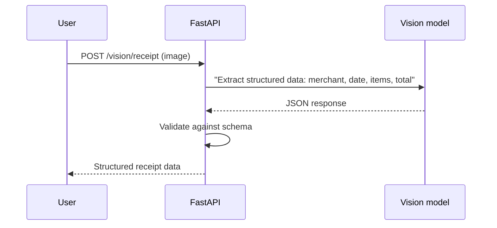

```python
from pydantic import BaseModel

class ReceiptItem(BaseModel):
    name: str
    price: float

class ReceiptData(BaseModel):
    merchant: str
    date: str
    items: list[ReceiptItem]
    subtotal: float | None = None
    tax: float | None = None
    total: float

async def analyze_receipt(image_bytes: bytes) -> ReceiptData:
    prompt = (
        "Extract structured data from this receipt image. Respond ONLY with JSON: "
        '{"merchant": str, "date": str, "items": [{"name": str, "price": number}], '
        '"subtotal": number, "tax": number, "total": number}'
    )
    text = await analyze_image(image_bytes, prompt)
    cleaned = text.strip().removeprefix("```json").removesuffix("```").strip()
    data = json.loads(cleaned)
    return ReceiptData.model_validate(data)
```

**Common real-world wrinkle:** receipts are photographed at odd angles, with folds,
faded thermal paper, and inconsistent layouts across merchants - accuracy in practice is
noticeably lower than on clean, scanned documents. Always build a review/correction UI
for extracted receipt data (especially for expense-reporting or accounting use cases)
rather than fully trusting automated extraction for financial records.

### 6.1 A worked confidence-flagging pattern

Rather than presenting extracted data as unconditionally correct, surface a confidence
signal the model itself can help generate, so the review UI can prioritize what actually
needs a human's attention:

```python
class ReceiptExtractionResult(BaseModel):
    data: ReceiptData
    needs_review: bool
    review_reasons: list[str]

async def analyze_receipt_with_confidence(image_bytes: bytes) -> ReceiptExtractionResult:
    prompt = (
        "Extract structured data from this receipt image. Respond ONLY with JSON: "
        '{"merchant": str, "date": str, "items": [{"name": str, "price": number}], '
        '"subtotal": number, "tax": number, "total": number, '
        '"uncertain_fields": [str]}  -- list any field names you were not confident about'
    )
    text = await analyze_image(image_bytes, prompt)
    cleaned = text.strip().removeprefix("```json").removesuffix("```").strip()
    raw = json.loads(cleaned)
    uncertain = raw.pop("uncertain_fields", [])

    data = ReceiptData.model_validate(raw)
    # Also flag for review if the extracted line items don't sum close to the total -
    # a cheap, deterministic sanity check independent of the model's own confidence.
    items_sum = sum(item.price for item in data.items)
    math_mismatch = abs(items_sum - data.total) > 0.05
    reasons = list(uncertain)
    if math_mismatch:
        reasons.append("line item total does not match stated total")

    return ReceiptExtractionResult(data=data, needs_review=bool(reasons), review_reasons=reasons)
```

This combines two complementary signals: the model's *self-reported* uncertainty (which
is useful but not fully reliable on its own) and a *deterministic sanity check*
(line-item totals should sum close to the stated total, a rule ordinary code can verify
independent of the model entirely). Relying on either signal alone misses cases the other
would catch - the deterministic check catches confidently-wrong extractions the model
never flagged, while the self-reported uncertainty catches ambiguity a pure math check
can't detect (an illegible merchant name, for instance).

## 7. Image Captioning

Image captioning generates a natural-language description of an image's content.

```python
async def caption_image(image_bytes: bytes, style: str = "detailed") -> str:
    prompts = {
        "brief": "Describe this image in one short sentence.",
        "detailed": "Describe this image in detail, including setting, subjects, and notable elements.",
        "alt_text": "Write concise, accessible alt text for this image for a screen reader.",
    }
    return await analyze_image(image_bytes, prompts.get(style, prompts["detailed"]))
```

| Caption style | Use case |
|---|---|
| Brief | Quick previews, search result snippets |
| Detailed | Content moderation context, detailed cataloging |
| Alt text | Accessibility - screen reader descriptions |
| Structured (objects + attributes) | Feeding into downstream search/filtering systems |

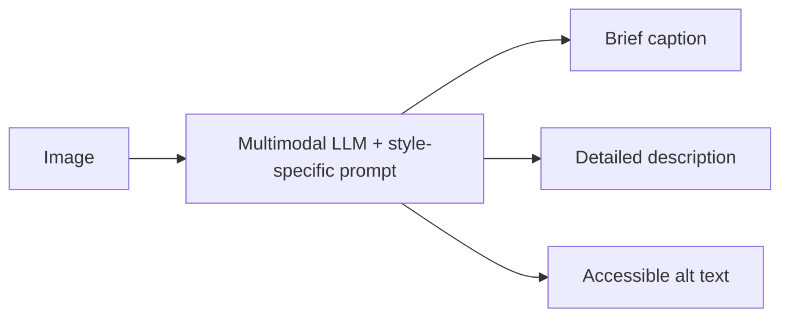

**Accessibility note:** alt text generation is a genuinely high-value, low-risk
application of image captioning - but AI-generated alt text should be reviewed by a human
for anything published publicly, since a plausible-sounding but incorrect description can
actively mislead a screen-reader user in a way that's worse than no description at all.
This is a case where the cost of an error is asymmetric in a way that's easy to overlook:
a missing caption is an obvious, recognizable gap a screen-reader user can identify as
such, while a confidently wrong caption presents as legitimate information and can send
someone to entirely the wrong conclusion about what an image contains - treat this
distinction as a reason to keep a human in the loop for public-facing alt text rather
than a purely theoretical concern.

## 8. Object Detection

Object detection identifies *what* objects are present in an image and *where* (bounding
boxes) - a capability multimodal LLMs support to a degree via prompting, but where
dedicated detection models remain the stronger choice for precise, high-volume, or
real-time use cases.

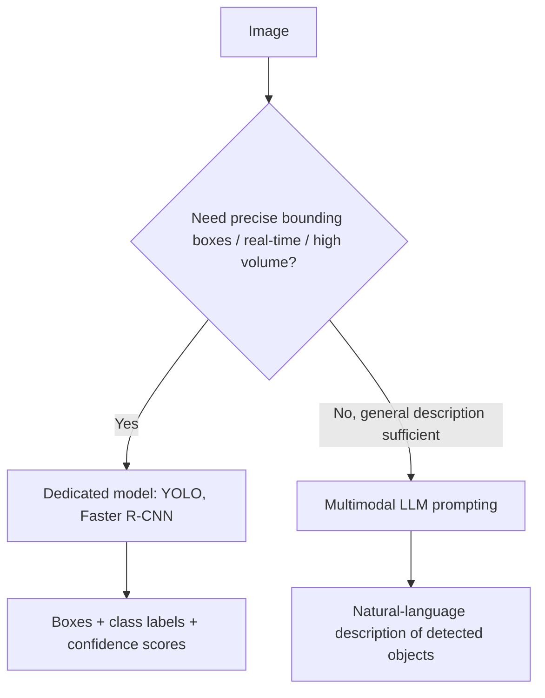

```python
# Dedicated object detection with YOLO (via the ultralytics package)
from ultralytics import YOLO

model = YOLO("yolov8n.pt")  # pretrained on COCO classes

def detect_objects(image_path: str) -> list[dict]:
    results = model(image_path)
    detections = []
    for box in results[0].boxes:
        detections.append({
            "class": model.names[int(box.cls)],
            "confidence": float(box.conf),
            "bbox": box.xyxy[0].tolist(),  # [x1, y1, x2, y2]
        })
    return detections
```

```python
# Multimodal LLM approach - good for general description, not precise coordinates
async def describe_objects(image_bytes: bytes) -> str:
    return await analyze_image(
        image_bytes,
        "List the distinct objects visible in this image, one per line.",
    )
```

| | Dedicated model (YOLO, etc.) | Multimodal LLM prompting |
|---|---|---|
| Bounding box precision | High, pixel-level coordinates | Low/unreliable - LLMs are not trained for precise spatial coordinates |
| Speed | Very fast, suitable for real-time video | Slower, API round-trip per image |
| Cost at high volume | Low - self-hosted, one-time model cost | Higher - per-call API pricing |
| Setup complexity | Higher - model hosting, GPU for real-time use | Very low - just a prompt |
| Flexibility (new object types) | Requires retraining/fine-tuning | Zero-shot - describe any object type in the prompt |

**Rule of thumb:** if you need *exact pixel coordinates* or *real-time video processing*,
use a dedicated detection model. If you need *flexible, general-purpose* "what's in this
image" understanding without retraining for new categories, multimodal LLM prompting is
simpler and often sufficient.

### 8.1 Processing video via frame sampling

Neither approach processes raw video directly in most practical setups - video is
sampled into individual frames, each handled as a still image, with results aggregated
across the sequence:

```python
import cv2

def extract_frames(video_path: str, sample_every_n_seconds: float = 1.0) -> list:
    cap = cv2.VideoCapture(video_path)
    fps = cap.get(cv2.CAP_PROP_FPS)
    frame_interval = int(fps * sample_every_n_seconds)
    frames = []
    frame_idx = 0
    while True:
        ret, frame = cap.read()
        if not ret:
            break
        if frame_idx % frame_interval == 0:
            frames.append(frame)
        frame_idx += 1
    cap.release()
    return frames

async def analyze_video_sampled(video_path: str, prompt: str) -> list[str]:
    frames = extract_frames(video_path, sample_every_n_seconds=2.0)
    results = []
    for frame in frames:
        _, buf = cv2.imencode(".jpg", frame)
        result = await analyze_image(buf.tobytes(), prompt)
        results.append(result)
    return results
```

The sampling interval is a direct latency/cost-vs-completeness trade-off: sampling every
second captures more detail but multiplies API calls (or dedicated-model inference
calls) proportionally; sampling every few seconds is often sufficient for tasks like
"summarize what happens in this video" where sub-second precision isn't needed. Gemini's
native video understanding (Section 3) is a notable exception - it can process video more
directly without manual frame extraction, at the cost of being tied to that specific
provider's capability.

## 9. Image Classification

Image classification assigns one or more category labels to an entire image - a
narrower, typically higher-accuracy-for-its-task cousin of object detection.

```python
# Dedicated classification model
from transformers import pipeline

classifier = pipeline("image-classification", model="google/vit-base-patch16-224")

def classify_image(image_path: str) -> list[dict]:
    return classifier(image_path)  # [{"label": ..., "score": ...}, ...]
```

```python
# Multimodal LLM approach with constrained output
async def classify_with_llm(image_bytes: bytes, categories: list[str]) -> str:
    prompt = (
        f"Classify this image into exactly one of these categories: {', '.join(categories)}. "
        "Respond with only the category name."
    )
    return (await analyze_image(image_bytes, prompt)).strip()
```

| Use case | Better fit |
|---|---|
| Fixed, well-defined category set at high volume (e.g. product photo quality check) | Dedicated fine-tuned classifier |
| Open-ended or evolving categories, low-medium volume | Multimodal LLM prompting |
| Need for calibrated confidence scores | Dedicated classifier (LLMs don't reliably expose calibrated probabilities) |
| Rapid prototyping before committing to training infrastructure | Multimodal LLM prompting, then optionally graduate to a trained classifier once volume/cost justifies it |

### 9.1 When to graduate from prompting to a trained classifier

A common and sensible product evolution: start with multimodal LLM prompting to validate
that a classification feature is even useful, then migrate to a dedicated fine-tuned
model once volume and cost justify the investment. A few concrete signals that it's time
to make that switch:

| Signal | What it indicates |
|---|---|
| Per-classification LLM cost now exceeds the amortized cost of training and hosting a dedicated model | Volume has crossed the economic threshold |
| You need sub-100ms classification latency | LLM API round trips can't reliably hit this; a dedicated model can |
| Your category set has stabilized and isn't changing frequently | Training investment won't be wasted on categories that keep shifting |
| You need calibrated confidence scores for downstream decision thresholds | Dedicated classifiers expose genuine probability distributions; LLM-reported "confidence" in text is not reliably calibrated |
| You have (or can label) enough training examples per category | Typically hundreds to thousands of labeled examples per class for a solid fine-tuned classifier |

Making this transition doesn't require abandoning the LLM-prompting code - many teams
keep the prompting-based path as a fallback for novel/unseen categories the trained
classifier wasn't built to handle, routing high-confidence, well-known categories to the
fast dedicated model and falling back to LLM prompting for anything ambiguous or new.

## 10. Vision APIs

| Provider | Model | Notes |
|---|---|---|
| OpenAI | GPT-4o / GPT-4o-mini | Strong general vision understanding, widely used |
| Anthropic | Claude (Sonnet/Opus with vision) | Strong document and detailed-reasoning vision tasks |
| Google | Gemini 1.5/2.x | Best-in-class long-context and video understanding |
| Google Cloud Vision API | Dedicated (non-LLM) | OCR, label detection, face detection, explicit content detection - task-specific, not conversational |
| AWS Rekognition | Dedicated (non-LLM) | Similar task-specific capabilities, deep AWS integration |
| AWS Textract | Dedicated (non-LLM) | Purpose-built document/form/table extraction |

```python
# Provider-agnostic vision call pattern, mirroring llm_providers.py from AI_ASSISTANT_GUIDE.md
async def analyze_image_multi_provider(image_bytes: bytes, prompt: str, provider_name: str) -> str:
    if provider_name == "anthropic" and ANTHROPIC_API_KEY:
        return await _anthropic_vision(image_bytes, prompt)
    if provider_name == "gemini" and GOOGLE_API_KEY:
        return await _gemini_vision(image_bytes, prompt)
    return await _openai_vision(image_bytes, prompt)

async def _anthropic_vision(image_bytes: bytes, prompt: str) -> str:
    client = AsyncAnthropic(api_key=ANTHROPIC_API_KEY)
    resp = await client.messages.create(
        model="claude-sonnet-4-6",
        max_tokens=1024,
        messages=[{
            "role": "user",
            "content": [
                {"type": "image", "source": {"type": "base64", "media_type": "image/png",
                                              "data": base64.b64encode(image_bytes).decode()}},
                {"type": "text", "text": prompt},
            ],
        }],
    )
    return "".join(b.text for b in resp.content if b.type == "text")

async def _gemini_vision(image_bytes: bytes, prompt: str) -> str:
    import google.generativeai as genai
    genai.configure(api_key=GOOGLE_API_KEY)
    model = genai.GenerativeModel("gemini-1.5-flash")
    response = await model.generate_content_async(
        [prompt, {"mime_type": "image/png", "data": image_bytes}]
    )
    return response.text
```

This mirrors the exact multi-provider abstraction pattern from
[`AI_ASSISTANT_GUIDE.md`](AI_ASSISTANT_GUIDE.md#3-modern-ai-assistant-architecture) -
vision calls should go through the same kind of provider-agnostic interface as text
chat, so switching or comparing providers is a configuration change, not a rewrite.

### 10.1 Rough cost and latency profile comparison

Exact pricing changes frequently across providers - always check current documentation
before making a commitment - but the relative shape of the trade-off is stable enough to
plan around:

| | Multimodal LLM (per image) | Dedicated cloud OCR/vision API | Self-hosted dedicated model |
|---|---|---|---|
| Typical latency | ~1-3 seconds | ~0.5-1.5 seconds | Tens of milliseconds (with GPU) |
| Cost structure | Per-token, scales with image size/detail level | Per-image, generally flat | Amortized compute cost, near-zero marginal cost per call |
| Setup time to first result | Minutes (a prompt) | Minutes to hours (API integration) | Days to weeks (model selection, hosting, testing) |
| Best economic fit | Low-to-medium volume, need for reasoning/context | Medium-to-high volume, pure extraction tasks | Very high volume, or strict latency requirements |

This table is the quantitative version of the qualitative guidance repeated throughout
Sections 4, 8, and 9: start with the multimodal LLM path for its near-zero setup cost,
and graduate to a dedicated or self-hosted approach only once volume, latency
requirements, or cost at scale genuinely justify the additional engineering investment.

## 11. Prompt Engineering

Vision prompting follows the same principles as text prompting (see
[`AI_ASSISTANT_GUIDE.md`](AI_ASSISTANT_GUIDE.md#8-prompt-engineering)), with a few
vision-specific patterns worth calling out explicitly.

| Technique | Example |
|---|---|
| Be explicit about output format | "Respond ONLY with JSON matching this schema: ..." |
| Specify the level of detail wanted | "In one sentence" vs. "In detailed paragraph form" |
| Ask for verbatim extraction vs. interpretation explicitly | "Extract the text exactly as written" vs. "Summarize what this document says" |
| Provide category constraints for classification | "Classify as exactly one of: [receipt, invoice, contract, other]" |
| Ask the model to note uncertainty | "If any field is unclear or illegible, use null rather than guessing" |

```python
# Weak prompt - ambiguous about format and thoroughness
prompt = "What's in this image?"

# Strong prompt - explicit about scope, format, and handling of uncertainty
prompt = (
    "Identify all text visible in this receipt image. Extract it as structured JSON "
    "with fields: merchant, date, items (array of {name, price}), total. "
    "If a field is illegible or missing, use null rather than guessing a value."
)
```

**Multi-image prompts:** most vision-capable models support multiple images in a single
message, useful for comparison tasks ("what changed between these two screenshots?") or
multi-page document processing:

```python
async def compare_images(image_bytes_1: bytes, image_bytes_2: bytes, prompt: str) -> str:
    client = AsyncOpenAI(api_key=OPENAI_API_KEY)
    def to_url(b: bytes) -> str:
        return f"data:image/png;base64,{base64.b64encode(b).decode()}"
    resp = await client.chat.completions.create(
        model="gpt-4o-mini",
        messages=[{
            "role": "user",
            "content": [
                {"type": "text", "text": prompt},
                {"type": "image_url", "image_url": {"url": to_url(image_bytes_1)}},
                {"type": "image_url", "image_url": {"url": to_url(image_bytes_2)}},
            ],
        }],
    )
    return resp.choices[0].message.content
```

## 12. FastAPI Integration

A complete set of vision endpoints mirroring the OCR/captioning/receipt patterns above.

```python
from fastapi import APIRouter, Depends, HTTPException, UploadFile

router = APIRouter(prefix="/api/vision")

MAX_IMAGE_BYTES = 10 * 1024 * 1024
ALLOWED_IMAGE_TYPES = {"image/png", "image/jpeg", "image/webp", "image/gif"}

async def _validated_image(file: UploadFile) -> bytes:
    if file.content_type not in ALLOWED_IMAGE_TYPES:
        raise HTTPException(415, f"Unsupported image type: {file.content_type}")
    data = await file.read()
    if len(data) > MAX_IMAGE_BYTES:
        raise HTTPException(413, "Image too large")
    if len(data) == 0:
        raise HTTPException(400, "Empty image file")
    return data

@router.post("/ocr")
async def ocr(file: UploadFile, user=Depends(get_current_user)):
    image_bytes = await _validated_image(file)
    try:
        text = await ocr_image(image_bytes)
    except Exception as exc:
        raise HTTPException(502, f"Vision provider error: {exc}")
    return {"text": text}

@router.post("/caption")
async def caption(file: UploadFile, style: str = "detailed", user=Depends(get_current_user)):
    image_bytes = await _validated_image(file)
    try:
        text = await caption_image(image_bytes, style)
    except Exception as exc:
        raise HTTPException(502, f"Vision provider error: {exc}")
    return {"caption": text}

@router.post("/receipt")
async def receipt(file: UploadFile, user=Depends(get_current_user)):
    image_bytes = await _validated_image(file)
    try:
        data = await analyze_receipt(image_bytes)
    except Exception as exc:
        raise HTTPException(502, f"Receipt analysis failed: {exc}")
    return data.model_dump()
```

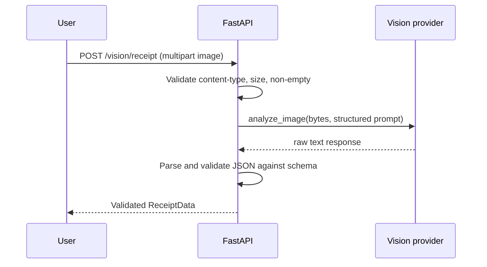

### 12.1 Background processing for slower vision tasks

Multi-page documents, batch uploads, or dedicated-model inference can take long enough
that blocking the HTTP response is a poor user experience - apply the same background
task pattern used for RAG document ingestion (see
[`RAG_GUIDE.md`](RAG_GUIDE.md#16-fastapi-integration)):

```python
from fastapi import BackgroundTasks

@router.post("/documents/upload")
async def upload_document_for_processing(
    file: UploadFile, background_tasks: BackgroundTasks, user=Depends(get_current_user), db=Depends(get_db)
):
    image_bytes = await _validated_image(file)
    document = await save_pending_document(db, user.id, file.filename, image_bytes)
    background_tasks.add_task(process_document_task, document.id)
    return {"id": document.id, "status": "processing"}

async def process_document_task(document_id: str):
    async with AsyncSessionLocal() as db:
        document = await get_document(db, document_id)
        try:
            result = await extract_structured_document(document.image_bytes, INVOICE_SCHEMA)
            document.extracted_data = result
            document.status = "ready"
        except Exception:
            document.status = "error"
        await db.commit()
```

The client immediately receives a `processing` status and either polls a status endpoint
or receives a push notification (WebSocket, server-sent event, or simple polling) once
extraction completes - precisely mirroring the document-upload UX pattern from
[`RAG_GUIDE.md`](RAG_GUIDE.md#16-fastapi-integration), since the underlying engineering
problem (a slow, external-API-dependent operation that shouldn't block the HTTP request)
is identical regardless of whether the background work is embedding a document or
extracting structured data from an image.

## 13. Security

Vision features introduce a distinct set of risks beyond the general LLM security
concerns covered in [`AI_ASSISTANT_GUIDE.md`](AI_ASSISTANT_GUIDE.md#24-security-best-practices)
- primarily because an image upload is both a richer attack surface (malformed files,
oversized payloads, embedded malicious content) and a richer information source (PII,
identity documents, financial data) than a typed text message.

| Risk | Mitigation |
|---|---|
| Unbounded/malicious file uploads | Validate content-type, cap file size, reject empty files (Section 12) |
| Sensitive content in images (PII, ID documents, medical images) | Apply the same data handling/retention policies as any sensitive data; avoid unnecessary logging of raw image bytes |
| Prompt injection via text embedded within an image | Treat extracted text from images as untrusted data in the model's context - see [`AI_ASSISTANT_GUIDE.md`](AI_ASSISTANT_GUIDE.md#241-a-concrete-prompt-injection-example) |
| Automated decisions from vision analysis (e.g. ID verification) without human review | Require human review for high-stakes decisions; never fully automate identity or financial verification from a single model call |
| Uploaded images used as a vector for exploiting image-parsing libraries | Keep image processing libraries (Pillow, etc.) updated; validate files are genuinely the claimed format, not just trusting the extension |
| Model hallucination presented as extracted fact | Explicitly instruct the model to flag uncertain/illegible content rather than guessing (Section 11) |

```python
from PIL import Image
import io

def validate_actual_image_format(data: bytes) -> str:
    """Verify the file is genuinely a valid image, not just named like one."""
    try:
        img = Image.open(io.BytesIO(data))
        img.verify()
        return img.format
    except Exception as exc:
        raise ValueError(f"Invalid or corrupted image file: {exc}")
```

> Prompt injection via images is a real, demonstrated risk: text rendered inside
> an image (e.g. "ignore previous instructions...") can be read by OCR/vision models the
> same as any other visible text, and a naive pipeline may treat it as an instruction if
> the extracted text is fed back into the conversation without being clearly framed as
> untrusted data.

### 13.1 A worked retention policy for uploaded images

Following the same pattern as the voice data retention discussion in
[`VOICE_AI_GUIDE.md`](VOICE_AI_GUIDE.md#141-a-worked-retention-policy-example), image
data deserves an explicit, enforced policy rather than indefinite default retention:

```python
from datetime import datetime, timedelta

# Sensitive document types (IDs, medical, financial) get shorter retention
RETENTION_DAYS_BY_CATEGORY = {
    "id_document": 1,
    "receipt": 90,
    "general_photo": 365,
}

async def purge_expired_images(db) -> dict:
    deleted_counts = {}
    for category, days in RETENTION_DAYS_BY_CATEGORY.items():
        cutoff = datetime.utcnow() - timedelta(days=days)
        deleted_counts[category] = await delete_images_older_than(db, category, cutoff)
    return deleted_counts
```

The pattern worth generalizing: **not all images carry the same sensitivity**, and a
single blanket retention period is usually wrong in one direction or the other - either
too aggressive for content users want to keep (a saved receipt for tax purposes) or too
lax for genuinely sensitive content (a photographed ID document that only ever needed to
exist transiently for verification). Categorize at ingestion time and apply
category-specific retention rather than a single global default.

## 14. Performance

| Technique | Impact |
|---|---|
| Resize/compress images before sending to the API | Most vision APIs don't need full-resolution images for good accuracy; smaller payloads mean faster upload and often lower cost |
| Cache results for identical images (hash-based) | Avoids redundant API calls for repeated uploads |
| Use a smaller/faster model for simple tasks | Not every vision task needs the flagship model - route by task difficulty |
| Batch multiple images in one request where supported | Reduces per-request overhead versus one call per image |
| Process images asynchronously, not blocking the request | Same background-task pattern as document ingestion in RAG (see [`RAG_GUIDE.md`](RAG_GUIDE.md#16-fastapi-integration)) |

```python
from PIL import Image
import io

def resize_for_vision_api(image_bytes: bytes, max_dimension: int = 1568) -> bytes:
    """Most vision APIs cap useful accuracy gains well below full camera resolution;
    resizing large images reduces payload size and cost with minimal accuracy loss."""
    img = Image.open(io.BytesIO(image_bytes))
    img.thumbnail((max_dimension, max_dimension), Image.LANCZOS)
    out = io.BytesIO()
    img.save(out, format=img.format or "JPEG", quality=85)
    return out.getvalue()
```

```python
import hashlib

async def cached_analyze_image(image_bytes: bytes, prompt: str, cache: dict) -> str:
    key = hashlib.sha256(image_bytes + prompt.encode()).hexdigest()
    if key in cache:
        return cache[key]
    result = await analyze_image(image_bytes, prompt)
    cache[key] = result
    return result
```

### 14.1 Batch processing many images concurrently

For bulk operations (processing an entire uploaded album, or a backlog of scanned
documents), process images concurrently rather than sequentially - but bound the
concurrency to avoid overwhelming the provider's rate limits or your own resources:

```python
import asyncio

async def batch_analyze(image_list: list[bytes], prompt: str, max_concurrency: int = 5) -> list[str]:
    semaphore = asyncio.Semaphore(max_concurrency)

    async def process_one(image_bytes: bytes) -> str:
        async with semaphore:
            try:
                return await analyze_image(image_bytes, prompt)
            except Exception as exc:
                return f"ERROR: {exc}"

    return await asyncio.gather(*(process_one(img) for img in image_list))
```

Sequential processing of, say, 200 images at roughly one second each means over three
minutes of wall-clock time; bounded concurrent processing at 5 in flight can complete the
same batch in a fraction of that time, while still respecting reasonable rate limits -
the `Semaphore` here is doing the same job a connection pool does for database access:
allowing real parallelism without unbounded resource contention.

## 15. Deployment

```bash
uvicorn main:app --host 0.0.0.0 --port 8000 --workers 4
```

```dockerfile
FROM python:3.12-slim
WORKDIR /app
RUN apt-get update && apt-get install -y --no-install-recommends \
    libjpeg-dev zlib1g-dev tesseract-ocr && rm -rf /var/lib/apt/lists/*
COPY requirements.txt .
RUN pip install --no-cache-dir -r requirements.txt
COPY . .
CMD ["uvicorn", "main:app", "--host", "0.0.0.0", "--port", "8000"]
```

| Consideration | Detail |
|---|---|
| Upload size limits | Enforce at both the reverse proxy (nginx `client_max_body_size`) and application layer |
| Dedicated model hosting (YOLO, classifiers) | Needs GPU for real-time throughput; CPU inference is viable for low-volume/batch use |
| Third-party vision API rate limits | Plan capacity and backoff behavior, same as any hosted LLM API |
| Image storage | Use object storage (S3-compatible), not local disk, for anything beyond single-instance prototypes |

See [`DEPLOYMENT_GUIDE.md`](DEPLOYMENT_GUIDE.md) for the general production deployment
checklist that applies here as much as any other service.

### 15.1 A note on regional deployment for vision workloads

Image uploads are typically larger payloads than text chat messages, which makes network
distance between your users, your application servers, and your chosen vision provider's
region a more noticeable latency factor than it is for a pure text pipeline. If your user
base is concentrated in a specific region, deploying your application servers in or near
that same region - and choosing a vision provider with infrastructure nearby - compounds
favorably: less time spent uploading the image to your server, and less time spent
forwarding it on to the provider. This is a minor optimization for occasional single-image
use cases, but becomes meaningfully noticeable for any workflow involving multi-page
document uploads or batch processing, where the cumulative effect of that extra network
hop multiplies across every image in the batch. Building a horizontally-scaled,
resilient vision pipeline is, in the end, no different in kind from building any other
resilient API-dependent service - the same load balancing, retry, and regional-proximity
principles apply throughout, just with image payloads in place of plain text.

## 16. Production Architecture

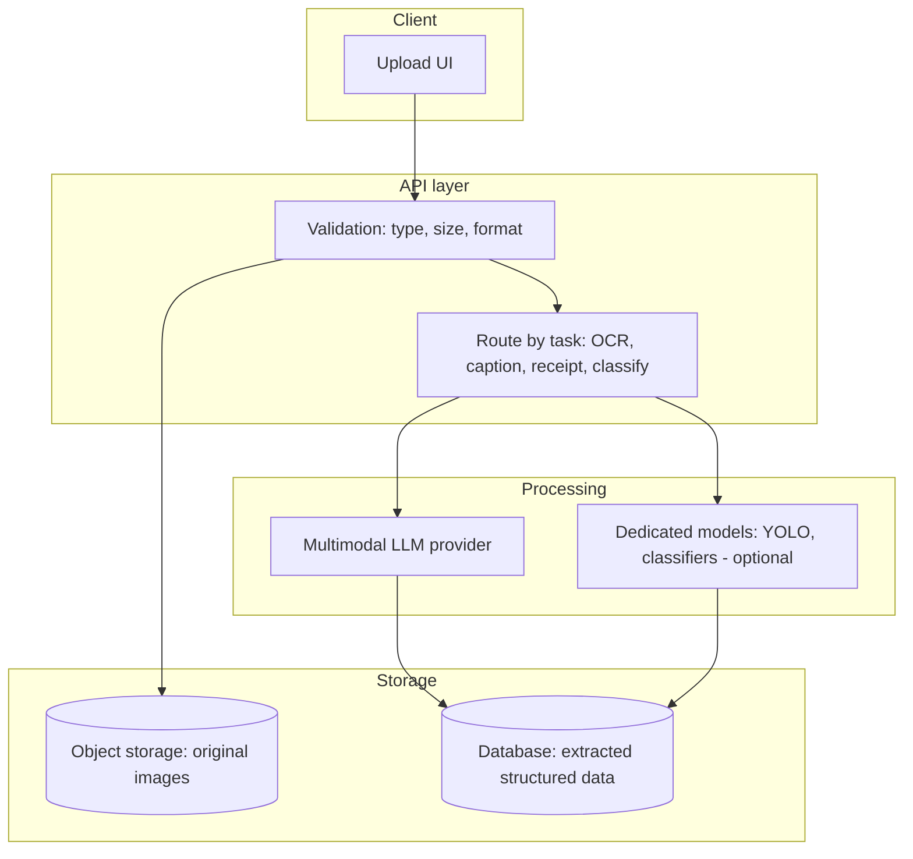

A production vision pipeline typically separates **validation** (fast, cheap, catches bad
input before expensive processing), **routing** (deciding which backend - multimodal LLM
vs. dedicated model - handles a given task), and **storage** (keeping both the original
image, for audit/reprocessing, and the extracted structured data, for querying) as
distinct, independently testable concerns. This mirrors the RAG ingestion pipeline pattern in
[`RAG_GUIDE.md`](RAG_GUIDE.md#18-enterprise-rag-architecture) - validate early, process
asynchronously, store both raw and derived data.

### 16.0 Why separation of concerns matters here specifically

Each of these three layers fails independently, and keeping them separate is what lets a
failure in one not cascade into the others. A validation bug should never allow a
malformed file through to an expensive API call; a routing decision (LLM vs. dedicated
model) should be swappable without touching how images are validated or stored; and a
storage outage shouldn't prevent validation and routing from at least attempting to
process a request (even if persisting the result has to be retried later). This is the
same architectural discipline described for RAG's connector/chunking/storage separation
in [`RAG_GUIDE.md`](RAG_GUIDE.md#181-governance-responsibilities-by-layer) - different
domain, identical underlying engineering principle: isolate the parts of a pipeline that
change or fail for different reasons, so a fix or an outage in one doesn't require
touching or breaking the others.

### 16.1 A complete production-shaped vision service

Combining validation, routing, caching, and structured extraction into one coherent
class - the shape a real production vision module tends to converge on:

```python
class VisionService:
    def __init__(self, provider_name: str = "openai", cache: dict | None = None):
        self.provider_name = provider_name
        self.cache = cache if cache is not None else {}

    async def process(self, raw_bytes: bytes, task: str, **kwargs) -> dict:
        # 1. Validate genuine image format before spending any API call
        try:
            image_format = validate_actual_image_format(raw_bytes)
        except ValueError as exc:
            return {"error": str(exc)}

        # 2. Normalize orientation and resize
        normalized = normalize_orientation(raw_bytes)
        resized = resize_for_vision_api(normalized)

        # 3. Route by task
        handlers = {
            "ocr": lambda: ocr_image(resized),
            "caption": lambda: caption_image(resized, kwargs.get("style", "detailed")),
            "receipt": lambda: analyze_receipt(resized),
        }
        handler = handlers.get(task)
        if handler is None:
            return {"error": f"Unknown vision task: {task}"}

        # 4. Cache identical (image, task) pairs
        cache_key = hashlib.sha256(resized + task.encode()).hexdigest()
        if cache_key in self.cache:
            return {"result": self.cache[cache_key], "cached": True}

        try:
            result = await handler()
        except Exception as exc:
            return {"error": f"Vision provider error: {exc}"}

        self.cache[cache_key] = result
        return {"result": result, "cached": False, "format": image_format}
```

Every defensive step from Sections 13-14 shows up here in composed form: format
validation before any API spend, orientation/resizing normalization, task-based routing,
and caching - the same layered structure that appeared in the RAG and voice handbooks'
"putting it all together" examples, because the same engineering discipline (validate
early, normalize consistently, cache deterministic work, fail gracefully) applies across
every AI-powered input pipeline regardless of modality.

## 17. Common Mistakes (25+)

Most vision AI mistakes cluster into three groups: skipping input validation (file type,
size, genuine format), trusting model output as ground truth without a verification step,
and reaching for a multimodal LLM call when a cheaper, faster dedicated model would serve
the task better (or vice versa). A useful diagnostic when reviewing your own vision
feature: for every mistake in the table below, ask whether your implementation has an
explicit, tested answer for it, or whether it's simply never come up yet in testing -
the latter is precisely how these issues surface first in production rather than in
development.

| # | Mistake | Fix |
|---|---|---|
| 1 | No file type/size validation on uploads | Validate content-type, cap size, verify the file is genuinely the claimed format (Section 13) |
| 2 | Sending full-resolution images when not needed | Resize before sending - most APIs gain little accuracy above a moderate resolution |
| 3 | Trusting extracted structured data without schema validation | Always validate JSON output against a Pydantic/JSON Schema model |
| 4 | No fallback for illegible/unclear content | Instruct the model to flag uncertainty (null/unclear) rather than guessing |
| 5 | Using a multimodal LLM for real-time video object detection | Use a dedicated fast model (YOLO) for real-time/high-volume detection instead |
| 6 | Assuming OCR/vision accuracy is uniform across document quality | Test with realistic, imperfect real-world images, not just clean samples |
| 7 | No human review for high-stakes automated decisions (ID verification, financial data) | Require human review; never fully automate high-stakes verification |
| 8 | Treating text extracted from images as trusted instructions | Frame it as untrusted data in the model's context (prompt injection risk) |
| 9 | No caching for repeated identical image analysis | Hash-based caching avoids redundant API spend |
| 10 | Blocking the request on synchronous image processing | Process asynchronously for anything beyond trivial processing time |
| 11 | Ignoring provider-specific image size/format limits | Check and enforce each provider's actual constraints before sending |
| 12 | Assuming bounding-box coordinates from an LLM prompt are pixel-accurate | LLMs are not reliable for precise spatial coordinates - use a dedicated detection model |
| 13 | No retry/error handling for vision API failures | Handle transient provider errors gracefully, same as any external API call |
| 14 | Storing raw images indefinitely with no retention policy | Apply a deliberate retention policy, especially for sensitive document types |
| 15 | Using a single fixed prompt for wildly different document types | Route to task-specific prompts (Section 11) rather than one generic prompt for everything |
| 16 | Not testing alt-text/captioning output for accessibility accuracy | Have a human review AI-generated alt text before publishing |
| 17 | Assuming all vision models handle non-English text equally well | Test explicitly with your actual target languages |
| 18 | No monitoring of vision API costs at scale | Vision calls (especially with large images) can be costlier than text-only calls - track spend |
| 19 | Choosing a dedicated model without benchmarking against multimodal LLM prompting first | For low-volume/prototyping, an LLM call is often faster to validate the approach before investing in model training |
| 20 | Ignoring image orientation/EXIF rotation issues | Normalize orientation before processing; a sideways photo degrades accuracy significantly |
| 21 | No maximum image count enforced on multi-image prompts | Unbounded multi-image requests inflate cost and latency unpredictably |
| 22 | Conflating classification and detection use cases | Pick the right capability (Sections 8-9) for what you actually need - "what is this" vs. "where are the objects" |
| 23 | Not validating uploaded files against actual image libraries (relying on file extension alone) | Use `Image.verify()` or equivalent, not just the filename/extension |
| 24 | Assuming vision model output is deterministic | Same non-determinism caveats as any LLM call - design for it |
| 25 | No content moderation on user-uploaded images | Apply the same moderation discipline as any user-generated content pipeline |
| 26 | Overlooking GPU/compute requirements for self-hosted dedicated models | Budget for the hardware real-time detection/classification models actually need |

## 18. FAQ (40+)

These questions cluster around a handful of recurring decision points: when to use
multimodal LLM prompting versus a dedicated model, how to handle the real-world messiness
of user-submitted images (rotation, poor lighting, unusual formats), and how to keep
extracted data trustworthy enough to act on. Skim for whichever theme matches your
current work rather than reading top to bottom.

**Q1. Do I need to train my own computer vision model?**
Rarely, for most applications - multimodal LLM APIs handle a wide range of vision tasks
(captioning, OCR, general Q&A about images) out of the box via prompting. Train/fine-tune
a dedicated model only when you need precise bounding boxes, real-time performance, or
very high volume where per-call LLM pricing becomes prohibitive.

**Q2. What's the difference between OCR and image captioning?**
OCR extracts the literal text present in an image; captioning describes the image's
visual content in natural language. A photo of a street sign needs OCR for the sign's
text and captioning for "a street sign on a busy intersection."

**Q3. Can multimodal LLMs read handwriting?**
To a reasonable degree, though accuracy is lower and more variable than for printed text
- test explicitly against your actual handwriting samples rather than assuming uniform
performance with typed/printed OCR benchmarks.

**Q4. Which provider has the best vision capability?**
No universally "best" answer - benchmark against your specific task (document extraction,
general description, object counting, etc.) since relative strengths shift between
providers and model versions.

**Q5. How do I extract data from a multi-page PDF, not just a single image?**
Convert each page to an image and process pages individually (or as a multi-image prompt
if your provider and page count support it), then merge the structured results -
combining this with the document chunking approach from
[`RAG_GUIDE.md`](RAG_GUIDE.md#4-chunking) for any subsequent search/retrieval need.

**Q6. Is it safe to send sensitive documents (IDs, medical records) to a cloud vision
API?**
Review the specific provider's data handling and retention policy before doing so - some
offer enterprise agreements with stronger data guarantees; for maximum control, a
self-hosted OCR/vision pipeline avoids sending sensitive data to any third party at all.

**Q7. How accurate is receipt/invoice extraction in practice?**
Generally good on clean, well-lit images of standard formats; noticeably worse on
crumpled, faded, or unusually formatted receipts - always build a human review/correction
step for financial data rather than fully automating it.

**Q8. Can vision models count objects accurately?**
Reasonably well for small numbers of clearly distinct objects; accuracy degrades for
large counts, overlapping objects, or cluttered scenes - for precise counting at scale, a
dedicated detection model is more reliable.

**Q9. What image formats are supported?**
Most vision APIs support common formats (JPEG, PNG, WebP, GIF); check your specific
provider's documentation for the authoritative list and any size/dimension limits.

**Q10. How large can an uploaded image be?**
Provider-specific - always enforce your own size cap (Section 12) both for cost control
and to stay within provider limits, and resize before sending when the source image
exceeds what the API can usefully use (Section 14).

**Q11. Do I need GPU infrastructure to use vision AI?**
Not for calling hosted multimodal LLM APIs - that compute runs on the provider's
infrastructure. GPU infrastructure becomes relevant only if you self-host a dedicated
model (YOLO, a classifier, self-hosted OCR at scale).

**Q12. How do I handle images with no readable text (OCR returns nothing)?**
Treat an empty OCR result as a valid outcome, not necessarily an error - explicitly
handle and communicate "no text found" rather than silently failing or fabricating
content.

**Q13. Can I use vision AI for content moderation (detecting inappropriate images)?**
Yes, this is a common use case - either a dedicated content moderation API/model or a
carefully prompted multimodal LLM call; dedicated moderation APIs are often preferable
for this specific task due to purpose-built accuracy and consistent policy alignment.

**Q14. What's the cost difference between LLM vision calls and dedicated OCR APIs at
scale?**
Dedicated OCR APIs (Google Cloud Vision, AWS Textract) are typically cheaper per-document
at high volume for pure text extraction; multimodal LLM calls tend to cost more per
image but add contextual understanding dedicated OCR doesn't provide - the right choice
depends on whether you need that understanding.

**Q15. How do I test vision AI features given non-deterministic output?**
Test the deterministic surrounding code (validation, schema parsing, error handling)
with standard tests; evaluate model output quality against a fixed set of representative
sample images with expected characteristics, accepting reasonable tolerance rather than
exact-match assertions.

**Q16. Can vision models detect image manipulation or deepfakes?**
This is a specialized, actively evolving capability, not something to rely on general
multimodal LLM prompting for - dedicated forensic detection tools are more appropriate
for this specific task if it's a genuine requirement.

**Q17. Should I resize images before or after uploading to my server?**
Either can work; client-side resizing (before upload) reduces bandwidth and server load,
while server-side resizing gives you more consistent control - many production systems do
both, with a lenient client-side resize and a strict server-side enforcement.

**Q18. How do I handle rotated/sideways images?**
Normalize orientation using EXIF metadata (many photos embed rotation info) before
processing - a sideways image can meaningfully degrade both OCR and general vision
accuracy.

```python
from PIL import Image, ImageOps
def normalize_orientation(image_bytes: bytes) -> bytes:
    img = Image.open(io.BytesIO(image_bytes))
    img = ImageOps.exif_transpose(img)  # auto-rotates based on EXIF orientation tag
    out = io.BytesIO()
    img.save(out, format=img.format or "JPEG")
    return out.getvalue()
```

**Q19. What's the difference between image classification and object detection?**
Classification assigns a label to the whole image ("this is a cat photo"); detection
identifies specific objects and their locations within the image ("a cat at these
coordinates, a couch at these coordinates").

**Q20. Can I fine-tune a multimodal LLM for my specific vision task?**
Some providers offer fine-tuning for vision-capable models, though it's less commonly
needed than for text-only tasks - prompting alone handles most practical vision use cases
well; consider fine-tuning only once you have clear evidence prompting isn't sufficient.

**Q21. How do I extract tables from a document image?**
Multimodal LLM prompting with an explicit instruction to preserve table structure in the
JSON output works reasonably well; for high-accuracy, high-volume table extraction,
dedicated document AI services (AWS Textract, Google Document AI) are purpose-built for
this and generally outperform general prompting.

**Q22. Is it possible to combine OCR with translation?**
Yes - either a two-step pipeline (OCR extraction, then a separate translation call) or a
single combined prompt ("extract the text and translate it to English") both work; a
combined prompt is simpler but gives less visibility into the intermediate extracted
text for verification purposes.

**Q23. How do I handle images containing multiple distinct documents (e.g. a photo of a
stack of receipts)?**
Either instruct the model to segment and extract each document separately in one call, or
detect and crop individual document regions first (a detection task) before running
extraction per region - the latter is more reliable for cluttered/overlapping documents.

**Q24. Can vision AI read barcodes/QR codes?**
General multimodal LLM prompting is unreliable for this - use a dedicated barcode/QR
decoding library (e.g. `pyzbar`) instead, which is fast, free, and far more accurate for
this narrow, well-defined task.

**Q25. What's a reasonable image size limit for a typical application?**
5-10MB is a common upload cap that comfortably covers typical phone camera photos while
preventing abuse; resize server-side (Section 14) before sending to any vision API
regardless of the upload cap.

**Q26. How do I debug "the vision model got this wrong"?**
Inspect the actual image quality first - many apparent model errors trace back to genuine
image quality issues (blur, poor lighting, extreme angles) rather than a model
limitation; if the image is clearly legible to a human and the model still errs, that's a
more meaningful signal worth investigating further.

**Q27. Should vision analysis happen synchronously or asynchronously in my API?**
For fast operations (a single small image, simple prompt), synchronous is fine; for
larger images, multi-page documents, or high-latency dedicated models, use the same
background-task pattern as document ingestion (see
[`RAG_GUIDE.md`](RAG_GUIDE.md#16-fastapi-integration)).

**Q28. Can I stream vision model responses the way I stream text chat?**
Yes, in principle - many providers support streaming for vision-containing messages the
same as text-only ones, useful for long, detailed descriptions where perceived latency
matters.

**Q29. How do I handle images uploaded in unusual color spaces or formats (CMYK, etc.)?**
Normalize to a standard format (RGB, common file type) during validation/preprocessing -
most vision APIs expect standard web image formats and may reject or mishandle unusual
color spaces.

**Q30. Is watermark/logo detection a standard capability?**
It's achievable via prompting for general cases ("is there a watermark visible?") but
precise, reliable brand/logo detection at scale typically benefits from a dedicated
trained classifier rather than general vision prompting.

**Q31. How do I handle privacy for images containing people's faces?**
Apply the same data protection discipline as any biometric-adjacent data - minimize
retention, avoid unnecessary logging, and be aware that many jurisdictions have specific
legal requirements around facial recognition/biometric data that go beyond general image
handling.

**Q32. Can vision AI help with UI testing (verifying a screenshot matches expected
output)?**
Yes, this is a growing use case - prompting a vision model to compare a screenshot
against an expected description or reference image can catch visual regressions,
complementary to traditional pixel-diffing tools.

**Q33. What's the best way to handle a document scanned upside down or at an angle?**
Same orientation normalization as Q18, plus consider asking the model directly ("if this
image appears rotated, note that in your response") as a lightweight fallback when
automated EXIF-based correction isn't available (e.g. for a photo with no EXIF data).

**Q34. How do I combine vision with RAG (searching across a library of scanned
documents)?**
OCR/extract text from each document at ingestion time, then feed that text into the
standard RAG chunking and embedding pipeline (see
[`RAG_GUIDE.md`](RAG_GUIDE.md#4-chunking)) - vision is the ingestion-time extraction
step, RAG is the subsequent search step.

**Q35. Can I use vision AI to verify a document is genuine (not fraudulent)?**
General-purpose vision prompting is not reliable for fraud detection - this requires
specialized forensic techniques and dedicated fraud-detection systems, not a naive
"does this look real" prompt to a general vision model.

**Q36. What's the latency difference between a multimodal LLM call and a dedicated
model?**
Dedicated models (especially GPU-hosted detection/classification models) are typically
much faster (milliseconds) than an LLM API round trip (often 1+ seconds) - a meaningful
factor for any real-time or high-throughput use case.

**Q37. How do I handle a user uploading a non-image file disguised with an image
extension?**
Validate the actual file content (Section 13's `Image.verify()` pattern), never trust the
file extension or declared content-type alone.

**Q38. Should I show users the raw extracted text/data or only a processed summary?**
Generally show both where practical - raw extraction supports trust/verification
(similar to citations in RAG), while a processed summary improves usability; hiding the
raw extraction entirely makes errors harder for users to catch and correct.

**Q39. Can vision models understand charts and graphs?**
Reasonably well for straightforward charts, less reliably for complex/dense
visualizations - verify accuracy against your specific chart types and complexity level
rather than assuming uniform performance.

**Q40. Is real-time webcam analysis (continuous video) supported by these same
techniques?**
For true real-time video, dedicated fast models (YOLO-class) run on sampled frames are
the standard approach; sending continuous frames to a multimodal LLM API is both far too
slow and far too costly for real-time use.

**Q41. How do I keep vision AI costs predictable at scale?**
Resize images before sending, cache identical-image results, route simple tasks to
smaller/cheaper models, and monitor per-feature spend the same way you'd monitor any
other LLM cost center - see the cost optimization principles in
[`AI_ASSISTANT_GUIDE.md`](AI_ASSISTANT_GUIDE.md#25-cost-optimization).

**Q42. Is it worth building a fallback chain across multiple vision providers?**
For high-availability production use cases, yes - the same multi-provider abstraction
pattern from Section 10 makes it straightforward to retry against a secondary provider
if the primary fails or times out, mirroring the resilience patterns any critical
external API dependency should have.

**Q43. How do I combine a deterministic sanity check with model-based confidence
scoring, as in the receipt example?**
Run both independently and flag for review if either signals a problem - a math-based
check (do the line items sum to the total) catches confidently-wrong extractions the
model itself never flagged, while the model's self-reported uncertainty catches
ambiguity a pure arithmetic check can't detect, such as an illegible merchant name. See
Section 6.1 for a complete worked example combining both.

**Q44. What's the honest accuracy ceiling for automated document extraction today?**
There's no single figure - it depends heavily on document quality, format consistency,
and how forgiving your downstream use case is of occasional errors. Measure it directly
against a representative sample of your actual documents, and design your product around
human review for anything where an error would be costly, rather than assuming any
published accuracy benchmark transfers directly to your specific document population.

## 19. Best Practices

The list below distills the highest-leverage recommendations from every section above
into a single scannable checklist. Treat it as a pre-launch review for any vision
feature, not just background reading - running through each line against your actual
implementation catches the majority of issues that would otherwise surface only once
real users submit real, imperfect photos rather than the clean test images used during
development.

- **Validate uploads rigorously** - content-type, size, and genuine file format, before
  any processing.
- **Resize images before sending** to vision APIs; most gain little from full resolution.
- **Always validate structured extraction output** against a schema before trusting it.
- **Instruct models to flag uncertainty** rather than guessing on illegible content.
- **Require human review for high-stakes automated decisions** (financial data, identity
  verification).
- **Choose the right tool for the task** - multimodal LLM prompting for flexible,
  low-volume understanding; dedicated models for real-time, high-volume, or
  precise-coordinate needs.
- **Treat extracted text as untrusted data** in the model's context - defend against
  prompt injection via image content.
- **Cache identical-image results** to avoid redundant API spend.
- **Normalize image orientation** before processing.
- **Apply a deliberate retention policy** for uploaded images, especially sensitive
  document types.
- **Show users the raw extraction alongside any processed summary** so errors are easy to
  catch.

## 20. Learning Roadmap

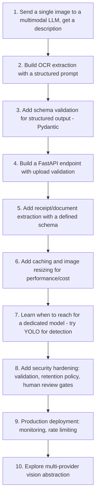

| Stage | Focus | Rough timeframe (part-time) |
|---|---|---|
| 1-3 | Fundamentals, first structured extraction | 3-5 days |
| 4-5 | Real FastAPI integration, document-specific extraction | 1 week |
| 6-7 | Performance, and dedicated-model exploration | 1 week |
| 8-10 | Production hardening, deployment, multi-provider | 1-2 weeks |

Start with a single `analyze_image` function calling one provider (Section 2) before
building anything else - every other capability in this handbook (OCR, receipt analysis,
captioning) is the same underlying call with a different, more specific prompt. Once that
core call works reliably with proper validation and error handling, the rest of this
roadmap is about which prompt to send and, occasionally, whether a dedicated model would
serve a specific high-volume or precision-sensitive task better than continued prompting.
The `VisionService` class in Section 16.1 is a reasonable template for where that
progression naturally ends up - validate, normalize, route, cache, fail gracefully -
regardless of which specific vision tasks your product ultimately needs.

### 20.1 Closing summary

Vision AI's practical engineering challenge looks less like a computer vision problem
and more like any other AI-integration problem: validate untrusted input rigorously,
treat model output as a claim to verify rather than a fact to trust, and pick the right
tool (flexible prompting vs. fast dedicated model) for the actual volume and precision
your task demands. The multimodal LLM APIs covered throughout this handbook have made the
*first draft* of a vision feature dramatically cheaper to build than it was even a few
years ago - a single well-crafted prompt now does what used to require a training
pipeline. What hasn't changed is the discipline required to take that first draft to
something trustworthy in production: schema validation, confidence signals, human review
gates for high-stakes decisions, and the same defensive engineering this handbook's
sibling guides apply to RAG, MCP, and voice. Build the smallest working vision feature
first, add the safeguards from Sections 13 and 17 before it touches anything
consequential, and let real usage data - not assumptions about accuracy - tell you when
it's time to graduate to a dedicated model.

---

*See also: [`AI_ASSISTANT_GUIDE.md`](AI_ASSISTANT_GUIDE.md) for the broader assistant
architecture vision fits into, [`VOICE_AI_GUIDE.md`](VOICE_AI_GUIDE.md) for the audio
counterpart, [`RAG_GUIDE.md`](RAG_GUIDE.md) for combining vision-extracted text with
retrieval, and [`DEPLOYMENT_GUIDE.md`](DEPLOYMENT_GUIDE.md) for the general production
deployment checklist. If you take one idea from this handbook forward, let it be that
the model call is the easy part - the validation, normalization, and human-review
scaffolding around it is what turns a vision demo into a vision feature you can actually
ship. That scaffolding is rarely glamorous work, and it is consistently the work that
determines whether a vision feature survives contact with real users and real, messy,
imperfect images.*
