# VOICE_AI_GUIDE.md - The Definitive Voice AI Handbook

**From First Principles to Production Voice Assistants**

> This handbook teaches Voice AI from zero prior knowledge to production deployment:
> speech-to-text, text-to-speech, streaming audio, voice activity detection, wake words,
> and how to build a real voice assistant with Python, FastAPI, and the browser's native
> audio APIs. Every code example is written to reflect the shape of a real production
> integration - the same STT/TTS calls, VAD logic, and streaming patterns a shipped voice
> product actually uses, not simplified demo code that breaks down under real network
> conditions and real user behavior. Companion documents:
> [`AI_ASSISTANT_GUIDE.md`](AI_ASSISTANT_GUIDE.md) for the broader assistant architecture
> voice fits into, and [`VISION_AI_GUIDE.md`](VISION_AI_GUIDE.md) for the multimodal
> counterpart.

---

## Table of Contents

1. [AI Voice Fundamentals](#1-ai-voice-fundamentals)
2. [Speech-to-Text](#2-speech-to-text)
3. [Text-to-Speech](#3-text-to-speech)
4. [Audio Processing](#4-audio-processing)
5. [Streaming Audio](#5-streaming-audio)
6. [Voice Activity Detection](#6-voice-activity-detection)
7. [Wake Words](#7-wake-words)
8. [Conversation Memory](#8-conversation-memory)
9. [Voice Assistant Architecture](#9-voice-assistant-architecture)
10. [OpenAI Voice APIs](#10-openai-voice-apis)
11. [Browser Integration](#11-browser-integration)
12. [FastAPI Backend](#12-fastapi-backend)
13. [Voice UX](#13-voice-ux)
14. [Security](#14-security)
15. [Deployment](#15-deployment)
16. [Performance](#16-performance)
17. [Common Mistakes (25+)](#17-common-mistakes-25)
18. [FAQ (40+)](#18-faq-40)
19. [Best Practices](#19-best-practices)
20. [Learning Roadmap](#20-learning-roadmap)

---

## 1. AI Voice Fundamentals

Voice AI is the combination of three distinct capabilities into one interaction loop:
converting speech to text (so a language model can reason over it), converting text back
to speech (so the model's answer can be heard), and everything in between that makes the
loop feel natural - timing, interruption handling, and audio quality.

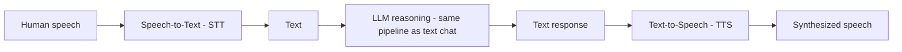

A critical mental model: **voice AI is not a different kind of intelligence** - the
reasoning step (see [`AI_ASSISTANT_GUIDE.md`](AI_ASSISTANT_GUIDE.md#5-chat-architecture))
is identical to any text-based chat pipeline. Voice AI adds an audio-in and audio-out
layer around that same core, plus the timing-sensitive engineering (Sections 4-7 of this
handbook) that a text-only chat interface never has to deal with. Keeping this separation
clear in your own mental model - and, ideally, in your actual codebase - is what lets a
single well-built assistant serve text, voice, and eventually other modalities without
three parallel, diverging implementations of the same underlying reasoning logic.

### 1.1 Key terms

| Term | Meaning |
|---|---|
| STT (Speech-to-Text) | Also called ASR (Automatic Speech Recognition); converts audio to text |
| TTS (Text-to-Speech) | Also called speech synthesis; converts text to audio |
| VAD (Voice Activity Detection) | Detects when someone is actually speaking vs. silence/noise |
| Wake word | A specific phrase ("Hey Siri") that activates listening from an idle state |
| Turn-taking | The logic governing when the assistant should stop listening and start responding |
| Barge-in / interruption | Letting the user interrupt the assistant's speech mid-response |
| Full-duplex | Audio flows both directions simultaneously, enabling natural interruption |
| Half-duplex / turn-based | Only one side "speaks" at a time - record, then respond, then record again |

### 1.2 Two architectural models

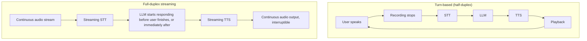

| | Turn-based | Full-duplex streaming |
|---|---|---|
| Implementation complexity | Low | High |
| Latency feel | Noticeable pause between turns | Near real-time, conversational |
| Interruption support | None, or crude (stop and restart) | Natural, built into the architecture |
| Good starting point? | Yes - build this first | Upgrade once turn-based works reliably |

### 1.3 When each architecture actually makes sense

Not every voice product needs full-duplex streaming, and building it prematurely is a
common source of wasted engineering effort. Match the architecture to the use case rather
than defaulting to the most sophisticated option:

| Use case | Recommended architecture |
|---|---|
| Voice memo / dictation tool | Turn-based - there's no "conversation" to interrupt |
| Customer support voice bot with simple Q&A | Turn-based, often sufficient |
| Natural back-and-forth voice assistant (smart speaker style) | Full-duplex streaming - interruption and low latency matter significantly |
| Voice-controlled command interface (e.g. "turn off the lights") | Turn-based with a short, tight recording window |
| Real-time voice translation | Full-duplex streaming - latency is the entire value proposition |
| Accessibility-focused voice input for forms/text fields | Turn-based, tightly scoped to the current field |

A useful diagnostic question: **does the user ever need to interrupt the assistant
mid-response, or does every interaction naturally resolve in one clean turn?** If the
latter, turn-based architecture is not a compromise - it's the correct, simpler choice.

## 2. Speech-to-Text

Speech-to-text converts spoken audio into text. The dominant approach today for most
applications is calling a hosted API (OpenAI's Whisper, for example) rather than running
a model yourself, though self-hosted options exist for privacy-sensitive or offline use
cases.

```python
from openai import AsyncOpenAI

async def transcribe_audio(file_bytes: bytes, filename: str = "audio.webm") -> str:
    client = AsyncOpenAI(api_key=OPENAI_API_KEY)
    transcript = await client.audio.transcriptions.create(
        model="whisper-1",
        file=(filename, file_bytes),
    )
    return transcript.text
```

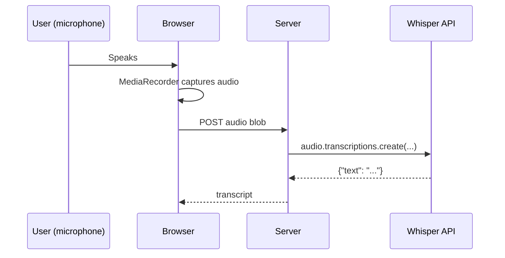

### 2.1 STT provider comparison

| Provider/model | Deployment | Notes |
|---|---|---|
| OpenAI Whisper (API) | Hosted | Strong accuracy, broad language support, simple API |
| OpenAI `gpt-4o-transcribe` / realtime STT | Hosted, streaming-capable | Lower latency, designed for conversational use |
| Whisper (self-hosted, open weights) | Local/self-hosted | Free after compute cost, full data privacy, requires GPU for good latency |
| Google Cloud Speech-to-Text | Hosted | Strong streaming support, deep GCP integration |
| Deepgram | Hosted | Purpose-built for low-latency streaming STT |
| Assembly AI | Hosted | Strong accuracy, additional features (speaker diarization, etc.) |

### 2.2 Batch vs. streaming STT

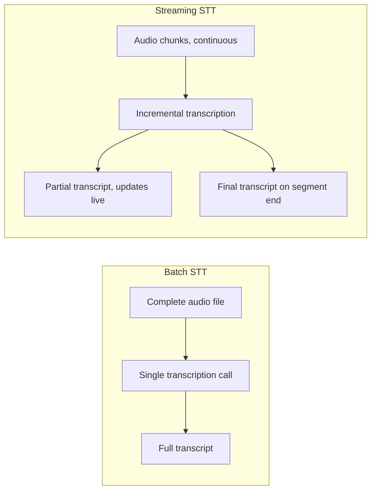

Batch STT (send a complete recording, get text back) is simpler to implement and
sufficient for turn-based voice interfaces. Streaming STT (continuously transcribe as
audio arrives) is necessary for full-duplex, low-latency conversational experiences,
where waiting for the user to finish speaking before transcription even begins would add
unacceptable delay.

```python
# Streaming STT sketch using an async generator of audio chunks
async def stream_transcribe(audio_chunk_stream) -> AsyncIterator[str]:
    async with stt_client.stream() as stream:
        async def send_audio():
            async for chunk in audio_chunk_stream:
                await stream.send_audio(chunk)
            await stream.close_send()

        asyncio.create_task(send_audio())
        async for result in stream.receive_transcripts():
            yield result.text  # partial or final, depending on result.is_final
```

## 3. Text-to-Speech

Text-to-speech converts generated text back into audio for playback.

```python
from openai import AsyncOpenAI

async def synthesize_speech(text: str, voice: str = "alloy") -> bytes:
    client = AsyncOpenAI(api_key=OPENAI_API_KEY)
    response = await client.audio.speech.create(
        model="tts-1",
        voice=voice,
        input=text,
    )
    return response.read()  # raw MP3 bytes
```

### 3.1 TTS provider comparison

| Provider/model | Latency profile | Voice quality/customization | Notes |
|---|---|---|---|
| OpenAI TTS (`tts-1`) | Low-medium | Good, fixed voice set (alloy, echo, fable, onyx, nova, shimmer) | Simple integration, good default |
| OpenAI TTS (`tts-1-hd`) | Higher | Higher fidelity | Better for pre-generated content where latency matters less |
| ElevenLabs | Low-medium | Excellent, extensive voice cloning/customization | Popular for highly natural or branded voices |
| Google Cloud Text-to-Speech | Low-medium | Good, wide language/voice selection | Deep GCP integration |
| Amazon Polly | Low-medium | Good, wide language/voice selection | Deep AWS integration |
| Local/open-source (e.g. Piper, Coqui) | Variable, hardware-dependent | Lower than commercial options typically | Full privacy, zero marginal cost, requires local compute |

### 3.2 Streaming TTS

For low-latency playback, TTS should stream audio chunks as they're generated rather than
waiting for the entire synthesis to complete:

```python
async def stream_speech(text: str, voice: str = "alloy") -> AsyncIterator[bytes]:
    client = AsyncOpenAI(api_key=OPENAI_API_KEY)
    async with client.audio.speech.with_streaming_response.create(
        model="tts-1", voice=voice, input=text
    ) as response:
        async for chunk in response.iter_bytes(chunk_size=4096):
            yield chunk
```

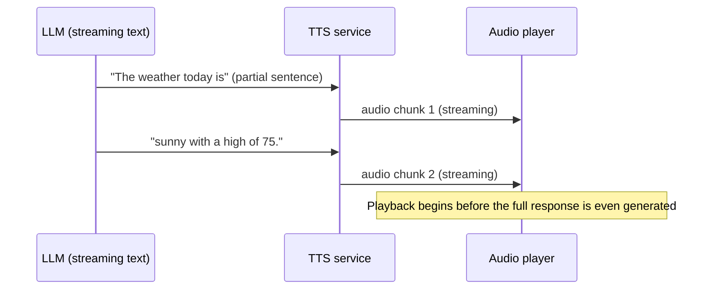

Sentence-level chunking of the LLM's streaming text output - sending each completed
sentence to TTS as soon as it's available, rather than waiting for the full response - is
the standard technique for minimizing the perceived delay between the user's question and
the assistant's first audible words.

### 3.3 Controlling prosody and pronunciation

Beyond picking a voice, some TTS providers accept **SSML** (Speech Synthesis Markup
Language) or provider-specific parameters to control pacing, emphasis, and pronunciation
of specific words - useful for numbers, acronyms, or names a default synthesis pass might
mispronounce:

```xml
<speak>
  Your order <say-as interpret-as="characters">A1B2</say-as> will arrive
  <break time="300ms"/> in approximately <say-as interpret-as="cardinal">3</say-as> days.
</speak>
```

Not every provider supports SSML (OpenAI's TTS API, for example, does not as of this
writing - check current provider documentation), and even where supported, over-using
markup tends to produce diminishing returns versus simply writing the input text in a way
that reads naturally aloud in the first place (spelling out an acronym phonetically in
plain text, for instance, rather than relying on markup to force correct pronunciation).

## 4. Audio Processing

A few audio fundamentals matter enough to production voice AI that skipping them causes
real bugs.

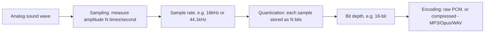

| Concept | What it means | Why it matters |
|---|---|---|
| Sample rate | How many amplitude measurements per second (Hz) | STT models expect a specific rate (often 16kHz); mismatches degrade accuracy |
| Bit depth | Precision of each sample (commonly 16-bit) | Affects audio fidelity and file size |
| Channels | Mono (1) vs. stereo (2) | Most STT expects mono; stereo doubles data with no accuracy benefit for speech |
| Format/codec | WAV (uncompressed), MP3, Opus, WebM | Determines file size and compatibility; browsers commonly record WebM/Opus |

```python
import io
from pydub import AudioSegment

def normalize_audio(input_bytes: bytes, input_format: str = "webm") -> bytes:
    """Convert arbitrary browser-recorded audio into the 16kHz mono WAV
    format most STT APIs expect, correcting for format/rate mismatches."""
    audio = AudioSegment.from_file(io.BytesIO(input_bytes), format=input_format)
    audio = audio.set_frame_rate(16000).set_channels(1)
    out = io.BytesIO()
    audio.export(out, format="wav")
    return out.getvalue()
```

**Common gotcha:** most hosted STT APIs (including Whisper) actually handle format
conversion internally and accept WebM/MP3/WAV directly - explicit normalization like the
above is mainly needed when working with self-hosted models that expect a specific raw
PCM format, or when you need to pre-process audio (e.g. trim silence) before sending it.

### 4.1 Codec comparison

| Codec | Compression | Typical use | Browser support |
|---|---|---|---|
| WAV (PCM) | None (uncompressed) | Local processing, VAD frame analysis | Universal, but large file sizes |
| MP3 | Lossy | TTS output, general playback | Universal |
| Opus (in WebM/Ogg container) | Lossy, optimized for speech | Browser `MediaRecorder` default, WebRTC | Modern browsers |
| FLAC | Lossless | Archival-quality recording, rarely needed for speech AI | Good but less universal than MP3/WAV |

### 4.2 Estimating bandwidth and storage

A quick sanity-check calculation that's worth internalizing rather than looking up every
time: uncompressed 16-bit mono PCM at 16kHz produces `16,000 samples/sec x 2 bytes/sample
= 32,000 bytes/sec = 32 KB/sec = ~1.9 MB/minute`. A typical browser-recorded
WebM/Opus stream compresses this dramatically - often to well under 100 KB/minute at
speech-appropriate bitrates. This matters for two very different reasons: **upload
bandwidth** (compressed formats transmit faster over constrained connections) and **raw
PCM processing** (VAD and other frame-level analysis typically needs uncompressed
samples, so a decode step sits between "audio arrived compressed" and "VAD can analyze
it").

```python
def estimate_pcm_size_bytes(duration_seconds: float, sample_rate: int = 16000, bit_depth: int = 16) -> int:
    bytes_per_sample = bit_depth // 8
    return int(duration_seconds * sample_rate * bytes_per_sample)  # mono
```

## 5. Streaming Audio

Streaming audio means processing audio incrementally as it arrives, rather than waiting
for a complete recording - essential for low-latency, full-duplex voice interfaces.

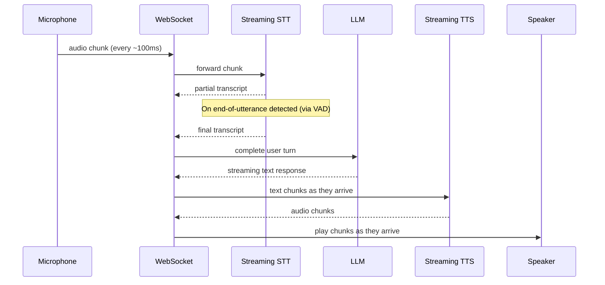

```python
# FastAPI WebSocket endpoint for streaming voice interaction
from fastapi import WebSocket

@app.websocket("/ws/voice")
async def voice_websocket(websocket: WebSocket):
    await websocket.accept()
    audio_buffer = bytearray()

    try:
        while True:
            message = await websocket.receive()
            if "bytes" in message:
                audio_buffer.extend(message["bytes"])
                if vad_detects_end_of_speech(audio_buffer):
                    transcript = await transcribe_audio(bytes(audio_buffer))
                    audio_buffer.clear()

                    await websocket.send_json({"type": "transcript", "text": transcript})

                    async for text_chunk in stream_llm_response(transcript):
                        async for audio_chunk in stream_speech(text_chunk):
                            await websocket.send_bytes(audio_chunk)

                    await websocket.send_json({"type": "turn_complete"})
    except Exception:
        await websocket.close()
```

**Why WebSockets, not HTTP, for streaming voice?** Voice interaction is inherently
bidirectional and continuous - audio flows in from the microphone while audio may
simultaneously need to flow out to the speaker (for interruption support). WebSockets
provide a persistent, full-duplex connection suited to this; Server-Sent Events (used for
text chat streaming, see [`AI_ASSISTANT_GUIDE.md`](AI_ASSISTANT_GUIDE.md#5-chat-architecture))
are one-directional and a poor fit for audio input.

## 6. Voice Activity Detection

**Voice Activity Detection (VAD)** determines when someone is actually speaking versus
silence or background noise - critical for knowing when to stop recording and start
processing, and for avoiding wasted STT calls on silence.

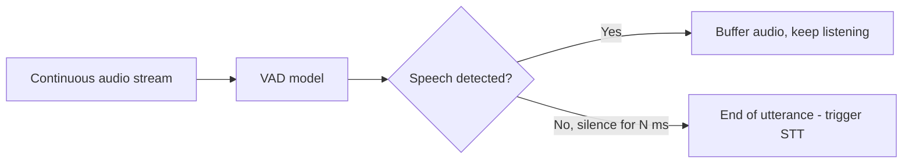

```python
import webrtcvad

class SimpleVAD:
    def __init__(self, aggressiveness: int = 2, sample_rate: int = 16000):
        self.vad = webrtcvad.Vad(aggressiveness)  # 0 (least aggressive) to 3 (most)
        self.sample_rate = sample_rate

    def is_speech(self, frame: bytes) -> bool:
        # frame must be 10, 20, or 30ms of 16-bit mono PCM at the given sample rate
        return self.vad.is_speech(frame, self.sample_rate)

class UtteranceDetector:
    def __init__(self, silence_threshold_ms: int = 700):
        self.vad = SimpleVAD()
        self.silence_threshold_ms = silence_threshold_ms
        self.silence_duration_ms = 0
        self.is_speaking = False

    def process_frame(self, frame: bytes, frame_duration_ms: int = 30) -> str:
        speech = self.vad.is_speech(frame)
        if speech:
            self.is_speaking = True
            self.silence_duration_ms = 0
            return "speaking"
        elif self.is_speaking:
            self.silence_duration_ms += frame_duration_ms
            if self.silence_duration_ms >= self.silence_threshold_ms:
                self.is_speaking = False
                return "utterance_end"
            return "trailing_silence"
        return "idle"
```

| VAD approach | Accuracy | Latency | Complexity |
|---|---|---|---|
| Energy/amplitude threshold | Low - fooled by loud background noise | Very low | Very simple |
| WebRTC VAD (as shown above) | Good | Low | Simple, widely used |
| Neural VAD models (e.g. Silero VAD) | Best | Low-medium | Slightly more setup, meaningfully more robust |

**Silence threshold tuning** matters more than it first appears: too short (e.g. 200ms)
cuts users off mid-sentence during natural pauses; too long (e.g. 8000ms) makes the
assistant feel sluggish to respond. 600-800ms is a common, reasonable starting point,
tunable based on observed user behavior.

### 6.1 Neural VAD

For products where accuracy matters more than the simplicity of a threshold-based
approach, neural VAD models (Silero VAD is a popular open-source option) offer
meaningfully better robustness to background noise, music, and non-speech sounds that
simpler energy-based or WebRTC VAD can misclassify as speech:

```python
import torch

class SileroVAD:
    def __init__(self):
        self.model, utils = torch.hub.load(
            repo_or_dir="snakers4/silero-vad", model="silero_vad", trust_repo=True
        )
        self.get_speech_timestamps = utils[0]

    def is_speech(self, audio_tensor: torch.Tensor, sample_rate: int = 16000, threshold: float = 0.5) -> bool:
        timestamps = self.get_speech_timestamps(audio_tensor, self.model, sampling_rate=sample_rate, threshold=threshold)
        return len(timestamps) > 0
```

The trade-off is straightforward: neural VAD requires loading and running a small model
(low but non-zero compute cost per frame) versus WebRTC VAD's near-instant heuristic
check. For most conversational voice products, this cost is negligible relative to the
STT and LLM calls happening in the same pipeline, making neural VAD the better default
once you've moved past initial prototyping.

## 7. Wake Words

A **wake word** (or wake phrase) lets a voice assistant stay passively listening without
sending continuous audio to a cloud STT service - audio is only processed further once a
lightweight, always-on local detector recognizes the trigger phrase.

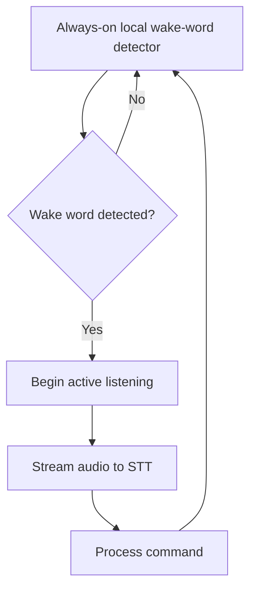

```python
# Conceptual sketch using an open-source wake-word engine (e.g. openWakeWord, Porcupine)
class WakeWordListener:
    def __init__(self, model, threshold: float = 0.5):
        self.model = model
        self.threshold = threshold

    async def listen(self, audio_frame_stream) -> AsyncIterator[bool]:
        async for frame in audio_frame_stream:
            score = self.model.predict(frame)
            yield score >= self.threshold
```

| Approach | Runs where | Privacy | Notes |
|---|---|---|---|
| Cloud-based always-listening STT | Server | Weaker - continuous audio leaves the device | Simpler, but costly and privacy-sensitive at scale |
| Local wake-word model (Porcupine, openWakeWord, etc.) | On-device | Strong - only post-wake-word audio leaves the device | Standard approach for dedicated hardware/mobile assistants |
| No wake word (push-to-talk / explicit button) | N/A | Strongest - audio only sent when explicitly triggered | Simplest to build; appropriate for most web/app-based assistants |

**For a web-based voice assistant** (the most common case for a custom-built product), a
simple push-to-talk button or click-to-record interaction is usually the right choice -
wake-word detection is primarily justified for hands-free, dedicated hardware devices
(smart speakers) or mobile apps, where implementation complexity is worth the hands-free
convenience it buys. If you do build a wake-word feature later, treat it as an additive
enhancement layered on top of an already-working push-to-talk flow, not a replacement for
it - a fallback manual trigger remains valuable even in a hands-free product, both for
noisy environments where the wake word may fail to trigger and for users who simply
prefer not to speak a trigger phrase before every request.

## 8. Conversation Memory

Voice conversations use exactly the same memory architecture as text chat (see
[`AI_ASSISTANT_GUIDE.md`](AI_ASSISTANT_GUIDE.md#6-conversation-memory) and
[Long-Term Memory](AI_ASSISTANT_GUIDE.md#7-long-term-memory)) - the only difference is
that the "message" content originates from a transcript rather than typed text. This is
worth stating plainly because it's easy to over-engineer a separate memory system for
voice under the assumption that a spoken conversation needs fundamentally different
handling; in practice, once audio becomes text, every downstream concern (windowing,
long-term fact extraction, per-conversation system prompts) is identical to the text
pipeline, and duplicating that logic for voice is both unnecessary and a maintenance
liability.

```python
async def handle_voice_turn(db, conversation, audio_bytes: bytes, provider_name="openai") -> bytes:
    transcript = await transcribe_audio(audio_bytes)

    # From here, this is identical to the text chat pipeline -
    # short-term window + long-term memory + system prompt, same as any turn.
    messages = await build_context_messages(db, conversation)
    messages.append(ChatMessage(role="user", content=transcript))

    provider = get_provider(provider_name)
    result = await provider.complete(messages)

    db.add(Message(conversation_id=conversation.id, role="user", content=transcript))
    db.add(Message(conversation_id=conversation.id, role="assistant", content=result.text))
    await db.commit()

    return await synthesize_speech(result.text)
```

One voice-specific consideration: **transcription errors become part of the permanent
conversation record** unless you handle them deliberately. A misheard word in the
transcript will be treated as what the user "said" for all future context and memory
extraction. Consider surfacing the transcript to the user for confirmation on
high-stakes voice interactions (e.g. before executing a side-effecting action), the same
principle as the tool-confirmation pattern in
[`AI_ASSISTANT_GUIDE.md`](AI_ASSISTANT_GUIDE.md#24-security-best-practices).

## 9. Voice Assistant Architecture

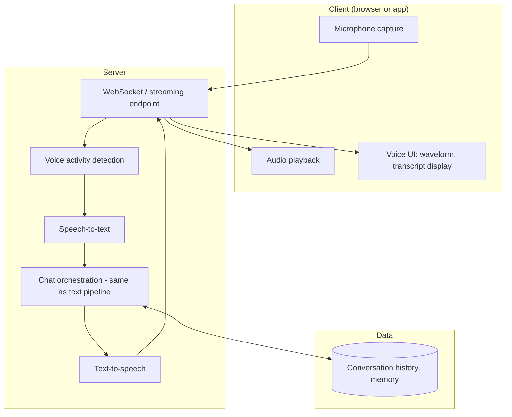

This architecture makes explicit what Section 1 stated conceptually: the **CHAT**
orchestration box is identical to a text-based assistant's core pipeline. Everything
voice-specific - microphone capture, VAD, STT, TTS, playback - forms a shell around that
same core, which is why a well-architected assistant can support text and voice
interfaces simultaneously without duplicating any reasoning logic.

### 9.1 Scaling considerations specific to voice

Voice adds infrastructure demands a text-only assistant doesn't have, worth planning for
before they become production incidents:

| Concern | Why voice makes it harder | Mitigation |
|---|---|---|
| Persistent connections | Each active voice session holds a WebSocket open, unlike stateless HTTP chat requests | Size your server pool for concurrent *sessions*, not just concurrent *requests* |
| Third-party API concurrency limits | STT/TTS providers often have stricter concurrent-request limits than text completion APIs | Track provider-specific limits separately from your own rate limiting |
| Audio buffering memory | Each in-progress streaming session holds an audio buffer in memory | Cap buffer size per session and enforce maximum session duration |
| Regional latency | Round-trip time compounds across STT -> LLM -> TTS in a way a single text API call doesn't | Deploy voice-handling compute close to both users and your STT/TTS provider's region |
| Graceful session cleanup | An abandoned WebSocket (closed tab, dropped connection) can leak resources if not handled | Implement heartbeats/timeouts and clean up buffers on disconnect |

None of this requires exotic infrastructure - a horizontally-scaled FastAPI deployment
(see [`AI_ASSISTANT_GUIDE.md`](AI_ASSISTANT_GUIDE.md#27-scaling)) handles voice sessions
fine, provided your load balancer is WebSocket-aware (Section 15) and you've sized
capacity around concurrent sessions rather than assuming voice traffic behaves like
stateless HTTP request traffic.

## 10. OpenAI Voice APIs

OpenAI offers voice capability through two distinct API surfaces, suited to different
architectural choices:

| API | Model | Interaction style | Best for |
|---|---|---|---|
| `audio.transcriptions` (Whisper) | `whisper-1` | Batch: send complete audio, get complete transcript | Turn-based voice interfaces |
| `audio.speech` | `tts-1` / `tts-1-hd` | Batch or streaming synthesis | Turn-based or streamed playback |
| Realtime API | `gpt-4o-realtime` class models | Full-duplex, low-latency, speech-to-speech | Natural, interruptible conversational voice |

```python
# Turn-based pipeline (Sections 2 + 3 combined)
async def voice_turn(audio_bytes: bytes) -> bytes:
    transcript = await transcribe_audio(audio_bytes)
    response_text = await get_llm_response(transcript)
    return await synthesize_speech(response_text)
```

```python
# Sketch of the Realtime API's event-driven, full-duplex model
import websockets
import json
import base64

async def realtime_session(api_key: str):
    uri = "wss://api.openai.com/v1/realtime?model=gpt-4o-realtime-preview"
    headers = {"Authorization": f"Bearer {api_key}", "OpenAI-Beta": "realtime=v1"}

    async with websockets.connect(uri, extra_headers=headers) as ws:
        await ws.send(json.dumps({
            "type": "session.update",
            "session": {"voice": "alloy", "instructions": "You are a helpful voice assistant."},
        }))

        async def send_audio(audio_chunk_stream):
            async for chunk in audio_chunk_stream:
                await ws.send(json.dumps({
                    "type": "input_audio_buffer.append",
                    "audio": base64.b64encode(chunk).decode(),
                }))

        async for message in ws:
            event = json.loads(message)
            if event["type"] == "response.audio.delta":
                yield base64.b64decode(event["delta"])  # streamed audio out
```

**Why the Realtime API matters architecturally:** it collapses STT, LLM reasoning, and
TTS into a single model that processes and generates speech directly - no separate
transcription/synthesis round trips. This significantly reduces latency and enables
natural interruption handling, at the cost of less control over the intermediate text
representation (useful for logging, moderation, or RAG injection) than the
compose-it-yourself pipeline from Sections 2-3.

### 10.1 Choosing between the composed pipeline and the Realtime API

| Consideration | Composed pipeline (Whisper + LLM + TTS) | Realtime API |
|---|---|---|
| Latency | Higher - three sequential API round trips | Lower - single persistent connection, speech-to-speech |
| Interruption support | Requires custom implementation | Native |
| Control over intermediate text | Full - inspect/modify the transcript before it reaches the LLM | Limited - text representation is internal to the API |
| RAG/tool injection | Straightforward - same pattern as any text pipeline | Supported, but requires working within the Realtime session's event model |
| Provider flexibility | Free to mix providers (e.g. OpenAI STT + Anthropic LLM + ElevenLabs TTS) | Locked to a single vendor's integrated voice model |
| Implementation complexity | Moderate | Higher initially, but removes the need to hand-build streaming orchestration |

There's no universally correct choice - a product that needs deep RAG integration,
multi-provider flexibility, or fine-grained control over the text the model sees is often
better served by the composed pipeline despite its higher latency; a product where
natural, low-latency conversational feel is the primary value proposition (a phone-call-like
assistant) more often justifies the Realtime API's architectural trade-offs.

## 11. Browser Integration

The browser's native `MediaRecorder` and `Audio`/`Web Audio` APIs handle microphone
capture and playback without any third-party library for basic use cases.

```javascript
// Recording audio in the browser
let mediaRecorder, chunks = [];

async function startRecording() {
  const stream = await navigator.mediaDevices.getUserMedia({ audio: true });
  mediaRecorder = new MediaRecorder(stream);
  chunks = [];
  mediaRecorder.ondataavailable = (e) => chunks.push(e.data);
  mediaRecorder.start();
}

async function stopRecording() {
  return new Promise((resolve) => {
    mediaRecorder.onstop = () => resolve(new Blob(chunks, { type: "audio/webm" }));
    mediaRecorder.stop();
  });
}

async function sendForTranscription(blob) {
  const formData = new FormData();
  formData.append("file", blob, "audio.webm");
  const response = await fetch("/api/voice/transcribe", { method: "POST", body: formData });
  return response.json();
}
```

```javascript
// Playing back synthesized speech
async function playResponse(text) {
  const response = await fetch(`/api/voice/speak?text=${encodeURIComponent(text)}`, {
    method: "POST",
  });
  const blob = await response.blob();
  const audio = new Audio(URL.createObjectURL(blob));
  await audio.play();
}
```

```javascript
// Streaming playback via Web Audio API for lower latency (vs. waiting for a full blob)
async function streamPlayback(audioChunkStream) {
  const audioContext = new AudioContext();
  for await (const chunk of audioChunkStream) {
    const buffer = await audioContext.decodeAudioData(chunk);
    const node = audioContext.createBufferSource();
    node.buffer = buffer;
    node.connect(audioContext.destination);
    node.start();
  }
}
```

| Browser API | Purpose |
|---|---|
| `navigator.mediaDevices.getUserMedia` | Request microphone access |
| `MediaRecorder` | Capture audio into a Blob (WebM/Opus by default in most browsers) |
| `Audio` element / `URL.createObjectURL` | Simple playback of a complete audio blob |
| `Web Audio API` (`AudioContext`) | Fine-grained control for streaming/low-latency playback and visualization |
| `WebSocket` | Persistent connection for full-duplex streaming voice (Section 5) |

### 11.1 Visualizing microphone input

A live waveform or amplitude indicator is one of the highest-value additions to a voice
UI (see Section 13) - it directly answers "is it hearing me right now?" without any text.

```javascript
async function visualizeMicrophone(canvasElement) {
  const stream = await navigator.mediaDevices.getUserMedia({ audio: true });
  const audioContext = new AudioContext();
  const source = audioContext.createMediaStreamSource(stream);
  const analyser = audioContext.createAnalyser();
  analyser.fftSize = 256;
  source.connect(analyser);

  const dataArray = new Uint8Array(analyser.frequencyBinCount);
  const ctx = canvasElement.getContext("2d");

  function draw() {
    requestAnimationFrame(draw);
    analyser.getByteFrequencyData(dataArray);
    ctx.clearRect(0, 0, canvasElement.width, canvasElement.height);
    const barWidth = canvasElement.width / dataArray.length;
    dataArray.forEach((value, i) => {
      const barHeight = (value / 255) * canvasElement.height;
      ctx.fillRect(i * barWidth, canvasElement.height - barHeight, barWidth - 1, barHeight);
    });
  }
  draw();
}
```

This same `AnalyserNode` data can also drive a simple client-side amplitude threshold as
a cheap, rough visual proxy for "the user is currently speaking" - useful for UI feedback
even when the authoritative VAD decision happens server-side (Section 6).

## 12. FastAPI Backend

A complete, minimal turn-based voice backend combining Sections 2, 3, and 8.

```python
from fastapi import APIRouter, Depends, HTTPException, UploadFile
from fastapi.responses import Response

router = APIRouter(prefix="/api/voice")

@router.post("/transcribe")
async def transcribe(file: UploadFile, user=Depends(get_current_user)):
    audio_bytes = await file.read()
    try:
        text = await transcribe_audio(audio_bytes, file.filename)
    except Exception as exc:
        raise HTTPException(400, f"Transcription failed: {exc}")
    return {"text": text}

@router.post("/speak")
async def speak(text: str, voice: str = "alloy", user=Depends(get_current_user)):
    try:
        audio = await synthesize_speech(text, voice)
    except Exception as exc:
        raise HTTPException(400, f"Speech synthesis failed: {exc}")
    return Response(content=audio, media_type="audio/mpeg")

@router.post("/converse")
async def voice_conversation_turn(
    file: UploadFile, conversation_id: str, user=Depends(get_current_user), db=Depends(get_db)
):
    """A single complete turn: audio in, audio out, memory updated."""
    audio_bytes = await file.read()
    conversation = await get_owned_conversation(db, conversation_id, user.id)
    response_audio = await handle_voice_turn(db, conversation, audio_bytes)
    return Response(content=response_audio, media_type="audio/mpeg")
```

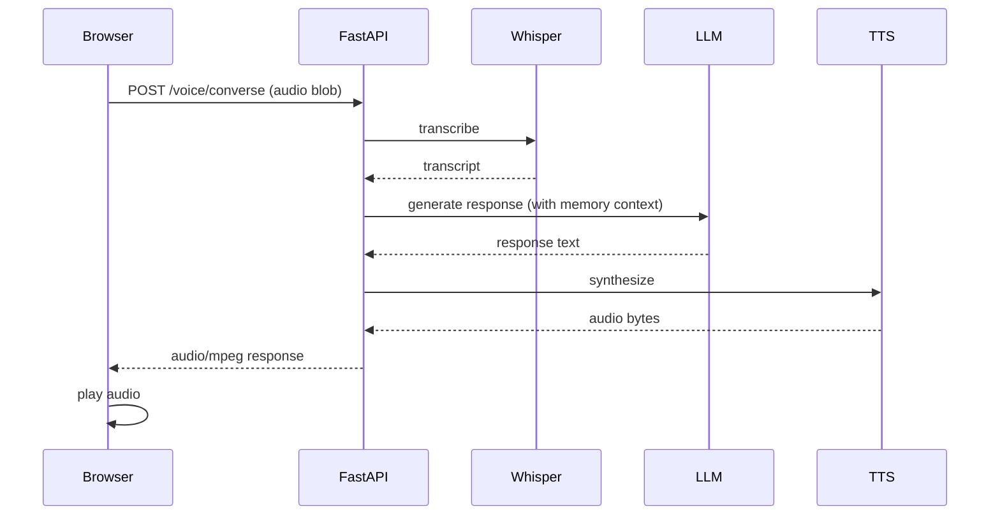

### 12.1 Handling upload limits and malformed audio

Two defensive checks belong in every voice upload endpoint, not just the happy path shown
above:

```python
MAX_AUDIO_BYTES = 10 * 1024 * 1024  # 10MB, generously above a typical short utterance
ALLOWED_CONTENT_TYPES = {"audio/webm", "audio/mp3", "audio/mpeg", "audio/wav", "audio/ogg"}

@router.post("/transcribe")
async def transcribe(file: UploadFile, user=Depends(get_current_user)):
    if file.content_type not in ALLOWED_CONTENT_TYPES:
        raise HTTPException(415, f"Unsupported audio type: {file.content_type}")

    audio_bytes = await file.read()
    if len(audio_bytes) > MAX_AUDIO_BYTES:
        raise HTTPException(413, "Audio file too large")
    if len(audio_bytes) == 0:
        raise HTTPException(400, "Empty audio file")

    try:
        text = await transcribe_audio(audio_bytes, file.filename)
    except Exception as exc:
        raise HTTPException(400, f"Transcription failed: {exc}")
    return {"text": text}
```

Skipping these checks is a common source of both security issues (unbounded upload size
as a resource-exhaustion vector) and confusing production bugs (a malformed or
zero-byte upload silently producing an empty or nonsensical transcript instead of a clear
error).

## 13. Voice UX

Voice interfaces have UX failure modes text chat doesn't - designing around them matters
as much as the underlying technical pipeline.

| UX principle | Why it matters | Implementation |
|---|---|---|
| Always show a visual listening/processing/speaking state | Users can't tell if the system heard them without a signal | A waveform, pulsing icon, or explicit status text |
| Keep responses concise | Long spoken responses are harder to follow than long written ones | Instruct the LLM to prefer shorter, more conversational phrasing for voice output specifically |
| Support interruption (barge-in) where possible | Waiting through a long response you don't need feels broken | Full-duplex architecture (Section 5), or at minimum a clear "stop" control |
| Confirm before side-effecting actions | Transcription errors can turn "cancel my 3pm" into an unintended action | Explicit confirmation step, same principle as tool-calling confirmation |
| Provide a text fallback | Not every environment/user is voice-appropriate | Always offer typed input as an alternative, never voice-only |
| Handle silence and "I didn't catch that" gracefully | STT will sometimes fail; users need a clear recovery path | A defined re-prompt behavior, not a silent failure |

```python
VOICE_SYSTEM_PROMPT_SUFFIX = (
    "\n\nYou are responding via voice. Keep responses conversational and concise - "
    "prefer short sentences over long lists. Avoid formatting that doesn't make sense "
    "when read aloud (no markdown headers, bullet points, or code blocks)."
)
```

**Why the system prompt suffix matters:** a response formatted for reading (with bullet
points, headers, code blocks) is often awkward or nonsensical when converted to speech.
Voice-specific prompting - either a dedicated system prompt addition or a distinct
conversation mode - is a small change with an outsized UX impact.

### 13.1 Designing recovery paths

Voice interfaces fail in ways text interfaces don't: mishearing, background noise
drowning out speech, or a user simply pausing mid-thought and triggering a premature
end-of-utterance detection. A voice product without deliberate recovery paths for these
cases feels broken far more often than the underlying STT/TTS technology's raw accuracy
would suggest.

| Failure scenario | Recommended recovery behavior |
|---|---|
| STT returns empty/near-empty transcript | Ask the user to repeat, don't silently do nothing |
| STT confidence is very low (if the provider exposes this) | Optionally confirm the interpretation before acting, especially for side-effecting commands |
| User's utterance is ambiguous | Ask a clarifying question via voice, exactly as a text assistant would |
| Network interruption mid-conversation | Detect the drop, inform the user, and offer to resume rather than failing silently |
| Repeated failures in a row | Offer to switch to text input rather than looping the same voice failure |

```python
VOICE_CLARIFICATION_PROMPT = (
    "\n\nIf the user's request is ambiguous or you're not confident you understood "
    "correctly, ask a brief clarifying question rather than guessing - voice "
    "transcription can introduce errors, so confirm before taking any action that "
    "would be costly to get wrong."
)
```

This pairs naturally with the confirmation pattern from Section 14 - clarification
handles *ambiguity*, confirmation handles *risk*, and a well-designed voice assistant
uses both, choosing between them based on how costly a mistake would actually be.

## 14. Security

| Risk | Mitigation |
|---|---|
| Unauthorized microphone access | Always require explicit browser permission (native behavior); never attempt to bypass it |
| Voice data (recordings, transcripts) retention without consent | Have a clear retention policy; allow users to delete voice history |
| Impersonation via voice cloning (for TTS-based systems) | Restrict custom voice cloning features to verified use cases; disclose AI-generated voice clearly |
| Side-effecting actions triggered by misheard commands | Require confirmation for high-stakes actions, same as any tool call (Sections 8, 13) |
| Audio data sent over unencrypted connections | Always use WSS (WebSocket Secure) / HTTPS in any non-local deployment |
| Injecting malicious instructions via spoken content read aloud from external sources | Treat transcribed content from untrusted sources the same as any other untrusted input - see prompt injection guidance in [`AI_ASSISTANT_GUIDE.md`](AI_ASSISTANT_GUIDE.md#241-a-concrete-prompt-injection-example) |

```python
# Require confirmation before executing a side-effecting action detected in a voice command
async def handle_voice_command(transcript: str, user_id: str) -> dict:
    intent = await classify_intent(transcript)
    if intent.is_side_effecting:
        return {
            "requires_confirmation": True,
            "action_summary": intent.summary,
            "message": f"I heard: '{transcript}'. Should I proceed?",
        }
    return await execute_intent(intent, user_id)
```

### 14.1 A worked retention policy example

Voice data is more sensitive than typed text in most users' minds - a recording captures
tone of voice, background environment, and potentially other people speaking nearby who
never consented to anything. A concrete retention policy, enforced in code rather than
just documented:

```python
from datetime import datetime, timedelta

RAW_AUDIO_RETENTION_DAYS = 7       # delete raw recordings quickly
TRANSCRIPT_RETENTION_DAYS = 365    # transcripts (text) can follow normal chat retention

async def purge_expired_voice_data(db) -> dict:
    audio_cutoff = datetime.utcnow() - timedelta(days=RAW_AUDIO_RETENTION_DAYS)
    transcript_cutoff = datetime.utcnow() - timedelta(days=TRANSCRIPT_RETENTION_DAYS)

    deleted_audio = await delete_raw_audio_older_than(db, audio_cutoff)
    deleted_transcripts = await delete_voice_transcripts_older_than(db, transcript_cutoff)

    return {"deleted_audio_files": deleted_audio, "deleted_transcripts": deleted_transcripts}
```

The pattern worth generalizing: **raw audio and its transcript are different data with
different retention needs.** The transcript is comparable to any other chat message and
can follow your standard conversation retention policy; the raw audio recording carries
additional sensitivity (voice biometrics, ambient sound, other speakers) and is often
best deleted much sooner, once transcription has succeeded and the audio itself is no
longer needed.

## 15. Deployment

```bash
# Development
uvicorn main:app --reload

# Production - WebSocket support requires an ASGI-compatible deployment
uvicorn main:app --host 0.0.0.0 --port 8000 --workers 4
```

```nginx
# nginx reverse proxy config snippet for WebSocket voice endpoints
location /ws/voice {
    proxy_pass http://backend;
    proxy_http_version 1.1;
    proxy_set_header Upgrade $http_upgrade;
    proxy_set_header Connection "upgrade";
    proxy_read_timeout 3600s;  # keep long-lived voice sessions alive
}
```

| Consideration | Detail |
|---|---|
| WebSocket-aware infrastructure | Load balancers/reverse proxies must support WebSocket upgrade and long connection timeouts |
| Audio file size limits | Cap upload size to prevent abuse; typical voice turns are small (seconds of audio) |
| Regional latency | For real-time voice, deploy compute close to users - round-trip latency compounds badly in a conversational loop |
| Third-party API rate limits | STT/TTS providers rate-limit; plan capacity and backoff behavior for peak usage |

See [`DEPLOYMENT_GUIDE.md`](DEPLOYMENT_GUIDE.md) for the general production deployment
checklist (HTTPS, health checks, monitoring) that applies here as much as any other
service.

### 15.1 Voice-specific monitoring

Beyond standard application monitoring, voice deployments benefit from tracking a small
set of voice-specific signals that generic API monitoring won't surface on its own:

```python
async def log_voice_turn_metrics(
    transcript_length: int, stt_latency_ms: float, llm_latency_ms: float,
    tts_first_chunk_latency_ms: float, total_turn_latency_ms: float, success: bool,
):
    logger.info(
        "voice_turn_complete",
        extra={
            "transcript_length": transcript_length,
            "stt_latency_ms": stt_latency_ms,
            "llm_latency_ms": llm_latency_ms,
            "tts_first_chunk_latency_ms": tts_first_chunk_latency_ms,
            "total_turn_latency_ms": total_turn_latency_ms,
            "success": success,
        },
    )
```

| Metric | Why track it |
|---|---|
| STT latency (p50/p95/p99) | Detects provider-side slowdowns before users complain |
| Time to first TTS audio chunk | The single number closest to "how responsive does this feel" |
| Empty/failed transcription rate | Spikes often indicate an audio format or quality regression, not a model problem |
| WebSocket session duration and disconnect rate | Surfaces infrastructure issues (proxy timeouts, network instability) affecting streaming sessions specifically |
| Confirmation-required actions triggered vs. confirmed | Tracks how often the safety net from Section 14 is actually engaging |

## 16. Performance

| Technique | Impact |
|---|---|
| Stream TTS output sentence-by-sentence rather than waiting for the full response | First audio plays much sooner, dramatically improving perceived latency |
| Use a lower-latency STT/TTS tier when available | Some providers offer explicitly latency-optimized model variants |
| Keep VAD silence thresholds tuned, not maximally conservative | Excessive silence padding adds directly to perceived response delay |
| Run STT and early LLM processing concurrently where architecture allows | Reduces end-to-end turn latency |
| Cache TTS output for frequently-repeated phrases (e.g. fixed prompts) | Avoids redundant synthesis calls for static content |
| Use WebSockets, not repeated HTTP requests, for streaming interactions | Avoids per-request connection overhead in a tight interaction loop |

```python
# Sentence-chunked streaming TTS - start speaking before the full LLM response is ready
import re

async def stream_voice_response(llm_text_stream) -> AsyncIterator[bytes]:
    buffer = ""
    async for token in llm_text_stream:
        buffer += token
        sentences = re.split(r"(?<=[.!?])\s+", buffer)
        if len(sentences) > 1:
            complete, buffer = sentences[:-1], sentences[-1]
            for sentence in complete:
                async for audio_chunk in stream_speech(sentence):
                    yield audio_chunk
    if buffer.strip():
        async for audio_chunk in stream_speech(buffer):
            yield audio_chunk
```

**Latency budget intuition:** a voice interaction feels "instant" under roughly 300ms of
total round-trip delay and noticeably laggy above 1 second. Every stage in the pipeline
(network, STT, LLM time-to-first-token, TTS time-to-first-audio) eats into that budget -
sentence-chunked streaming TTS is the single highest-leverage optimization because it
overlaps LLM generation time with audio playback rather than stacking them sequentially.

### 16.1 A complete production-shaped voice turn handler

Combining VAD, STT, memory-aware LLM generation, and streaming TTS into one coherent
class - the shape a real production voice module tends to converge on:

```python
class VoiceAssistant:
    def __init__(self, db, stt_fn, tts_stream_fn, llm_provider_name: str = "openai"):
        self.db = db
        self.stt_fn = stt_fn
        self.tts_stream_fn = tts_stream_fn
        self.provider_name = llm_provider_name

    async def handle_turn(
        self, conversation, audio_bytes: bytes
    ) -> AsyncIterator[bytes]:
        # 1. Guard against empty/silent submissions before spending an API call
        if len(audio_bytes) < MIN_AUDIO_BYTES:
            async for chunk in self.tts_stream_fn("I didn't catch that - could you try again?"):
                yield chunk
            return

        # 2. Transcribe
        try:
            transcript = await self.stt_fn(audio_bytes)
        except Exception:
            async for chunk in self.tts_stream_fn("Sorry, I'm having trouble hearing you right now."):
                yield chunk
            return

        if not transcript.strip():
            async for chunk in self.tts_stream_fn("I didn't catch that - could you try again?"):
                yield chunk
            return

        # 3. Build context exactly as the text pipeline does (memory + history)
        messages = await build_context_messages(self.db, conversation)
        messages.append(ChatMessage(role="system", content=VOICE_SYSTEM_PROMPT_SUFFIX))
        messages.append(ChatMessage(role="user", content=transcript))

        # 4. Stream the LLM response, chunk to sentences, and synthesize as we go
        provider = get_provider(self.provider_name)
        full_response = []
        buffer = ""
        async for token in provider.stream_chat(messages):
            full_response.append(token)
            buffer += token
            sentences = re.split(r"(?<=[.!?])\s+", buffer)
            if len(sentences) > 1:
                complete, buffer = sentences[:-1], sentences[-1]
                for sentence in complete:
                    async for audio_chunk in self.tts_stream_fn(sentence):
                        yield audio_chunk
        if buffer.strip():
            async for audio_chunk in self.tts_stream_fn(buffer):
                yield audio_chunk

        # 5. Persist the turn - same conversation record as text chat
        self.db.add(Message(conversation_id=conversation.id, role="user", content=transcript))
        self.db.add(
            Message(conversation_id=conversation.id, role="assistant", content="".join(full_response))
        )
        await self.db.commit()
```

Notice every failure mode from Section 17's mistake table gets an explicit guard here:
empty audio short-circuits before an API call, STT failures degrade gracefully with a
spoken apology instead of a crash, and sentence-chunked streaming keeps latency low
without waiting for the complete response. This class is deliberately provider-agnostic
(via `get_provider`) and transport-agnostic (it yields audio chunks that either a
WebSocket handler or an HTTP streaming response can consume) - the voice-specific logic
stays cleanly separated from how the audio actually reaches the user.

## 17. Common Mistakes (25+)

Most voice AI mistakes fall into three categories: treating audio like text (ignoring
format/sample-rate/encoding realities), ignoring the latency budget that makes voice feel
conversational vs. sluggish, and skipping the UX safeguards (confirmation, fallback,
visual state) that voice interfaces specifically need. A fourth, subtler category shows
up mainly in production rather than during development: skipping the defensive checks
(upload limits, empty-audio handling, provider failure handling) that only matter once
real, imperfect users and real, imperfect networks are involved rather than a clean local
demo.

| # | Mistake | Fix |
|---|---|---|
| 1 | Waiting for the complete LLM response before starting TTS | Stream sentence-by-sentence (Section 16) |
| 2 | No visual "listening/processing/speaking" state | Users can't tell if the system heard them - always show state |
| 3 | Assuming all browsers record the same audio format | Browsers commonly default to WebM/Opus; verify what your STT provider accepts or normalize (Section 4) |
| 4 | No silence/VAD threshold tuning | Too short cuts users off; too long feels sluggish - tune deliberately |
| 5 | No text fallback for voice-only interfaces | Not every user/environment can or wants to use voice |
| 6 | Auto-executing side-effecting actions from voice commands with no confirmation | Misheard commands can trigger unintended real-world actions |
| 7 | Ignoring transcription errors in the conversation record | Bad transcripts silently corrupt memory and context for the rest of the conversation |
| 8 | Using HTTP polling instead of WebSockets for streaming voice | Adds latency and overhead versus a persistent connection |
| 9 | No handling for STT/TTS API failures | A transient provider outage shouldn't crash the whole voice turn |
| 10 | Sending markdown-formatted text to TTS | Headers, bullets, and code blocks read awkwardly aloud - use a voice-specific prompt (Section 13) |
| 11 | No maximum recording length | Unbounded recordings risk large uploads and runaway costs |
| 12 | Deploying WebSocket endpoints behind infrastructure that doesn't support them | Verify load balancer/proxy WebSocket support and timeout settings |
| 13 | Ignoring mobile browser microphone permission quirks | Test explicitly on iOS Safari and Android Chrome, which have different permission UX |
| 14 | No wake-word/push-to-talk distinction made deliberately | Choosing "always listening" without considering the privacy and cost implications |
| 15 | Assuming Whisper handles all languages equally well | Accuracy varies significantly by language; test with your actual target languages |
| 16 | Not testing with real background noise | Clean-room demo audio doesn't reflect real usage conditions |
| 17 | No maximum silence/timeout in wake-word listening loops | A stuck detector can consume resources indefinitely |
| 18 | Storing raw audio indefinitely with no retention policy | Privacy risk and unnecessary storage cost |
| 19 | Blocking the FastAPI event loop with synchronous audio processing libraries | Use async-compatible libraries or run CPU-heavy processing in a thread pool |
| 20 | No rate limiting on transcription/synthesis endpoints | These are expensive calls - abuse can be costly quickly |
| 21 | Assuming TTS voices sound the same across providers | Always listen-test the actual voice before committing to a provider |
| 22 | No handling of empty/silent audio submissions | A silent recording sent to STT should short-circuit, not waste an API call |
| 23 | Ignoring latency added by geographic distance to the STT/TTS provider's region | Deploy compute close to both users and the provider region when possible |
| 24 | Conflating voice UX design with text chat UX design | Voice needs its own conciseness and confirmation patterns, not a direct port of chat UI conventions |
| 25 | Not testing barge-in/interruption behavior explicitly | If claiming full-duplex support, verify interruption actually works under real network conditions |
| 26 | Hardcoding a single TTS voice with no user choice | Voice preference is personal; expose a selection where the product allows it |
| 27 | No monitoring of STT accuracy or TTS failure rates in production | Quality regressions from provider-side model updates can go unnoticed without monitoring |

## 18. FAQ (40+)

These questions cluster around the same handful of recurring themes: choosing turn-based
versus streaming architecture, picking between hosted and self-hosted STT/TTS, and
handling the failure modes (silence, mishearing, permission denial) that are unique to
voice as an input/output modality. Skim for whichever theme matches what you're currently
building rather than reading start to finish.

**Q1. Do I need to build streaming/full-duplex voice from day one?**
No - build a turn-based (record, transcribe, respond, speak) pipeline first. It's
dramatically simpler and validates the product before you invest in streaming
architecture.

**Q2. What's the cheapest way to prototype voice AI?**
OpenAI's Whisper + TTS APIs are inexpensive and require no infrastructure - a turn-based
prototype using both can be built in an afternoon.

**Q3. Can I run STT and TTS entirely locally with no API calls?**
Yes - open-source Whisper models and local TTS engines (Piper, Coqui) run fully offline,
at the cost of needing your own compute (ideally a GPU for acceptable STT latency) and
generally lower voice quality than commercial TTS.

**Q4. What audio format should the browser record in?**
Let the browser use its default (`MediaRecorder` typically produces WebM/Opus) and send
that directly to your STT provider - most hosted APIs, including Whisper, accept it
without manual conversion.

**Q5. How long can a single STT request be?**
Provider-specific; Whisper's API has a file size limit (25MB as of common current
limits - verify current documentation). For longer audio, chunk it or use a streaming
STT approach instead.

**Q6. Is WebRTC required for voice AI?**
Not necessarily - `MediaRecorder` + a simple upload works fine for turn-based
interfaces. WebRTC becomes relevant for peer-to-peer or very low-latency streaming
scenarios beyond what a WebSocket-based architecture provides.

**Q7. How do I detect when the user has stopped speaking?**
Voice Activity Detection (Section 6) - either a simple energy threshold, WebRTC VAD, or a
neural VAD model, combined with a tuned silence duration threshold.

**Q8. What's a reasonable silence threshold before considering an utterance complete?**
600-800ms is a common starting point; shorter feels responsive but risks cutting off
natural pauses, longer feels sluggish.

**Q9. Should I use a wake word for a web-based voice assistant?**
Usually no - push-to-talk (a button click) is simpler, more private, and sufficient for
most web/app products. Wake words matter most for hands-free hardware devices.

**Q10. How do I handle multiple languages?**
Most hosted STT/TTS APIs support multiple languages; either auto-detect (many STT APIs
support this) or let the user select explicitly - verify accuracy for your specific
target languages rather than assuming uniform quality.

**Q11. Can voice AI understand emotion or tone, not just words?**
To a limited degree - some providers offer emotion/sentiment signals alongside
transcription, and some TTS systems support expressive/emotional voice styles, but this
is a more specialized and less mature capability than core transcription/synthesis.

**Q12. What's the difference between the OpenAI Realtime API and composing Whisper + TTS
myself?**
The Realtime API processes speech-to-speech in one model with much lower latency and
native interruption support; composing Whisper + your LLM + TTS yourself gives more
control over each intermediate step (useful for logging, RAG injection, moderation) at
the cost of higher latency and more engineering to get streaming right.

**Q13. How do I make voice responses sound less robotic?**
Choose a high-quality TTS voice, keep generated text conversational (short sentences,
natural phrasing) via prompt engineering, and consider providers like ElevenLabs for
more natural-sounding synthesis if budget allows.

**Q14. Should transcripts be shown to the user during a voice conversation?**
Often yes - a live transcript display builds trust (the user can verify they were heard
correctly) and provides an accessible fallback for anyone who can't or prefers not to
listen to audio.

**Q15. How much does voice AI typically cost to run?**
STT and TTS are both usually priced per unit of audio (per minute for STT, per character
for TTS); costs are generally modest for individual conversations but should be monitored
at scale - see the cost optimization guidance in
[`AI_ASSISTANT_GUIDE.md`](AI_ASSISTANT_GUIDE.md#25-cost-optimization).

**Q16. Can I clone a specific person's voice for TTS?**
Some providers (ElevenLabs, for example) offer voice cloning features, but this raises
significant consent and misuse concerns - always require explicit, verifiable consent
from the person being cloned, and disclose AI-generated voice content clearly.

**Q17. How do I test voice AI reliably given non-deterministic STT/TTS output?**
Test the deterministic parts (VAD logic, audio format handling, conversation
orchestration) with standard unit tests; evaluate STT/TTS quality with a fixed set of
representative audio samples and expected transcripts/characteristics, accepting some
tolerance rather than exact-match assertions.

**Q18. What happens if the user's microphone permission is denied?**
Always design for graceful degradation - detect the permission failure and fall back to
a text input, never leave the user stuck with a non-functional voice-only interface.

**Q19. Is background noise cancellation something I need to implement myself?**
Generally no - modern STT models are reasonably robust to moderate background noise, and
browsers apply some noise suppression by default (`echoCancellation`,
`noiseSuppression` constraints in `getUserMedia`). Heavy noise environments may still
need dedicated audio preprocessing.

**Q20. How do I handle very long voice conversations (memory/context)?**
Identically to long text conversations - short-term windowing plus long-term memory
extraction, as covered in [`AI_ASSISTANT_GUIDE.md`](AI_ASSISTANT_GUIDE.md#6-conversation-memory).
Voice doesn't change the underlying memory architecture.

**Q21. Can voice AI be used for accessibility purposes?**
Yes, significantly - voice interfaces are valuable for users with visual impairments or
motor difficulties that make typing hard; always pair with a genuinely usable text
fallback rather than treating voice as accessibility-only or text as accessibility-only.

**Q22. What's "barge-in" and do I need to support it?**
Letting the user interrupt the assistant's speech mid-response. It's important for
natural-feeling conversation but requires full-duplex architecture (Section 5) - not
necessary for a first, turn-based version of a product.

**Q23. How do I keep voice responses concise without losing important information?**
Prompt the model explicitly for voice-appropriate brevity (Section 13) and consider
offering "tell me more" as a natural follow-up pattern rather than trying to cram
everything into one spoken response.

**Q24. Do I need a dedicated audio processing library, or can I just pass raw bytes
around?**
For simple turn-based pipelines using hosted APIs that accept common formats directly
(like Whisper), raw bytes are often sufficient. A library like `pydub` becomes useful
once you need format conversion, trimming, or other preprocessing.

**Q25. What sample rate should I target?**
16kHz mono is a common standard for speech (higher than needed for intelligible speech,
lower than needed for music) - check your specific STT provider's documentation for
their preferred input format.

**Q26. How do I debug "the transcript is wrong"?**
Listen to the actual recorded audio first - many "STT is broken" reports turn out to be
genuinely unclear audio (background noise, quiet speech, unusual accents the model
handles less well) rather than a bug in your integration.

**Q27. Should voice input always go through the same LLM pipeline as text input?**
Generally yes, for consistency of behavior and shared memory - the difference should be
limited to the input/output modality layer, not the underlying reasoning (Section 9).

**Q28. Can I run voice AI entirely client-side, with no server?**
Partially - some STT/TTS can run in-browser via WebAssembly-compiled models (e.g.
whisper.cpp compiled to WASM) for privacy/offline use cases, though with performance
trade-offs versus server-side or hosted API processing.

**Q29. What's the role of a system prompt in a voice assistant?**
The same role as in text chat, plus voice-specific formatting guidance (Section 13) - no
separate "voice prompt engineering" discipline beyond that addition.

**Q30. How do I handle a user speaking a command in the middle of the assistant's TTS
playback?**
This requires full-duplex support (Section 5) with explicit interruption handling - on
detecting new speech input during playback, stop the current TTS output and process the
new input as the start of a new turn.

**Q31. Is it possible to have multiple voices for different assistant "personas"?**
Yes - most TTS APIs let you select a voice per request; mapping a conversation's chosen
persona or system prompt to a specific TTS voice is a straightforward product feature.

**Q32. What's the biggest latency bottleneck in a typical voice pipeline?**
Usually LLM generation time (time to first token, and total generation time for the full
response) - this is why sentence-chunked streaming TTS (Section 16) is the highest-impact
optimization, since it overlaps generation and playback rather than serializing them.

**Q33. How do I handle profanity or inappropriate spoken input?**
The same content moderation considerations apply as any text input - voice doesn't
introduce a fundamentally different moderation problem, though transcription may
occasionally introduce or omit words inaccurately, worth accounting for in strict
moderation pipelines.

**Q34. Should I cache commonly-requested TTS output?**
Yes, for static/repeated phrases (e.g. a fixed greeting or menu prompt) - caching avoids
redundant synthesis cost and latency for content that doesn't change per user.

**Q35. What's the difference between ASR and STT?**
They're synonyms in almost all practical usage - Automatic Speech Recognition (ASR) is
the more formal/academic term, Speech-to-Text (STT) the more commonly used product term.

**Q36. Can voice assistants call tools/functions the same way text-based agents do?**
Yes - once speech is transcribed to text, it flows into the exact same tool-calling
pipeline described in [`AI_ASSISTANT_GUIDE.md`](AI_ASSISTANT_GUIDE.md#10-tool-calling);
voice adds no special tool-calling mechanism of its own.

**Q37. How do I choose between OpenAI, Google, Amazon, and specialized providers
(Deepgram, ElevenLabs) for STT/TTS?**
Benchmark actual latency and quality against your specific use case and target
languages/accents - published comparisons age quickly in this space, and the "best"
choice is workload-dependent.

**Q38. Is on-device (local) voice processing viable for a production product today?**
Increasingly yes for STT (efficient local Whisper variants exist), less commonly for
TTS at commercial-grade quality - evaluate based on your privacy requirements and
acceptable quality/latency trade-offs.

**Q39. How do I test voice UX with real users effectively?**
Include realistic background noise and accents in test scenarios, test on actual mobile
devices (not just desktop browsers), and specifically probe failure recovery (what
happens when STT gets it wrong) rather than only testing happy-path interactions.

**Q40. What's a reasonable maximum recording length to enforce?**
Depends on the use case, but capping single utterances at 30-60 seconds is common for
conversational voice assistants - longer inputs likely indicate the user needs a
different interaction pattern (e.g. dictation mode) rather than a raised limit.

**Q41. Does voice AI require a different rate-limiting strategy than text chat?**
The same principles apply (per-user/per-IP limits), but STT/TTS calls tend to be more
expensive per-request than a typical text message, so limits should account for that
higher per-call cost.

**Q42. Can I build a voice assistant that works fully offline, with no internet at all?**
Yes, in principle - self-hosted STT (local Whisper), a locally-run LLM, and local TTS
can form a fully offline pipeline, though voice quality and reasoning capability
typically trade off against a cloud-based equivalent at the same hardware budget.

**Q43. How do I handle a user who speaks with a strong regional accent or as a
non-native speaker?**
Modern STT models (Whisper included) generally handle accent variation reasonably well,
but accuracy is not uniform across all accents and languages - test explicitly with
audio representative of your actual user base rather than assuming benchmark accuracy
figures transfer directly to your product's population.

**Q44. Is it worth building a custom wake-word model instead of using an off-the-shelf
one?**
Rarely, for most products - off-the-shelf wake-word engines (Porcupine, openWakeWord)
are accurate and fast to integrate. Custom wake-word training is justified mainly for a
branded/proprietary trigger phrase at meaningful commercial scale, not as a default
starting choice.

**Q45. What's the honest failure rate I should expect from STT in real-world conditions?**
There's no universal figure - it depends heavily on audio quality, background noise,
accent, and domain vocabulary. Measure it directly against a representative sample of
your actual users' audio rather than trusting a vendor's headline accuracy number, which
is typically measured on clean benchmark datasets that don't reflect real usage
conditions.

## 19. Best Practices

The list below distills the highest-leverage recommendations from every section above.
Treat it as a pre-launch checklist for any voice feature, not just background reading -
running through it against your actual implementation before shipping catches most of
the issues that would otherwise surface as confusing user complaints ("it cut me off",
"it didn't understand me", "it took forever to respond") rather than clean bug reports.

- **Build turn-based first, streaming/full-duplex later** - validate the product before
  investing in the harder architecture.
- **Stream TTS output sentence-by-sentence**, not after the full LLM response completes.
- **Always show a clear visual state** (listening/processing/speaking).
- **Always offer a text fallback** - never ship voice-only.
- **Tune VAD silence thresholds deliberately**, not on a guess.
- **Require confirmation before side-effecting voice commands.**
- **Keep voice-formatted responses conversational and concise** via a dedicated prompt
  addition.
- **Use WebSockets for streaming interactions**, not repeated HTTP polling.
- **Test with real background noise and real devices**, not just clean desktop demos.
- **Monitor STT/TTS accuracy and failure rates in production**, not just at launch.
- **Never auto-execute high-stakes actions from a single unconfirmed voice command.**

## 20. Learning Roadmap

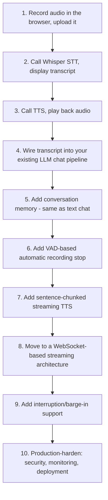

| Stage | Focus | Rough timeframe (part-time) |
|---|---|---|
| 1-3 | Basic record/transcribe/synthesize/playback loop | 2-3 days |
| 4-5 | Wire into a real assistant pipeline with memory | 3-5 days |
| 6-7 | VAD and streaming TTS for better UX | 1 week |
| 8-9 | Full-duplex streaming architecture | 1-2 weeks |
| 10 | Production hardening | Ongoing |

Build the turn-based pipeline in Sections 2, 3, and 12 first, end to end, before touching
streaming or VAD - a working "record, transcribe, respond, speak" loop with just a few
hundred lines of code teaches you the entire shape of the problem, and every later stage
in this roadmap is an incremental refinement of that same loop rather than a different
architecture. The jump from turn-based to full-duplex streaming (Sections 5-7) is by far
the largest single step in this roadmap - budget real time for it, and don't be
discouraged if it takes noticeably longer than every earlier stage combined; that's the
normal shape of this learning curve, not a sign something is wrong with your approach.

### 20.1 Closing summary

Voice AI's central engineering challenge is not making speech recognition or synthesis
work - hosted APIs have made both nearly a solved problem for most use cases - it's
managing the *timing and failure modes* that a text interface never has to think about:
knowing when someone has finished speaking, recovering gracefully when a transcript comes
back wrong, and keeping perceived latency low enough that a conversation feels natural
rather than like a series of walkie-talkie exchanges. Every technique in this handbook,
from VAD threshold tuning to sentence-chunked streaming TTS, exists to solve one of those
timing or failure-mode problems. Master the turn-based pipeline first, treat the
reasoning layer as identical to your existing text assistant (because it is), and layer
in streaming, VAD, and interruption handling only once you have a concrete reason your
product needs them.

---

*See also: [`AI_ASSISTANT_GUIDE.md`](AI_ASSISTANT_GUIDE.md) for the broader assistant
architecture voice fits into, [`VISION_AI_GUIDE.md`](VISION_AI_GUIDE.md) for the
multimodal counterpart, and [`DEPLOYMENT_GUIDE.md`](DEPLOYMENT_GUIDE.md) for the general
production deployment checklist referenced in Section 15. If you take one idea from this
handbook forward, let it be that voice AI's hardest problems are timing problems, not
recognition-accuracy problems - invest your engineering effort accordingly.*
